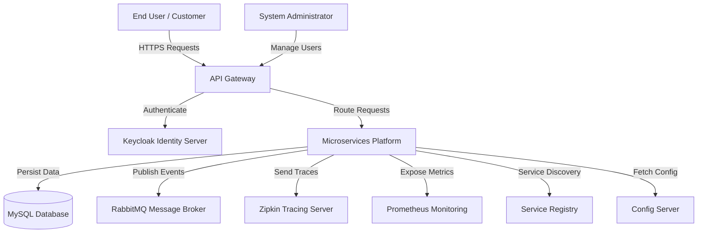
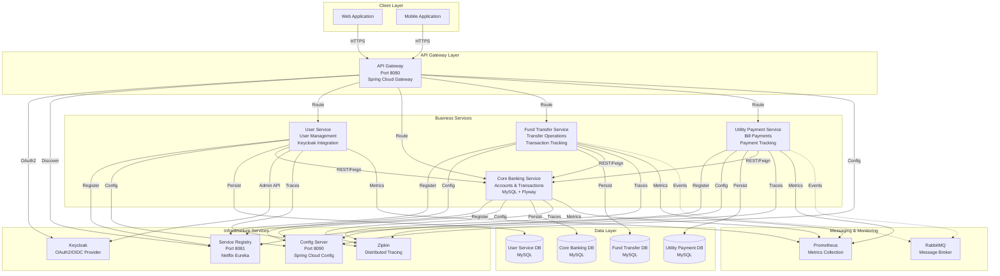
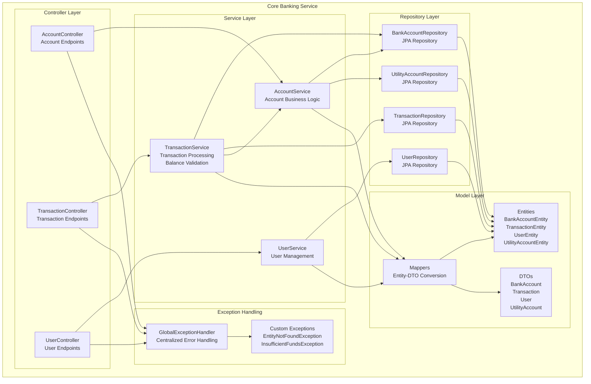
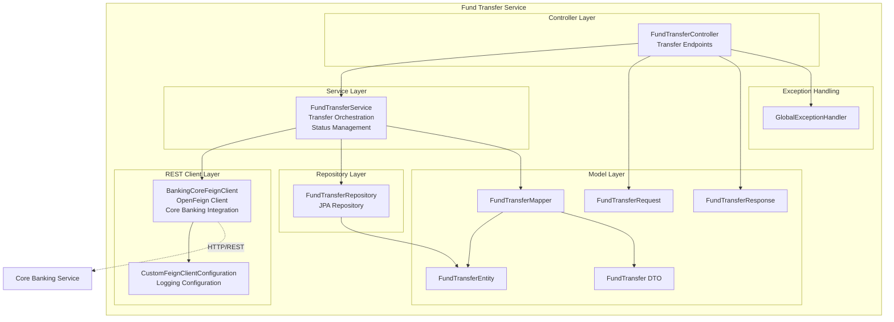
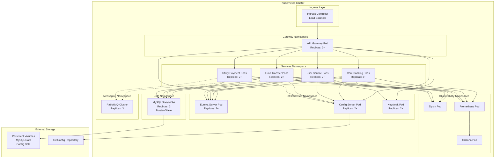
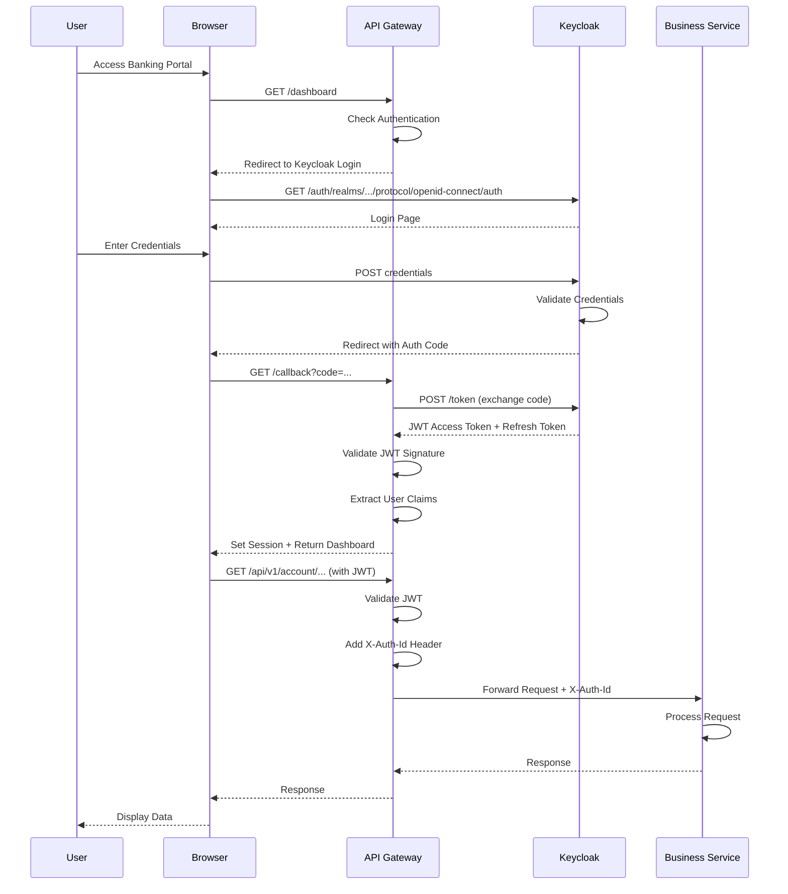
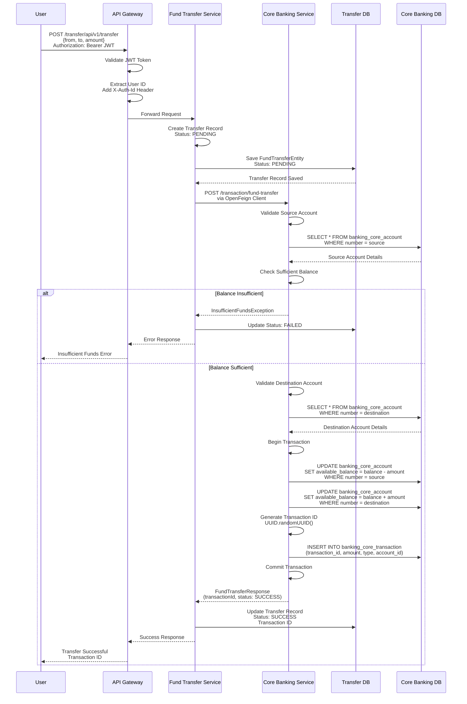
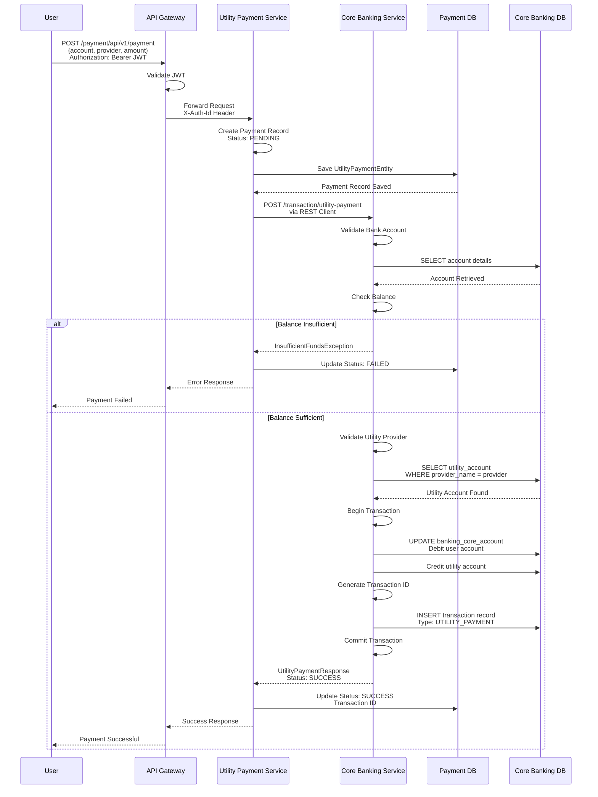
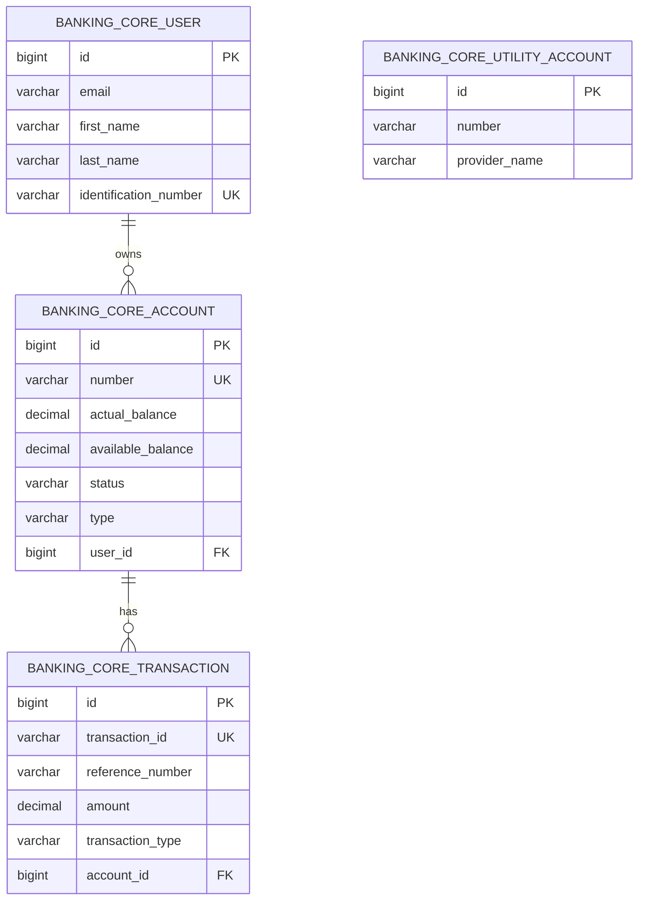

# High-Level Design (HLD) - Internet Banking Microservices Platform

## 1. System Overview and Scope

### 1.1 Purpose
The Internet Banking Microservices Platform is a comprehensive, cloud-native banking solution built using Spring Boot microservices architecture. The system enables secure online banking operations including account management, fund transfers, and utility payments through a distributed, scalable architecture.

### 1.2 Scope
The platform encompasses:
- User registration and authentication via Keycloak OAuth2/OIDC
- Core banking operations (accounts, balances, transactions)
- Inter-account fund transfers
- Utility bill payments
- Real-time transaction processing
- Distributed tracing and monitoring
- Centralized configuration management
- Service discovery and API gateway routing

### 1.3 Key Business Capabilities
- **User Management**: Registration, authentication, profile management
- **Account Management**: View balances, transaction history, account details
- **Fund Transfers**: Transfer money between accounts with transaction tracking
- **Utility Payments**: Pay utility bills through integrated providers
- **Transaction History**: View and track all banking operations
- **Security & Compliance**: OAuth2-based authentication, audit trails

## 2. Core User Journeys

### 2.1 User Registration and Onboarding
1. User submits registration request with personal details
2. System validates email and identification number
3. User account created in Keycloak identity provider
4. Local user record created with PENDING status
5. Admin reviews and approves user registration
6. User credentials activated in Keycloak
7. User can login and access banking services

### 2.2 Account Management
1. User authenticates via Keycloak OAuth2 flow
2. JWT token issued and propagated through API Gateway
3. User accesses account information through secured endpoints
4. System retrieves account details, balances from core banking service
5. Transaction history displayed with pagination support

### 2.3 Fund Transfer Flow
1. User initiates fund transfer request
2. API Gateway validates JWT token and routes to Fund Transfer Service
3. Fund Transfer Service creates pending transaction record
4. Service calls Core Banking Service via OpenFeign client
5. Core Banking validates source and destination accounts
6. System checks sufficient balance availability
7. Transaction executed atomically (debit source, credit destination)
8. Transaction record persisted with unique transaction ID
9. Fund Transfer Service updates transaction status to SUCCESS
10. Response returned to user with transaction details

### 2.4 Utility Payment Flow
1. User selects utility provider and enters payment details
2. Request routed through API Gateway to Utility Payment Service
3. Service creates pending payment record
4. REST client calls Core Banking Service for payment processing
5. Core Banking validates account and utility provider
6. Balance checked and payment amount debited
7. Utility account credited with payment amount
8. Transaction logged with reference number
9. Payment status updated to SUCCESS
10. Confirmation returned to user

## 3. Microservices Architecture

### 3.1 Service Inventory

#### 3.1.1 Core Banking Service
**Responsibility**: Central service managing all banking core operations

**Key Functions**:
- Account management (savings, checking accounts)
- Balance inquiries and updates
- Transaction processing and recording
- User account data management
- Utility provider account management

**Technology**: Spring Boot 2.4.5, Spring Data JPA, MySQL, Flyway
**Port**: Dynamically assigned via Eureka
**Database**: MySQL with Flyway migrations

**Key Endpoints**:
- `GET /api/v1/account/read/{accountNumber}` - Retrieve account details
- `POST /api/v1/transaction/fund-transfer` - Execute fund transfer
- `POST /api/v1/transaction/utility-payment` - Process utility payment
- `GET /api/v1/user/read/{identification}` - Retrieve user by ID

#### 3.1.2 Internet Banking User Service
**Responsibility**: User lifecycle management and Keycloak integration

**Key Functions**:
- User registration with Keycloak integration
- User profile management
- Status updates (PENDING, APPROVED, REJECTED)
- User authentication coordination
- Integration with Core Banking for user validation

**Technology**: Spring Boot 2.4.5, Spring Data JPA, Keycloak Admin Client
**Port**: Dynamically assigned via Eureka
**Database**: Separate user service database

**Key Endpoints**:
- `POST /api/v1/register` - User registration (public endpoint)
- `GET /api/v1/read` - List all users with pagination
- `GET /api/v1/read/{userId}` - Get user by ID
- `PUT /api/v1/update/{userId}` - Update user status

#### 3.1.3 Fund Transfer Service
**Responsibility**: Orchestrate and track fund transfer operations

**Key Functions**:
- Fund transfer initiation and tracking
- Transaction status management
- Integration with Core Banking for actual transfer execution
- Transaction history with pagination
- Asynchronous notification via RabbitMQ (planned)

**Technology**: Spring Boot 2.4.5, Spring Data JPA, OpenFeign
**Port**: Dynamically assigned via Eureka
**Database**: Fund transfer transaction database

**Key Endpoints**:
- `POST /api/v1/transfer` - Initiate fund transfer
- `GET /api/v1/transfer` - List all transfers with pagination

#### 3.1.4 Utility Payment Service
**Responsibility**: Manage utility bill payments

**Key Functions**:
- Utility payment processing
- Payment transaction tracking
- Integration with Core Banking for payment execution
- Payment history retrieval
- Support for multiple utility providers

**Technology**: Spring Boot 2.4.5, Spring Data JPA, OpenFeign
**Port**: Dynamically assigned via Eureka
**Database**: Utility payment database

**Key Endpoints**:
- `POST /api/v1/payment` - Process utility payment
- `GET /api/v1/payment` - List all payments with pagination

#### 3.1.5 API Gateway (Spring Cloud Gateway)
**Responsibility**: Single entry point for all client requests

**Key Functions**:
- Request routing to appropriate microservices
- OAuth2 authentication and authorization
- JWT token validation
- Token propagation via X-Auth-Id header
- CSRF protection
- Load balancing through Eureka integration

**Technology**: Spring Cloud Gateway, Spring Security OAuth2
**Port**: 8080 (default)

**Security Configuration**:
- Public endpoint: `/user/api/v1/register`
- All other endpoints: Authenticated via OAuth2 JWT
- Acts as OAuth2 resource server
- Supports OAuth2 login flow

#### 3.1.6 Service Registry (Netflix Eureka)
**Responsibility**: Service discovery and registration

**Key Functions**:
- Service registration from all microservices
- Service discovery for inter-service communication
- Health monitoring of registered services
- Dynamic service instance management

**Technology**: Spring Cloud Netflix Eureka Server
**Port**: 8081
**Configuration**: Standalone mode (not registering with itself)

#### 3.1.7 Config Server (Spring Cloud Config)
**Responsibility**: Centralized configuration management

**Key Functions**:
- External configuration storage via Git repository
- Environment-specific configurations
- Dynamic configuration refresh
- Secure property management

**Technology**: Spring Cloud Config Server
**Port**: 8090
**Configuration Source**: Git repository at `https://github.com/javatodev/internet-banking-configurations.git`
**Search Paths**: `/configuration`
**Branch**: `main`

## 4. Technology Stack

### 4.1 Core Technologies
- **Language**: Java 11
- **Framework**: Spring Boot 2.4.5
- **Build Tool**: Gradle

### 4.2 Spring Cloud Components
- **Service Discovery**: Netflix Eureka (Client & Server)
- **API Gateway**: Spring Cloud Gateway
- **Configuration**: Spring Cloud Config Server
- **Distributed Tracing**: Spring Cloud Sleuth with Zipkin
- **Inter-Service Communication**: OpenFeign

### 4.3 Data & Persistence
- **Database**: MySQL
- **ORM**: Spring Data JPA
- **Migration Tool**: Flyway
- **Connection Pooling**: HikariCP (default with Spring Boot)

### 4.4 Security & Identity
- **Identity Provider**: Keycloak
- **Authentication Protocol**: OAuth2 / OpenID Connect (OIDC)
- **Token Format**: JWT (JSON Web Tokens)
- **Security Framework**: Spring Security 5.x

### 4.5 Messaging & Events
- **Message Broker**: RabbitMQ
- **Purpose**: Asynchronous notifications, event-driven communication

### 4.6 Observability & Monitoring
- **Distributed Tracing**: Zipkin
- **Trace Correlation**: Spring Cloud Sleuth
- **Metrics Collection**: Prometheus
- **Health Checks**: Spring Boot Actuator
- **Logging**: SLF4J with Logback

### 4.7 Container & Orchestration
- **Containerization**: Docker
- **Container Orchestration**: Kubernetes
- **Container Registry**: Docker Hub / private registry

### 4.8 Third-Party Services
- **Dependency Management**: Jitpack (for custom libraries)

## 5. Architecture Views

### 5.1 Context Diagram



### 5.2 Container Diagram



### 5.3 Component Diagram - Core Banking Service



### 5.4 Component Diagram - Fund Transfer Service



### 5.5 Deployment Architecture - Docker/Kubernetes



### 5.6 Runtime Interaction - User Login Flow



### 5.7 Runtime Interaction - Fund Transfer Flow



### 5.8 Runtime Interaction - Utility Payment Flow



## 6. Security Architecture

### 6.1 Authentication & Authorization Framework

#### OAuth2 / OpenID Connect Flow
The system implements OAuth2 2.0 with OpenID Connect (OIDC) using Keycloak as the identity provider.

**Components**:
- **Authorization Server**: Keycloak
- **Resource Server**: API Gateway + All Microservices
- **Client**: Web/Mobile Applications
- **Token Format**: JWT (JSON Web Tokens)

#### Authentication Flow
1. User accesses protected resource
2. API Gateway redirects to Keycloak login page
3. User enters credentials
4. Keycloak validates credentials
5. Authorization code returned to gateway
6. Gateway exchanges code for JWT access token
7. Gateway validates JWT signature
8. Subsequent requests include JWT in Authorization header
9. Gateway validates token and extracts claims
10. Username extracted and propagated via X-Auth-Id header

### 6.2 Resource Server Configuration

#### API Gateway Security
- Acts as OAuth2 Resource Server
- Validates JWT tokens on every request
- Public endpoints: `/user/api/v1/register`
- All other endpoints require valid JWT
- CSRF protection disabled for REST API
- Token introspection for validation

#### Microservices Security
All business microservices are configured as OAuth2 resource servers:
- Accept requests from API Gateway only
- Rely on X-Auth-Id header for user identification
- No direct token validation (delegated to gateway)
- Internal service-to-service calls via Feign use token propagation

### 6.3 Token Propagation

The API Gateway implements a custom `GlobalFilter` that:
1. Extracts the authenticated principal from Security Context
2. Retrieves username from JWT token
3. Adds `X-Auth-Id` header to all proxied requests
4. Enables downstream services to identify the calling user

```java
@Bean
public GlobalFilter customGlobalFilter() {
    return ((exchange, chain) -> exchange.getPrincipal().map(principal -> {
        String userName = "";
        if (principal instanceof JwtAuthenticationToken) {
            userName = principal.getName();
        }
        exchange.getRequest().mutate()
                .header("X-Auth-Id", userName)
                .build();
        return exchange;
    }).flatMap(chain::filter));
}
```

### 6.4 Keycloak Integration

#### User Service Integration
The User Service integrates directly with Keycloak Admin REST API:
- **User Registration**: Creates user in Keycloak realm
- **Credential Management**: Sets initial passwords
- **User Activation**: Enables/disables users based on approval status
- **Profile Updates**: Synchronizes user data between systems

#### Keycloak Configuration
- **Grant Type**: Client Credentials for service-to-service
- **Realm**: Configured per environment
- **Client ID & Secret**: Stored in centralized configuration
- **Server URL**: Externalized configuration property

### 6.5 Security Policies

#### Gateway Security Policies
- All requests must include valid JWT except registration
- JWT validation includes signature verification
- Token expiration enforced
- Refresh token support for session extension
- Rate limiting (configurable)

#### Transport Security
- HTTPS enforced for all external communication
- TLS 1.2+ required
- Certificate validation enabled
- Mutual TLS for sensitive operations (configurable)

#### Data Protection
- Passwords never stored in application databases
- All credentials managed by Keycloak
- Sensitive configuration encrypted
- Database credentials externalized

## 7. Configuration Management

### 7.1 Spring Cloud Config Architecture

#### Config Server Setup
- **Type**: Git-backed configuration repository
- **Port**: 8090
- **Repository**: `https://github.com/javatodev/internet-banking-configurations.git`
- **Search Path**: `/configuration`
- **Branch**: `main`

#### Configuration Hierarchy
1. **Application-specific**: `{service-name}.yml`
2. **Profile-specific**: `{service-name}-{profile}.yml`
3. **Common configuration**: `application.yml`

### 7.2 Bootstrap Configuration

All microservices include `bootstrap.yml` pointing to Config Server:

```yaml
spring:
  cloud:
    config:
      uri: http://localhost:8090
```

This ensures configuration is fetched before application context initialization.

### 7.3 Configuration Categories

#### Service Configuration
- Application name
- Server port (or dynamic via Eureka)
- Database connection details
- JPA/Hibernate properties
- Flyway migration settings

#### Infrastructure Configuration
- Eureka client settings
- Service discovery URLs
- Health check intervals
- Instance metadata

#### Security Configuration
- Keycloak server URL, realm, client credentials
- OAuth2 resource server settings
- JWT validation parameters

#### Integration Configuration
- OpenFeign client settings
- REST client timeouts
- Connection pool sizes
- Circuit breaker parameters

#### Observability Configuration
- Zipkin server URL
- Spring Cloud Sleuth sampling rates
- Actuator endpoints exposure
- Logging levels per package

### 7.4 Secrets Management

**Current Approach**:
- Sensitive properties stored in Git repository
- Should be encrypted using Spring Cloud Config encryption
- Production environments should use external secret stores

**Recommended Enhancements**:
- HashiCorp Vault integration
- Kubernetes Secrets
- AWS Secrets Manager / Azure Key Vault
- Encrypted properties with asymmetric keys

### 7.5 Configuration Refresh

Spring Cloud Config supports dynamic refresh:
- Actuator `/refresh` endpoint
- Spring Cloud Bus for cluster-wide refresh
- Webhook triggers from Git repository
- No application restart required for most properties

## 8. Observability & Monitoring

### 8.1 Distributed Tracing

#### Zipkin Integration
- **Purpose**: Track requests across microservices
- **Implementation**: Spring Cloud Sleuth
- **Trace Propagation**: Automatic via HTTP headers
- **Span Collection**: Async to Zipkin server

#### Trace Context
Each request generates:
- **Trace ID**: Unique identifier for entire request flow
- **Span ID**: Unique identifier for each service interaction
- **Parent Span ID**: Links child spans to parents

#### Benefits
- Request flow visualization
- Latency analysis per service
- Bottleneck identification
- Error correlation across services

### 8.2 Metrics Collection

#### Spring Boot Actuator
Exposes health and metrics endpoints:
- `/actuator/health` - Service health status
- `/actuator/metrics` - Available metrics
- `/actuator/prometheus` - Prometheus-compatible metrics

#### Prometheus Integration
- Scrapes metrics from all service instances
- Time-series data storage
- PromQL query language
- Alerting rules configuration

#### Key Metrics
- **JVM Metrics**: Heap, threads, GC activity
- **HTTP Metrics**: Request count, latency, error rates
- **Database Metrics**: Connection pool stats, query performance
- **Custom Business Metrics**: Transaction counts, amounts

### 8.3 Logging Strategy

#### Structured Logging
- SLF4J API with Logback implementation
- JSON format for production (ELK stack compatibility)
- Correlation IDs included automatically by Sleuth
- Environment-specific log levels via Config Server

#### Log Aggregation
Recommended setup:
- Filebeat/Fluentd for log collection
- Elasticsearch for storage and indexing
- Kibana for visualization and search
- Logstash for log transformation (optional)

#### Log Levels by Environment
- **Development**: DEBUG for all packages
- **Staging**: INFO, DEBUG for specific packages
- **Production**: INFO, WARN for application, ERROR for exceptions

### 8.4 Health Checks

#### Liveness Probes
- Verify application is running
- Kubernetes uses for restart decisions
- Endpoint: `/actuator/health/liveness`

#### Readiness Probes
- Verify application can handle traffic
- Checks database connectivity, dependencies
- Endpoint: `/actuator/health/readiness`

#### Custom Health Indicators
- Database connectivity
- External service availability
- Circuit breaker status
- Queue/topic health (RabbitMQ)

## 9. Data Model & Persistence

### 9.1 Database Architecture

#### Database per Service Pattern
Each microservice owns its database:
- **Core Banking DB**: Accounts, transactions, users, utility providers
- **User Service DB**: User registration data, status tracking
- **Fund Transfer DB**: Transfer transaction records
- **Utility Payment DB**: Payment transaction records

#### Technology Stack
- **RDBMS**: MySQL 8.0+
- **Schema Management**: Flyway migrations
- **ORM**: Spring Data JPA (Hibernate)
- **Connection Pooling**: HikariCP

### 9.2 Core Banking Data Model

#### Tables

**banking_core_user**
- `id` (BIGINT, PK, AUTO_INCREMENT)
- `email` (VARCHAR)
- `first_name` (VARCHAR)
- `last_name` (VARCHAR)
- `identification_number` (VARCHAR, UNIQUE)

**banking_core_account**
- `id` (BIGINT, PK, AUTO_INCREMENT)
- `number` (VARCHAR, UNIQUE)
- `actual_balance` (DECIMAL 19,2)
- `available_balance` (DECIMAL 19,2)
- `status` (VARCHAR) - ACTIVE, INACTIVE, CLOSED
- `type` (VARCHAR) - SAVINGS, CHECKING
- `user_id` (BIGINT, FK → banking_core_user)

**banking_core_transaction**
- `id` (BIGINT, PK, AUTO_INCREMENT)
- `transaction_id` (VARCHAR, UNIQUE)
- `reference_number` (VARCHAR)
- `amount` (DECIMAL 19,2)
- `transaction_type` (VARCHAR) - FUND_TRANSFER, UTILITY_PAYMENT
- `account_id` (BIGINT, FK → banking_core_account)

**banking_core_utility_account**
- `id` (BIGINT, PK, AUTO_INCREMENT)
- `number` (VARCHAR)
- `provider_name` (VARCHAR)

### 9.3 Entity Relationships



### 9.4 Flyway Migrations

#### Migration Strategy
- Version-controlled SQL scripts
- Sequential execution on application startup
- Idempotent migrations
- Rollback scripts for production

#### Migration Files
- `V1.0.20210427174638__create_base_table_structure.sql`
  - Creates users, accounts, utility accounts tables
  - Establishes foreign key relationships
  
- `V1.0.20210427174721__temp_data.sql`
  - Initial seed data for development/testing
  
- `V1.0.20210429210839__create_transaction_table.sql`
  - Creates transaction table with foreign keys

#### Best Practices
- Never modify applied migrations
- Use descriptive migration names
- Test migrations on staging before production
- Keep migrations small and focused

### 9.5 Data Access Patterns

#### Repository Pattern
Spring Data JPA repositories provide:
- CRUD operations
- Query derivation from method names
- Custom queries via `@Query` annotation
- Pagination and sorting support

#### Example Repositories
- `BankAccountRepository.findByNumber(String number)`
- `UserRepository.findAll(Pageable pageable)`
- `TransactionRepository.save(TransactionEntity entity)`

#### Transaction Management
- `@Transactional` at service layer
- ACID guarantees for fund transfers
- Rollback on exceptions
- Isolation level configuration per use case

## 10. Inter-Service Communication

### 10.1 Synchronous Communication - REST

#### OpenFeign Clients
Declarative REST client for inter-service calls:

**Fund Transfer Service → Core Banking**
```java
@FeignClient(name = "core-banking-service")
public interface BankingCoreFeignClient {
    @GetMapping("/api/v1/account/read/{accountNumber}")
    AccountResponse readBankAccount(@PathVariable String accountNumber);
    
    @PostMapping("/api/v1/transaction/fund-transfer")
    FundTransferResponse fundTransfer(@RequestBody FundTransferRequest request);
}
```

**Utility Payment Service → Core Banking**
```java
@FeignClient(name = "core-banking-service")
public interface BankingCoreRestClient {
    @GetMapping("/api/v1/account/read/{accountNumber}")
    AccountResponse readBankAccount(@PathVariable String accountNumber);
    
    @PostMapping("/api/v1/transaction/utility-payment")
    UtilityPaymentResponse utilityPayment(@RequestBody UtilityPaymentRequest request);
}
```

#### Feign Configuration
- **Service Discovery**: Integrated with Eureka
- **Load Balancing**: Client-side via Spring Cloud LoadBalancer
- **Logging**: Configurable (NONE, BASIC, HEADERS, FULL)
- **Error Handling**: Custom error decoder

#### Custom Feign Error Decoder
Handles HTTP errors and extracts error details:
```java
public class CustomFeignErrorDecoder implements ErrorDecoder {
    @Override
    public Exception decode(String methodKey, Response response) {
        // Extract error body
        // Parse error response
        // Throw appropriate exception
    }
}
```

### 10.2 Asynchronous Communication - RabbitMQ

#### Message Patterns (Planned)
- **Event Publishing**: Services publish domain events
- **Notification Queue**: Async notification delivery
- **Audit Trail**: Transaction events for compliance

#### Use Cases
- Fund transfer notifications
- Payment confirmations
- Account status changes
- Audit logging

#### Benefits
- Decoupling of services
- Resilience to downstream failures
- Buffering during high load
- Event sourcing capability

### 10.3 Service Discovery Integration

#### Eureka Client Configuration
Every microservice registers with Eureka:
- Service name (spring.application.name)
- Instance ID
- Host and port
- Health check URL
- Metadata

#### Service Resolution
1. Feign client references service by name
2. Spring Cloud LoadBalancer queries Eureka
3. List of available instances returned
4. Round-robin load balancing applied
5. Request sent to selected instance

#### Failure Handling
- Retry on connection failure
- Circuit breaker integration
- Fallback responses
- Instance blacklisting on repeated failures

## 11. Resilience & Fault Tolerance

### 11.1 Resilience Patterns

#### Circuit Breaker (Planned Enhancement)
**Implementation**: Spring Cloud Circuit Breaker (Resilience4j)

**States**:
- **CLOSED**: Normal operation, requests pass through
- **OPEN**: Failure threshold exceeded, fast-fail
- **HALF_OPEN**: Test if downstream recovered

**Configuration**:
- Failure rate threshold: 50%
- Wait duration in open state: 60s
- Ring buffer size: 10 calls

#### Retry Pattern
**Use Cases**:
- Transient network failures
- Temporary service unavailability
- Database deadlocks

**Configuration**:
- Max retry attempts: 3
- Backoff strategy: Exponential
- Initial interval: 100ms
- Max interval: 1000ms

#### Timeout Configuration
**REST Client Timeouts**:
- Connection timeout: 5 seconds
- Read timeout: 10 seconds
- Configured per Feign client

**Database Timeouts**:
- Connection timeout: 30 seconds
- Query timeout: 60 seconds
- Transaction timeout: 120 seconds

### 11.2 Bulkhead Pattern

**Purpose**: Isolate resources to prevent cascading failures

**Implementation**:
- Separate thread pools per Feign client
- Connection pool limits per database
- Rate limiting at API Gateway

### 11.3 Graceful Degradation

**Strategies**:
- Return cached data when service unavailable
- Fallback to read-only operations
- Queue write operations for later processing
- Partial failure handling (return what's available)

### 11.4 Data Consistency

#### Transactional Boundaries
- Transactions within single service/database
- No distributed transactions (2PC avoided)
- Eventual consistency across services

#### Saga Pattern (Future Enhancement)
For complex multi-service transactions:
- Choreography-based sagas via events
- Compensating transactions for rollback
- Saga execution coordinator

## 12. Non-Functional Requirements

### 12.1 Performance

#### Response Time Targets
- **P50**: < 200ms (median response)
- **P95**: < 500ms (95th percentile)
- **P99**: < 1000ms (99th percentile)
- **Timeout**: 10s (hard limit)

#### Throughput
- **Fund Transfers**: 1000 TPS per instance
- **Account Queries**: 5000 TPS per instance
- **User Registration**: 100 TPS
- **Concurrent Users**: 10,000+

#### Optimization Strategies
- Database query optimization and indexing
- Connection pooling (HikariCP)
- Response caching where appropriate
- Async processing for non-critical operations
- CDN for static assets

### 12.2 Scalability

#### Horizontal Scaling
- Stateless microservices design
- Scale each service independently
- Auto-scaling based on CPU/memory/request rate
- Kubernetes HPA (Horizontal Pod Autoscaler)

#### Vertical Scaling
- JVM heap sizing per service needs
- Database instance upgrades
- Increased connection pool sizes

#### Scaling Triggers
- CPU utilization > 70%
- Memory utilization > 80%
- Request queue depth > threshold
- Response time degradation

### 12.3 Availability

#### Target SLA
- **Availability**: 99.9% (8.76 hours downtime/year)
- **Recovery Time Objective (RTO)**: < 15 minutes
- **Recovery Point Objective (RPO)**: < 5 minutes

#### High Availability Design
- Multi-instance deployment (minimum 2)
- Multi-AZ deployment in cloud
- Database replication (master-slave)
- Load balancing across instances
- Health-based routing

#### Disaster Recovery
- Regular database backups (every 6 hours)
- Transaction log shipping
- Multi-region deployment (production)
- Automated failover procedures
- Regular DR drills

### 12.4 Security

#### Authentication
- OAuth2 + OIDC via Keycloak
- JWT tokens with short expiration (15 minutes)
- Refresh token rotation
- Multi-factor authentication (planned)

#### Authorization
- Role-based access control (RBAC)
- Fine-grained permissions
- Principle of least privilege
- Regular access audits

#### Data Security
- Encryption at rest (database level)
- Encryption in transit (TLS 1.2+)
- Sensitive data masking in logs
- PII data protection

#### Compliance
- GDPR compliance for EU customers
- PCI-DSS for payment processing
- SOC 2 Type II (target)
- Regular security audits and penetration testing

### 12.5 Maintainability

#### Code Quality
- SonarQube for static analysis
- Code coverage > 80%
- Peer code reviews mandatory
- Coding standards enforcement

#### Documentation
- API documentation (OpenAPI/Swagger)
- Architecture decision records (ADR)
- Runbooks for operations
- Inline code documentation

#### Deployment
- Blue-green deployments
- Canary releases for high-risk changes
- Automated rollback on failure
- Database migration automation

## 13. Risks & Assumptions

### 13.1 Risks

#### Technical Risks

**Database Performance**
- **Risk**: MySQL becomes bottleneck under high load
- **Mitigation**: Read replicas, caching layer, query optimization
- **Contingency**: Migration to distributed database (Cassandra, CockroachDB)

**Service Dependencies**
- **Risk**: Keycloak outage blocks all authentication
- **Mitigation**: High availability setup, cached token validation
- **Contingency**: Fallback authentication mechanism

**Network Latency**
- **Risk**: Inter-service calls increase response time
- **Mitigation**: Service co-location, async processing, caching
- **Contingency**: GraphQL or BFF pattern to reduce round trips

**Data Consistency**
- **Risk**: Eventual consistency issues across services
- **Mitigation**: Saga pattern, idempotency, reconciliation jobs
- **Contingency**: Manual intervention procedures

#### Operational Risks

**Deployment Failures**
- **Risk**: Breaking changes during deployment
- **Mitigation**: Automated testing, canary deployments, feature flags
- **Contingency**: Automated rollback, blue-green deployments

**Configuration Errors**
- **Risk**: Wrong configuration deployed to production
- **Mitigation**: Configuration validation, staged rollouts
- **Contingency**: Quick rollback via Config Server

**Monitoring Gaps**
- **Risk**: Issues not detected promptly
- **Mitigation**: Comprehensive alerting, SLO monitoring
- **Contingency**: On-call escalation procedures

#### Security Risks

**Token Theft**
- **Risk**: JWT tokens stolen and reused
- **Mitigation**: Short expiration, refresh token rotation, IP binding
- **Contingency**: Token revocation endpoint

**SQL Injection**
- **Risk**: Database compromise via injection attacks
- **Mitigation**: Parameterized queries, ORM usage, input validation
- **Contingency**: Database activity monitoring, alerts

**DDoS Attacks**
- **Risk**: Service unavailability due to attack
- **Mitigation**: Rate limiting, WAF, DDoS protection (CloudFlare/AWS Shield)
- **Contingency**: Traffic filtering, capacity scaling

### 13.2 Assumptions

#### Infrastructure
- Kubernetes cluster available and properly configured
- Network connectivity between all components
- Sufficient compute and storage resources
- Managed MySQL service or dedicated DBA team

#### External Services
- Keycloak properly configured with realms and clients
- RabbitMQ cluster available and stable
- Zipkin server operational for tracing
- Prometheus/Grafana for metrics visualization

#### Development
- Team familiar with Spring Boot and microservices
- CI/CD pipeline established
- Git-based configuration management in place
- Testing environments mirror production

#### Operations
- 24/7 on-call support available
- Incident response procedures documented
- Regular backup and restore testing
- Security patching schedule established

## 14. Capacity Planning & Sizing

### 14.1 Service Sizing Recommendations

#### API Gateway
- **CPU**: 2 cores per instance
- **Memory**: 2 GB per instance
- **Instances**: Minimum 2, scale to 5+
- **Expected Load**: 10,000 requests/sec total

#### Core Banking Service
- **CPU**: 4 cores per instance (transaction-heavy)
- **Memory**: 4 GB per instance
- **Instances**: Minimum 3, scale to 10+
- **Expected Load**: 5,000 TPS

#### User Service
- **CPU**: 2 cores per instance
- **Memory**: 2 GB per instance
- **Instances**: Minimum 2, scale to 4
- **Expected Load**: 500 TPS

#### Fund Transfer Service
- **CPU**: 2 cores per instance
- **Memory**: 2 GB per instance
- **Instances**: Minimum 2, scale to 5
- **Expected Load**: 1,000 TPS

#### Utility Payment Service
- **CPU**: 2 cores per instance
- **Memory**: 2 GB per instance
- **Instances**: Minimum 2, scale to 4
- **Expected Load**: 800 TPS

#### Eureka Server
- **CPU**: 2 cores per instance
- **Memory**: 1 GB per instance
- **Instances**: 2-3 (high availability)

#### Config Server
- **CPU**: 1 core per instance
- **Memory**: 1 GB per instance
- **Instances**: 2 (high availability)

### 14.2 Database Sizing

#### MySQL Instances
- **CPU**: 8 cores (minimum)
- **Memory**: 16 GB (minimum)
- **Storage**: 500 GB SSD (initial), scale as needed
- **IOPS**: 10,000+ provisioned IOPS
- **Connections**: 500 max connections

#### Database Replication
- **Master**: Handles writes
- **Read Replicas**: 2-3 for read scaling
- **Replication Lag**: < 1 second target

### 14.3 Infrastructure Components

#### Keycloak
- **CPU**: 4 cores
- **Memory**: 4 GB
- **Instances**: 2-3 (high availability)
- **Database**: Dedicated PostgreSQL instance

#### RabbitMQ Cluster
- **CPU**: 2 cores per node
- **Memory**: 4 GB per node
- **Nodes**: 3 (cluster setup)
- **Storage**: 100 GB per node

#### Zipkin
- **CPU**: 2 cores
- **Memory**: 4 GB
- **Storage**: 200 GB (trace retention)
- **Database**: Elasticsearch or MySQL backend

### 14.4 Network Bandwidth
- **Internet-facing**: 1 Gbps minimum
- **Internal**: 10 Gbps (service-to-service)
- **Database**: 10 Gbps dedicated

### 14.5 Growth Projections

#### Year 1
- Users: 10,000
- Daily Transactions: 50,000
- Peak TPS: 100
- Storage Growth: 50 GB/year

#### Year 2
- Users: 50,000
- Daily Transactions: 250,000
- Peak TPS: 500
- Storage Growth: 250 GB/year

#### Year 3
- Users: 200,000
- Daily Transactions: 1,000,000
- Peak TPS: 2,000
- Storage Growth: 1 TB/year

## 15. API Gateway Routing & Endpoint Strategy

### 15.1 Gateway Routing Configuration

#### Routing Rules
The API Gateway implements path-based routing to microservices:

| Path Pattern | Target Service | Load Balancing |
|-------------|----------------|----------------|
| `/user/api/**` | internet-banking-user-service | Round-robin via Eureka |
| `/account/api/**` | core-banking-service | Round-robin via Eureka |
| `/transaction/api/**` | core-banking-service | Round-robin via Eureka |
| `/transfer/api/**` | internet-banking-fund-transfer-service | Round-robin via Eureka |
| `/payment/api/**` | internet-banking-utility-payment-service | Round-robin via Eureka |

#### Service Discovery Integration
- Gateway discovers service instances from Eureka
- Automatic load balancing across instances
- Circuit breaker per service
- Retry on failure

### 15.2 Endpoint Exposure Strategy

#### Public Endpoints (No Authentication)
- `POST /user/api/v1/register` - User registration

#### Authenticated Endpoints (JWT Required)
All other endpoints require valid JWT token in Authorization header.

**User Management**:
- `GET /user/api/v1/read` - List users (paginated)
- `GET /user/api/v1/read/{userId}` - Get user details
- `PUT /user/api/v1/update/{userId}` - Update user

**Account Management**:
- `GET /account/api/v1/read/{accountNumber}` - Get account details

**Fund Transfers**:
- `POST /transfer/api/v1/transfer` - Initiate fund transfer
- `GET /transfer/api/v1/transfer` - List transfers (paginated)

**Utility Payments**:
- `POST /payment/api/v1/payment` - Process utility payment
- `GET /payment/api/v1/payment` - List payments (paginated)

**Transaction History**:
- `GET /transaction/api/v1/read` - Get transaction history

### 15.3 API Versioning Strategy
- URL path versioning: `/api/v1/`, `/api/v2/`
- Backward compatibility maintained for one major version
- Deprecation notices in response headers
- Migration guides for version upgrades

### 15.4 Rate Limiting (Planned)
- Per-user limits: 100 requests/minute
- Per-IP limits: 1000 requests/minute
- Burst allowance: 20 requests
- 429 Too Many Requests response

## 16. DevOps & CI/CD Overview

### 16.1 Source Control
- **Repository**: Git (GitHub/GitLab)
- **Branching Strategy**: GitFlow
  - `main`: Production-ready code
  - `develop`: Integration branch
  - `feature/*`: Feature development
  - `hotfix/*`: Production fixes
- **Monorepo Structure**: All services in single repository

### 16.2 Build Pipeline

#### Gradle Build
- Multi-project Gradle build
- Dependency resolution via Gradle wrapper
- Unit test execution
- Code coverage reports (JaCoCo)
- Static analysis (SonarQube)
- Build artifacts: Executable JARs

#### Docker Image Build
- Multi-stage Dockerfile for optimized images
- Base image: OpenJDK 11 slim
- Layer caching for faster builds
- Image tagging: `service-name:version-commit_sha`
- Push to container registry

### 16.3 CI/CD Workflow

#### Continuous Integration (GitHub Actions Example)
```yaml
name: Java CI with Gradle
on: [push, pull_request]
jobs:
  build:
    runs-on: ubuntu-latest
    steps:
      - Checkout code
      - Set up JDK 11
      - Gradle build and test
      - SonarQube analysis
      - Build Docker images
      - Push to registry
      - Run integration tests
```

#### Continuous Deployment
**Development Environment**:
- Auto-deploy on merge to `develop`
- Kubernetes deployment via Helm
- Automated smoke tests

**Staging Environment**:
- Auto-deploy on tag creation
- Manual approval gate
- Full regression test suite
- Performance testing

**Production Environment**:
- Manual approval required
- Blue-green deployment strategy
- Canary release (10% → 50% → 100%)
- Automated rollback on error threshold

### 16.4 Testing Strategy

#### Unit Tests
- JUnit 5 framework
- Mockito for mocking
- Code coverage > 80%
- Run on every commit

#### Integration Tests
- Spring Boot Test
- Testcontainers for database
- WireMock for external services
- Run on pull requests

#### End-to-End Tests
- Selenium/Cypress for UI
- REST Assured for API
- Run on staging deployment

#### Performance Tests
- JMeter or Gatling
- Run weekly on staging
- Baseline metrics tracked

### 16.5 Deployment Automation

#### Kubernetes Manifests
- Deployment YAML per service
- Service definitions
- ConfigMaps for configuration
- Secrets for sensitive data
- Ingress rules for routing

#### Helm Charts
- Parameterized deployments
- Environment-specific values files
- Rollback capability
- Dependency management

### 16.6 Infrastructure as Code
- Terraform for cloud resources
- Kubernetes operators for stateful services
- GitOps approach (ArgoCD/Flux)

## 17. Environment Topology

### 17.1 Development Environment

**Purpose**: Local developer testing

**Components**:
- All services run locally or in Minikube
- H2 in-memory database (optional)
- Embedded Eureka (optional)
- Local Keycloak instance
- Mock external services

**Configuration**:
- Profile: `dev`
- Log level: DEBUG
- Mock data auto-populated

### 17.2 Integration/Test Environment

**Purpose**: Automated testing and QA

**Infrastructure**:
- Kubernetes cluster (single-node or small cluster)
- Shared MySQL instance
- Shared Keycloak realm
- Shared infrastructure services

**Configuration**:
- Profile: `test`
- Log level: INFO
- Test data reset nightly

### 17.3 Staging Environment

**Purpose**: Pre-production validation

**Infrastructure**:
- Production-like Kubernetes cluster
- Separate MySQL instances per service
- Dedicated Keycloak instance
- Full observability stack

**Configuration**:
- Profile: `staging`
- Log level: INFO
- Production-like data volume
- Performance testing enabled

### 17.4 Production Environment

**Purpose**: Live customer traffic

**Infrastructure**:
- Multi-AZ Kubernetes cluster
- Highly available MySQL clusters
- Multi-instance Keycloak cluster
- Full observability and alerting
- CDN and WAF

**Configuration**:
- Profile: `prod`
- Log level: WARN
- Audit logging enabled
- Enhanced security policies

**Regions**:
- Primary: US-East
- Secondary: EU-West (DR)

## 18. Compliance & Auditing

### 18.1 Banking Compliance Requirements

#### Regulatory Frameworks
- **PCI-DSS**: Payment Card Industry Data Security Standard
- **GDPR**: General Data Protection Regulation (EU)
- **SOX**: Sarbanes-Oxley Act (if publicly traded)
- **KYC/AML**: Know Your Customer / Anti-Money Laundering

### 18.2 Audit Trail

#### Transaction Auditing
All financial transactions logged with:
- Transaction ID (UUID)
- Timestamp (with timezone)
- User identifier
- Source and destination accounts
- Amount and currency
- Transaction type
- Status (PENDING, SUCCESS, FAILED)
- IP address of originating request

#### User Activity Auditing
- Login/logout events
- Profile changes
- Permission changes
- Failed authentication attempts
- Password resets

#### System Auditing
- Configuration changes
- Deployment events
- Database schema changes
- Access control modifications

### 18.3 Data Retention

#### Transaction Records
- Retention Period: 7 years (regulatory requirement)
- Storage: Immutable audit log
- Access: Read-only, admin-only

#### Log Files
- Application Logs: 90 days
- Audit Logs: 7 years
- Trace Data: 30 days
- Metrics: 1 year

### 18.4 Data Privacy

#### PII Protection
- Minimal PII collection
- Encryption at rest and in transit
- Access logging for PII access
- Data anonymization for non-production

#### Right to Erasure (GDPR)
- User data deletion API
- Cascade deletion across services
- Audit log of deletion (anonymous)
- 30-day grace period

#### Data Portability
- Export user data API
- Standardized format (JSON)
- Complete profile and transaction history

### 18.5 Security Audits

#### Regular Activities
- Quarterly penetration testing
- Annual third-party security audit
- Continuous vulnerability scanning
- Dependency vulnerability checks

#### Compliance Certifications
- SOC 2 Type II (target)
- ISO 27001 (target)
- PCI-DSS Level 1 (if processing cards)

## 19. Future Roadmap

### 19.1 Phase 1 - Current State (Implemented)
- ✅ Microservices architecture with Spring Boot
- ✅ Service discovery via Eureka
- ✅ API Gateway with Spring Cloud Gateway
- ✅ Centralized configuration
- ✅ OAuth2 authentication via Keycloak
- ✅ Core banking operations
- ✅ Fund transfer service
- ✅ Utility payment service
- ✅ User management service
- ✅ Distributed tracing with Zipkin
- ✅ Docker containerization

### 19.2 Phase 2 - Near Term (0-6 months)

**Resilience Enhancements**:
- Implement circuit breakers (Resilience4j)
- Add retry and timeout policies
- Bulkhead pattern for resource isolation

**Asynchronous Processing**:
- RabbitMQ integration for events
- Notification service implementation
- Event-driven architecture for transfers

**Enhanced Observability**:
- ELK stack for log aggregation
- Grafana dashboards for metrics
- Custom business metrics

**Testing Improvements**:
- Contract testing (Pact)
- Chaos engineering (Chaos Monkey)
- Load testing automation

### 19.3 Phase 3 - Medium Term (6-12 months)

**Advanced Features**:
- Scheduled payments
- Recurring transfers
- Account statements generation
- Multi-currency support

**Mobile Banking**:
- Native mobile apps (iOS/Android)
- Push notifications
- Biometric authentication
- Mobile-specific APIs

**Enhanced Security**:
- Multi-factor authentication
- Fraud detection system
- Behavioral analytics
- Advanced threat protection

**Operational Excellence**:
- GitOps with ArgoCD
- Service mesh (Istio)
- Advanced canary deployments
- Automated capacity planning

### 19.4 Phase 4 - Long Term (12-24 months)

**Business Expansion**:
- Investment accounts
- Loan management
- Credit card integration
- Third-party banking integrations (Open Banking)

**AI/ML Capabilities**:
- Spending analysis and insights
- Fraud detection ML models
- Personalized financial advice
- Chatbot for customer support

**Advanced Architecture**:
- Event sourcing and CQRS
- Polyglot persistence (different DBs per need)
- GraphQL API layer
- Serverless functions for specific workloads

**Global Expansion**:
- Multi-region active-active deployment
- Localization and internationalization
- Compliance with regional regulations
- Edge computing for low latency

### 19.5 Technical Debt & Improvements

**Code Quality**:
- Refactor legacy code patterns
- Improve test coverage to 90%+
- Documentation updates
- API standardization

**Performance Optimization**:
- Database query optimization
- Caching layer implementation
- Connection pool tuning
- JVM performance tuning

**Security Hardening**:
- Zero-trust architecture
- Secret rotation automation
- Enhanced encryption
- Regular security training

## 20. Conclusion

The Internet Banking Microservices Platform represents a modern, scalable, and secure approach to online banking. Built on proven technologies and architectural patterns, the system is designed to handle growth while maintaining high availability and performance.

### Key Strengths
- **Scalability**: Independent service scaling based on demand
- **Resilience**: Fault isolation and graceful degradation
- **Security**: Enterprise-grade OAuth2/OIDC authentication
- **Observability**: Comprehensive monitoring and tracing
- **Maintainability**: Clear service boundaries and responsibilities
- **Extensibility**: Easy to add new services and features

### Success Factors
- Strong DevOps culture and automation
- Comprehensive testing at all levels
- Proactive monitoring and alerting
- Regular security audits
- Continuous improvement mindset

### Next Steps
1. Complete Phase 2 resilience enhancements
2. Implement comprehensive load testing
3. Achieve SOC 2 Type II certification
4. Expand feature set based on user feedback
5. Optimize performance based on production metrics

This HLD serves as the foundation for building and evolving a world-class internet banking platform capable of serving millions of users with reliability, security, and excellent user experience.
