# Low-Level Design (LLD) - Internet Banking Microservices Platform

## Document Information

**Document Type**: Low-Level Design  
**Version**: 1.0  
**Last Updated**: 2024  
**Status**: Active  
**Related Documents**: 
- [High-Level Design](./HLD.md)
- [Product Architecture](./ProductArchitecture.md)

## Table of Contents

1. [Introduction](#1-introduction)
2. [Core Banking Service](#2-core-banking-service)
3. [User Service](#3-user-service)
4. [Fund Transfer Service](#4-fund-transfer-service)
5. [Utility Payment Service](#5-utility-payment-service)
6. [API Gateway](#6-api-gateway)
7. [Service Registry (Eureka)](#7-service-registry-eureka)
8. [Configuration Server](#8-configuration-server)
9. [Database Schema Details](#9-database-schema-details)
10. [Inter-Service Communication](#10-inter-service-communication)
11. [Security Implementation](#11-security-implementation)
12. [Exception Handling](#12-exception-handling)
13. [Configuration Management](#13-configuration-management)
14. [Observability Implementation](#14-observability-implementation)
15. [Data Flow Diagrams](#15-data-flow-diagrams)
16. [Deployment Configuration](#16-deployment-configuration)

---

## 1. Introduction

### 1.1 Purpose

This Low-Level Design document provides detailed technical specifications for the Internet Banking Microservices Platform. It covers the internal architecture of each microservice, including class structures, API contracts, database schemas, and implementation details necessary for developers to understand, maintain, and extend the system.

### 1.2 Scope

This document covers:
- Detailed class diagrams for each microservice
- API endpoint specifications with request/response models
- Database schema and JPA entity mappings
- Inter-service communication patterns using REST and Feign
- Security configuration and OAuth2 implementation
- Configuration properties and profiles
- Error handling and validation strategies
- Observability implementation (tracing, metrics, logging)

### 1.3 Technology Stack Summary

| Component | Technology | Version |
|-----------|-----------|---------|
| Language | Java | 11 |
| Framework | Spring Boot | 2.4.5 |
| Build Tool | Gradle | 7.x |
| Database | MySQL | 8.0+ |
| Schema Migration | Flyway | - |
| ORM | Spring Data JPA (Hibernate) | - |
| Service Discovery | Netflix Eureka | - |
| API Gateway | Spring Cloud Gateway | - |
| Config Management | Spring Cloud Config | - |
| Security | Keycloak (OAuth2/OIDC) | - |
| HTTP Client | OpenFeign | - |
| Tracing | Spring Cloud Sleuth + Zipkin | - |
| Metrics | Spring Boot Actuator + Prometheus | - |

### 1.4 Design Patterns Used

- **Repository Pattern**: Data access abstraction using Spring Data JPA
- **Service Layer Pattern**: Business logic encapsulation
- **DTO Pattern**: Data Transfer Objects for API communication
- **Mapper Pattern**: Entity-DTO conversion
- **Circuit Breaker Pattern**: Resilience in inter-service calls (planned)
- **API Gateway Pattern**: Single entry point for clients
- **Service Registry Pattern**: Dynamic service discovery
- **Externalized Configuration Pattern**: Centralized config management

---

## 2. Core Banking Service

### 2.1 Service Overview

**Service Name**: `core-banking-service`  
**Spring Application Name**: `core-banking-service`  
**Port**: Dynamic (assigned by Eureka)  
**Base Package**: `com.javatodev.finance`

**Responsibilities**:
- Manage banking accounts (creation, retrieval)
- Process transactions (fund transfers, utility payments)
- Maintain user records
- Manage utility provider accounts
- Enforce business rules for banking operations

### 2.2 Package Structure

```
com.javatodev.finance
├── CoreBankingServiceApplication.java (Main class)
├── controller/
│   ├── AccountController.java
│   ├── TransactionController.java
│   └── UserController.java
├── service/
│   ├── AccountService.java
│   ├── TransactionService.java
│   └── UserService.java
├── repository/
│   ├── BankAccountRepository.java
│   ├── TransactionRepository.java
│   ├── UserRepository.java
│   └── UtilityAccountRepository.java
├── model/
│   ├── entity/
│   │   ├── BankAccountEntity.java
│   │   ├── TransactionEntity.java
│   │   ├── UserEntity.java
│   │   └── UtilityAccountEntity.java
│   ├── dto/
│   │   ├── BankAccount.java
│   │   ├── Transaction.java
│   │   ├── User.java
│   │   ├── UtilityAccount.java
│   │   ├── request/
│   │   │   ├── FundTransferRequest.java
│   │   │   └── UtilityPaymentRequest.java
│   │   └── response/
│   │       ├── FundTransferResponse.java
│   │       └── UtilityPaymentResponse.java
│   ├── mapper/
│   │   ├── BaseMapper.java
│   │   ├── BankAccountMapper.java
│   │   ├── UserMapper.java
│   │   └── UtilityAccountMapper.java
│   ├── AccountStatus.java (Enum)
│   ├── AccountType.java (Enum)
│   └── TransactionType.java (Enum)
└── exception/
    ├── EntityNotFoundException.java
    ├── ErrorResponse.java
    ├── GlobalErrorCode.java
    ├── GlobalExceptionHandler.java
    ├── InsufficientFundsException.java
    └── SimpleBankingGlobalException.java
```

### 2.3 Class Diagrams

#### 2.3.1 Entity Layer

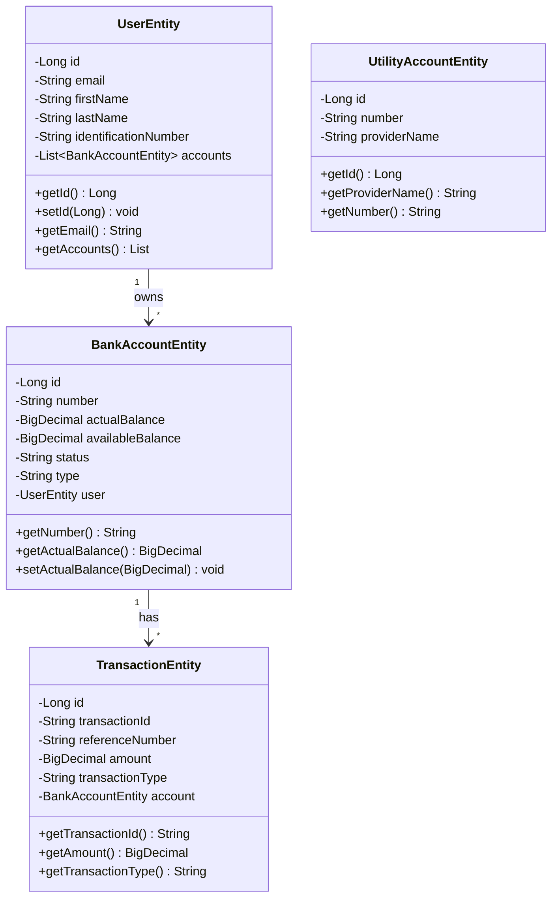

#### 2.3.2 Service Layer

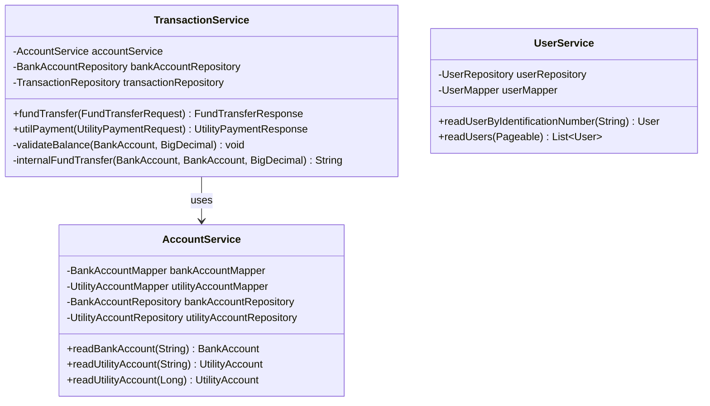

#### 2.3.3 Repository Layer

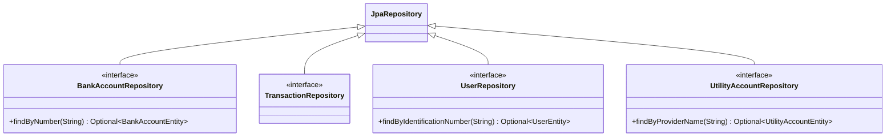

### 2.4 API Endpoints

#### 2.4.1 Account Controller

**Base Path**: `/api/v1/account`

##### GET /api/v1/account/read/{accountNumber}

**Description**: Retrieve bank account details by account number

**Request Parameters**:
- `accountNumber` (Path Variable): Account number as String

**Response**: `200 OK`
```json
{
  "id": 1,
  "number": "100015003000",
  "type": "SAVINGS_ACCOUNT",
  "status": "ACTIVE",
  "actualBalance": 100000.00,
  "availableBalance": 100000.00,
  "userId": 1
}
```

**Error Responses**:
- `404 NOT FOUND`: Account not found
```json
{
  "errorCode": "ENTITY_NOT_FOUND",
  "message": "Entity not found"
}
```

**Implementation**:
```java
@GetMapping("/read/{accountNumber}")
public BankAccount readAccountByNumber(@PathVariable("accountNumber") String accountNumber) {
    return accountService.readBankAccount(accountNumber);
}
```

##### GET /api/v1/account/util/read/{providerName}

**Description**: Retrieve utility account by provider name

**Request Parameters**:
- `providerName` (Path Variable): Utility provider name (e.g., "VODAFONE")

**Response**: `200 OK`
```json
{
  "id": 1,
  "number": "8203232565",
  "providerName": "VODAFONE"
}
```

#### 2.4.2 Transaction Controller

**Base Path**: `/api/v1/transaction`

##### POST /api/v1/transaction/fund-transfer

**Description**: Execute fund transfer between accounts

**Request Body**:
```json
{
  "fromAccount": "100015003000",
  "toAccount": "100015003001",
  "amount": 1000.00,
  "authId": "user-auth-id"
}
```

**Request Model** (`FundTransferRequest`):
| Field | Type | Required | Validation |
|-------|------|----------|------------|
| fromAccount | String | Yes | Not null |
| toAccount | String | Yes | Not null |
| amount | BigDecimal | Yes | Positive, non-zero |
| authId | String | No | - |

**Response**: `200 OK`
```json
{
  "message": "Transaction successfully completed",
  "transactionId": "550e8400-e29b-41d4-a716-446655440000"
}
```

**Error Responses**:
- `400 BAD REQUEST`: Insufficient funds
```json
{
  "errorCode": "INSUFFICIENT_FUNDS",
  "message": "Insufficient funds in the account 100015003000"
}
```
- `404 NOT FOUND`: Account not found
```json
{
  "errorCode": "ENTITY_NOT_FOUND",
  "message": "Entity not found"
}
```

**Implementation**:
```java
@PostMapping("/fund-transfer")
public FundTransferResponse fundTransfer(@RequestBody FundTransferRequest fundTransferRequest) {
    return transactionService.fundTransfer(fundTransferRequest);
}
```

**Business Logic** (TransactionService.fundTransfer):
1. Retrieve source account details
2. Retrieve destination account details
3. Validate source account balance (sufficient funds check)
4. Execute internal fund transfer:
   - Generate unique transaction ID (UUID)
   - Debit source account
   - Save debit transaction record (negative amount)
   - Credit destination account
   - Save credit transaction record (positive amount)
5. Return success response with transaction ID

**Transaction Management**: Method annotated with `@Transactional` ensures atomicity

##### POST /api/v1/transaction/utility-payment

**Description**: Process utility bill payment

**Request Body**:
```json
{
  "account": "100015003000",
  "providerId": "VODAFONE",
  "amount": 500.00,
  "referenceNumber": "BILL-2024-001"
}
```

**Request Model** (`UtilityPaymentRequest`):
| Field | Type | Required | Validation |
|-------|------|----------|------------|
| account | String | Yes | Not null |
| providerId | String | Yes | Not null |
| amount | BigDecimal | Yes | Positive, non-zero |
| referenceNumber | String | Yes | Not null |

**Response**: `200 OK`
```json
{
  "message": "Utility payment successfully completed",
  "transactionId": "660e8400-e29b-41d4-a716-446655440001"
}
```

**Business Logic** (TransactionService.utilPayment):
1. Generate unique transaction ID
2. Retrieve user account details
3. Validate account balance
4. Retrieve utility provider account details
5. Debit user account
6. Save transaction record with type UTILITY_PAYMENT
7. (Note: Integration with third-party payment provider would happen here)
8. Return success response

#### 2.4.3 User Controller

**Base Path**: `/api/v1/user`

##### GET /api/v1/user/read/{identification}

**Description**: Retrieve user details by identification number

**Request Parameters**:
- `identification` (Path Variable): User identification number

**Response**: `200 OK`
```json
{
  "id": 1,
  "email": "sam@gmail.com",
  "firstName": "Sam",
  "lastName": "Silva",
  "identificationNumber": "808829932V",
  "accounts": [
    {
      "id": 1,
      "number": "100015003000",
      "type": "SAVINGS_ACCOUNT",
      "status": "ACTIVE",
      "actualBalance": 100000.00,
      "availableBalance": 100000.00
    }
  ]
}
```

##### GET /api/v1/user/read

**Description**: List all users with pagination

**Request Parameters**:
- `page` (Query): Page number (default: 0)
- `size` (Query): Page size (default: 20)

**Response**: `200 OK`
```json
[
  {
    "id": 1,
    "email": "sam@gmail.com",
    "firstName": "Sam",
    "lastName": "Silva",
    "identificationNumber": "808829932V"
  }
]
```

### 2.5 Database Schema

#### 2.5.1 Tables

**Table: banking_core_user**
| Column | Type | Constraints | Description |
|--------|------|-------------|-------------|
| id | BIGINT(20) | PK, AUTO_INCREMENT | Primary key |
| email | VARCHAR(255) | - | User email address |
| first_name | VARCHAR(255) | - | First name |
| last_name | VARCHAR(255) | - | Last name |
| identification_number | VARCHAR(255) | - | National ID or similar |

**Table: banking_core_account**
| Column | Type | Constraints | Description |
|--------|------|-------------|-------------|
| id | BIGINT(20) | PK, AUTO_INCREMENT | Primary key |
| number | VARCHAR(255) | - | Account number |
| actual_balance | DECIMAL(19,2) | - | Actual balance |
| available_balance | DECIMAL(19,2) | - | Available balance |
| status | VARCHAR(255) | - | Account status (ACTIVE, INACTIVE, CLOSED) |
| type | VARCHAR(255) | - | Account type (SAVINGS_ACCOUNT, CHECKING) |
| user_id | BIGINT(20) | FK → banking_core_user(id) | Owner user ID |

**Table: banking_core_transaction**
| Column | Type | Constraints | Description |
|--------|------|-------------|-------------|
| id | BIGINT(20) | PK, AUTO_INCREMENT | Primary key |
| transaction_id | VARCHAR(50) | NOT NULL | Unique transaction identifier (UUID) |
| reference_number | VARCHAR(50) | NOT NULL | Reference number |
| amount | DECIMAL(19,2) | - | Transaction amount (negative for debit, positive for credit) |
| transaction_type | VARCHAR(30) | NOT NULL | Transaction type (FUND_TRANSFER, UTILITY_PAYMENT) |
| account_id | BIGINT(20) | FK → banking_core_account(id) | Associated account ID |

**Table: banking_core_utility_account**
| Column | Type | Constraints | Description |
|--------|------|-------------|-------------|
| id | BIGINT(20) | PK, AUTO_INCREMENT | Primary key |
| number | VARCHAR(255) | - | Utility account number |
| provider_name | VARCHAR(255) | - | Provider name (VODAFONE, VERIZON, etc.) |

#### 2.5.2 Flyway Migrations

**Migration Files Location**: `src/main/resources/db/migration/`

**V1.0.20210427174638__create_base_table_structure.sql**:
- Creates `banking_core_user` table
- Creates `banking_core_account` table with FK to user
- Creates `banking_core_utility_account` table

**V1.0.20210427174721__temp_data.sql**:
- Inserts sample users (4 users)
- Inserts sample accounts (14 accounts)
- Inserts sample utility accounts (6 providers)

**V1.0.20210429210839__create_transaction_table.sql**:
- Creates `banking_core_transaction` table with FK to account

**Migration Execution**: Automatic on application startup via Flyway

### 2.6 Entity-DTO Mapping

#### 2.6.1 BankAccountEntity to BankAccount DTO

**Mapper**: `BankAccountMapper`

**Conversion Logic**:
```java
@Component
public class BankAccountMapper extends BaseMapper<BankAccountEntity, BankAccount> {
    @Override
    public BankAccount convertToDto(BankAccountEntity entity) {
        BankAccount dto = new BankAccount();
        BeanUtils.copyProperties(entity, dto);
        return dto;
    }
    
    @Override
    public BankAccountEntity convertToEntity(BankAccount dto) {
        BankAccountEntity entity = new BankAccountEntity();
        BeanUtils.copyProperties(dto, entity);
        return entity;
    }
}
```

**Field Mapping**:
| Entity Field | DTO Field | Type | Notes |
|--------------|-----------|------|-------|
| id | id | Long | Primary key |
| number | number | String | Account number |
| actualBalance | actualBalance | BigDecimal | - |
| availableBalance | availableBalance | BigDecimal | - |
| status | status | String (Enum) | - |
| type | type | String (Enum) | - |
| user.id | userId | Long | FK reference |

### 2.7 Configuration

**Application Configuration** (`application.yml`):
```yaml
spring:
  application:
    name: core-banking-service
```

**Bootstrap Configuration** (`bootstrap.yml`):
```yaml
spring:
  cloud:
    config:
      uri: http://localhost:8090
```

**Centralized Configuration** (from Config Server):
- Database connection settings (URL, username, password)
- JPA/Hibernate properties
- Flyway migration settings
- Eureka client configuration
- Actuator endpoints configuration
- Logging levels

### 2.8 Service Dependencies

**External Dependencies**:
- MySQL database
- Spring Cloud Config Server (for configuration)
- Netflix Eureka (for service registration)
- Zipkin (for distributed tracing)

**Maven/Gradle Dependencies**:
- `spring-boot-starter-web`
- `spring-boot-starter-data-jpa`
- `spring-cloud-starter-netflix-eureka-client`
- `spring-cloud-starter-config`
- `spring-cloud-starter-sleuth`
- `spring-cloud-sleuth-zipkin`
- `flyway-core`
- `mysql-connector-java`
- `lombok`

---

## 3. User Service

### 3.1 Service Overview

**Service Name**: `internet-banking-user-service`  
**Spring Application Name**: `internet-banking-user-service`  
**Port**: Dynamic (assigned by Eureka)  
**Base Package**: `com.javatodev.finance`

**Responsibilities**:
- User registration with Keycloak integration
- User profile management
- User status updates (PENDING, APPROVED, REJECTED)
- Integration with Core Banking Service for user validation
- Keycloak Admin API integration for identity management

### 3.2 Package Structure

```
com.javatodev.finance
├── InternetBankingUserServiceApplication.java
├── controller/
│   └── UserController.java
├── service/
│   ├── UserService.java
│   ├── KeycloakUserService.java
│   └── rest/
│       └── BankingCoreRestClient.java (Feign client)
├── configuration/
│   ├── CustomFeignClientConfiguration.java
│   ├── CustomFeignErrorDecoder.java
│   ├── KeycloakManager.java
│   └── KeycloakProperties.java
├── model/
│   ├── entity/
│   │   └── UserEntity.java
│   ├── repository/
│   │   └── UserRepository.java
│   ├── dto/
│   │   ├── User.java
│   │   ├── UserUpdateRequest.java
│   │   └── Status.java (Enum)
│   ├── mapper/
│   │   ├── BaseMapper.java
│   │   └── UserMapper.java
│   └── rest/
│       └── response/
│           ├── AccountResponse.java
│           └── UserResponse.java
└── exception/
    ├── EntityNotFoundException.java
    ├── ErrorResponse.java
    ├── GlobalErrorCode.java
    ├── GlobalExceptionHandler.java
    ├── InvalidBankingUserException.java
    ├── InvalidEmailException.java
    ├── SimpleBankingGlobalException.java
    └── UserAlreadyRegisteredException.java
```

### 3.3 Class Diagrams

#### 3.3.1 Service Layer

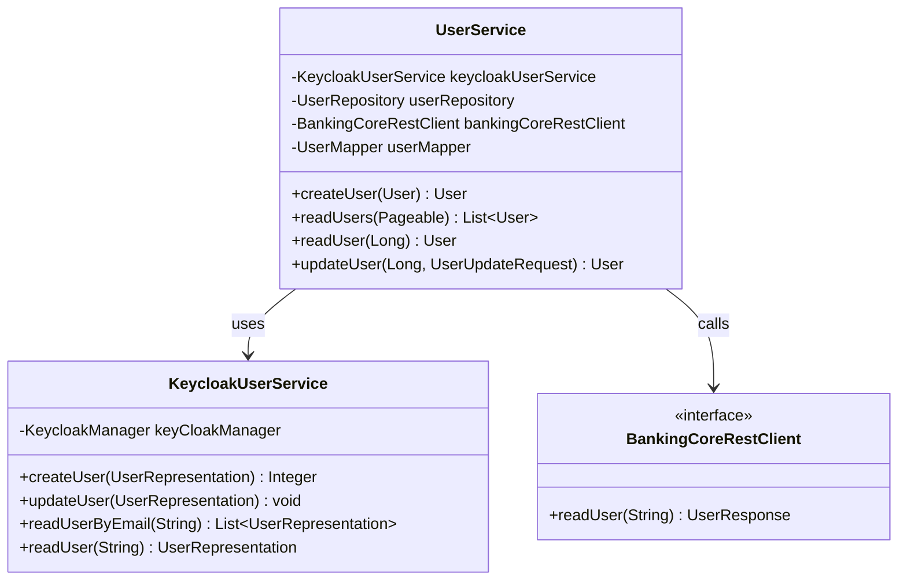

#### 3.3.2 Configuration Layer

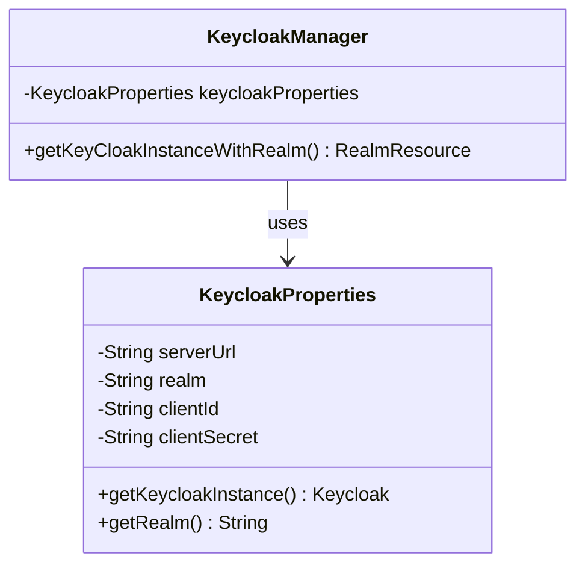

### 3.4 API Endpoints

#### 3.4.1 User Controller

**Base Path**: `/api/v1`

##### POST /api/v1/register

**Description**: Register a new user (Public endpoint - no authentication required)

**Request Body**:
```json
{
  "email": "john.doe@example.com",
  "identification": "901234567V",
  "password": "SecurePass123!"
}
```

**Request Model** (`User`):
| Field | Type | Required | Validation |
|-------|------|----------|------------|
| email | String | Yes | Valid email format |
| identification | String | Yes | Not null |
| password | String | Yes | Minimum 8 characters |

**Response**: `200 OK`
```json
{
  "id": 1,
  "email": "john.doe@example.com",
  "identification": "901234567V",
  "authId": "keycloak-user-id",
  "status": "PENDING"
}
```

**Error Responses**:
- `400 BAD REQUEST`: User already registered
```json
{
  "errorCode": "ERROR_EMAIL_REGISTERED",
  "message": "This email already registered as a user. Please check and retry."
}
```
- `400 BAD REQUEST`: Invalid email
```json
{
  "errorCode": "ERROR_INVALID_EMAIL",
  "message": "Incorrect email. Please check and retry."
}
```
- `404 NOT FOUND`: User not found in core banking system
```json
{
  "errorCode": "ERROR_USER_NOT_FOUND_UNDER_NIC",
  "message": "We couldn't find user under given identification. Please check and retry"
}
```

**Business Logic** (UserService.createUser):
1. Check if user already exists in Keycloak by email
2. Call Core Banking Service to validate user identification
3. Verify email matches between request and core banking record
4. Create user representation in Keycloak:
   - Set email and username
   - Set enabled = false (requires approval)
   - Set emailVerified = false
   - Set password credentials
5. Create user in Keycloak
6. Retrieve Keycloak user ID
7. Save user record locally with status = PENDING
8. Return user details

##### GET /api/v1/read

**Description**: List all users with pagination (Authenticated)

**Request Parameters**:
- `page` (Query): Page number (default: 0)
- `size` (Query): Page size (default: 20)

**Response**: `200 OK`
```json
[
  {
    "id": 1,
    "email": "john.doe@example.com",
    "identification": "901234567V",
    "status": "PENDING"
  }
]
```

##### GET /api/v1/read/{userId}

**Description**: Get user details by ID (Authenticated)

**Request Parameters**:
- `userId` (Path Variable): User ID

**Response**: `200 OK`
```json
{
  "id": 1,
  "email": "john.doe@example.com",
  "identification": "901234567V",
  "authId": "keycloak-user-id",
  "status": "PENDING"
}
```

##### PUT /api/v1/update/{userId}

**Description**: Update user status (Authenticated, Admin only)

**Request Parameters**:
- `userId` (Path Variable): User ID

**Request Body**:
```json
{
  "status": "APPROVED"
}
```

**Response**: `200 OK`
```json
{
  "id": 1,
  "email": "john.doe@example.com",
  "identification": "901234567V",
  "status": "APPROVED"
}
```

**Business Logic** (UserService.updateUser):
1. Retrieve user entity by ID
2. If status is being set to APPROVED:
   - Retrieve user from Keycloak
   - Set enabled = true
   - Set emailVerified = true
   - Update user in Keycloak
3. Update local user status
4. Save and return updated user

### 3.5 Keycloak Integration

#### 3.5.1 Keycloak Configuration

**KeycloakProperties** (ConfigurationProperties):
```java
@ConfigurationProperties(prefix = "keycloak")
public class KeycloakProperties {
    private String serverUrl;  // e.g., http://localhost:8080/auth
    private String realm;      // e.g., internet-banking
    private String clientId;   // e.g., user-service
    private String clientSecret;
}
```

**Keycloak Client Initialization**:
```java
public Keycloak getKeycloakInstance() {
    return KeycloakBuilder.builder()
        .serverUrl(serverUrl)
        .realm(realm)
        .grantType(OAuth2Constants.CLIENT_CREDENTIALS)
        .clientId(clientId)
        .clientSecret(clientSecret)
        .build();
}
```

#### 3.5.2 Keycloak Admin Operations

**Create User**:
```java
public Integer createUser(UserRepresentation userRepresentation) {
    Response response = keyCloakManager.getKeyCloakInstanceWithRealm()
        .users()
        .create(userRepresentation);
    return response.getStatus(); // 201 if successful
}
```

**Update User**:
```java
public void updateUser(UserRepresentation userRepresentation) {
    keyCloakManager.getKeyCloakInstanceWithRealm()
        .users()
        .get(userRepresentation.getId())
        .update(userRepresentation);
}
```

**Read User by Email**:
```java
public List<UserRepresentation> readUserByEmail(String email) {
    return keyCloakManager.getKeyCloakInstanceWithRealm()
        .users()
        .search(email);
}
```

### 3.6 Feign Client Configuration

#### 3.6.1 BankingCoreRestClient

**Interface Definition**:
```java
@FeignClient(name = "core-banking-service")
public interface BankingCoreRestClient {
    @GetMapping("/api/v1/user/read/{identification}")
    UserResponse readUser(@PathVariable("identification") String identification);
}
```

**Configuration**:
```java
@Configuration
public class CustomFeignClientConfiguration {
    @Bean
    public ErrorDecoder errorDecoder() {
        return new CustomFeignErrorDecoder();
    }
}
```

**Custom Error Decoder**:
```java
public class CustomFeignErrorDecoder implements ErrorDecoder {
    @Override
    public Exception decode(String methodKey, Response response) {
        switch (response.status()) {
            case 404:
                return new EntityNotFoundException("Resource not found");
            case 400:
                // Parse response body and extract error details
                return new SimpleBankingGlobalException("Bad request", "ERROR_CODE");
            default:
                return new Exception("Generic error");
        }
    }
}
```

### 3.7 Database Schema

**Table: user** (User Service database)
| Column | Type | Constraints | Description |
|--------|------|-------------|-------------|
| id | BIGINT(20) | PK, AUTO_INCREMENT | Primary key |
| auth_id | VARCHAR(255) | - | Keycloak user ID |
| identification | VARCHAR(255) | - | National ID |
| status | VARCHAR(50) | - | User status (PENDING, APPROVED, REJECTED) |

**Entity Mapping** (`UserEntity`):
```java
@Entity
@Table(name = "user")
public class UserEntity {
    @Id
    @GeneratedValue(strategy = GenerationType.IDENTITY)
    private Long id;
    
    private String authId;      // Keycloak user ID
    private String identification;
    
    @Enumerated(EnumType.STRING)
    private Status status;
}
```

### 3.8 Exception Handling

**Custom Exceptions**:
- `UserAlreadyRegisteredException`: User email already exists
- `InvalidEmailException`: Email doesn't match core banking record
- `InvalidBankingUserException`: User not found in core banking
- `EntityNotFoundException`: Generic entity not found

**Error Codes** (`GlobalErrorCode`):
```java
public class GlobalErrorCode {
    public static final String ERROR_EMAIL_REGISTERED = "ERROR_EMAIL_REGISTERED";
    public static final String ERROR_INVALID_EMAIL = "ERROR_INVALID_EMAIL";
    public static final String ERROR_USER_NOT_FOUND_UNDER_NIC = "ERROR_USER_NOT_FOUND_UNDER_NIC";
    public static final String ERROR_ENTITY_NOT_FOUND = "ERROR_ENTITY_NOT_FOUND";
}
```

---

## 4. Fund Transfer Service

### 4.1 Service Overview

**Service Name**: `internet-banking-fund-transfer-service`  
**Spring Application Name**: `internet-banking-fund-transfer-service`  
**Port**: Dynamic (assigned by Eureka)  
**Base Package**: `com.javatodev.finance`

**Responsibilities**:
- Initiate fund transfer requests
- Track fund transfer transactions
- Manage transaction status lifecycle
- Integrate with Core Banking Service via Feign for actual transfer execution
- Provide transfer history with pagination

### 4.2 Package Structure

```
com.javatodev.finance
├── InternetBankingFundTransferServiceApplication.java
├── controller/
│   └── FundTransferController.java
├── service/
│   ├── FundTransferService.java
│   └── rest/
│       └── client/
│           └── BankingCoreFeignClient.java
├── configuration/
│   └── CustomFeignClientConfiguration.java
├── model/
│   ├── entity/
│   │   └── FundTransferEntity.java
│   ├── repository/
│   │   └── FundTransferRepository.java
│   ├── dto/
│   │   ├── FundTransfer.java
│   │   ├── request/
│   │   │   └── FundTransferRequest.java
│   │   └── response/
│   │       ├── AccountResponse.java
│   │       └── FundTransferResponse.java
│   ├── mapper/
│   │   ├── BaseMapper.java
│   │   └── FundTransferMapper.java
│   └── TransactionStatus.java (Enum)
└── exception/
    ├── ErrorResponse.java
    ├── GlobalExceptionHandler.java
    └── SimpleBankingGlobalException.java
```

### 4.3 Class Diagrams

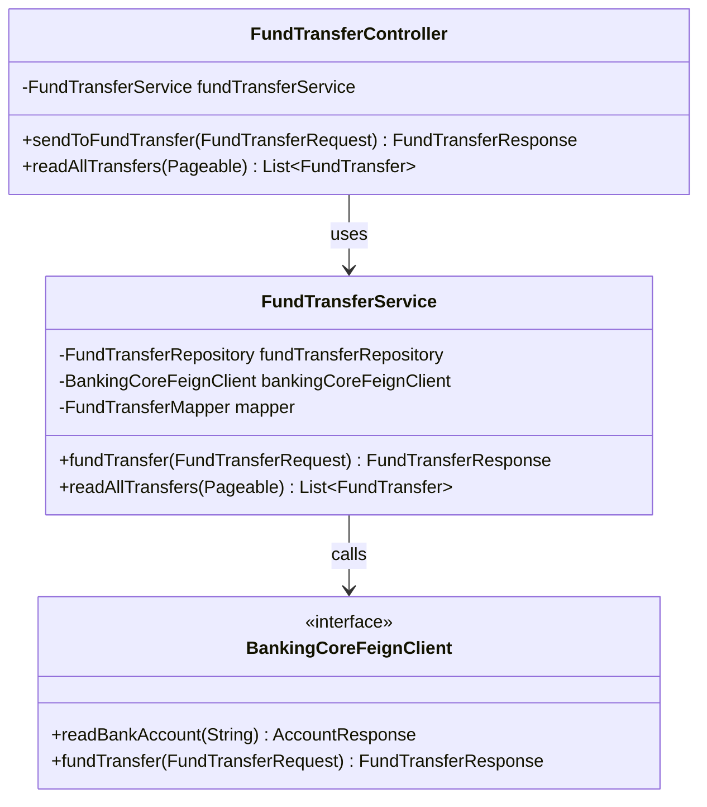

### 4.4 API Endpoints

#### 4.4.1 Fund Transfer Controller

**Base Path**: `/api/v1`

##### POST /api/v1/transfer

**Description**: Initiate a fund transfer (Authenticated)

**Request Body**:
```json
{
  "fromAccount": "100015003000",
  "toAccount": "100015003001",
  "amount": 5000.00,
  "authId": "user-auth-id"
}
```

**Request Model** (`FundTransferRequest`):
| Field | Type | Required | Validation |
|-------|------|----------|------------|
| fromAccount | String | Yes | Not null |
| toAccount | String | Yes | Not null |
| amount | BigDecimal | Yes | Positive, > 0 |
| authId | String | No | - |

**Response**: `200 OK`
```json
{
  "message": "Fund Transfer Successfully Completed",
  "transactionId": "550e8400-e29b-41d4-a716-446655440000"
}
```

**Error Responses**:
- `400 BAD REQUEST`: Insufficient funds or invalid accounts
- `500 INTERNAL SERVER ERROR`: Core banking service unavailable

**Implementation**:
```java
@PostMapping("/transfer")
public FundTransferResponse sendToFundTransfer(@RequestBody FundTransferRequest fundTransferRequest) {
    return fundTransferService.fundTransfer(fundTransferRequest);
}
```

**Business Logic** (FundTransferService.fundTransfer):
1. Create local fund transfer entity from request
2. Set status = PENDING
3. Save fund transfer entity to database
4. Call Core Banking Service via Feign client to execute transfer
5. Update local entity with transaction reference from Core Banking
6. Set status = SUCCESS
7. Save updated entity
8. Return success response with transaction ID

**Transaction Flow**:
```
Fund Transfer Service                Core Banking Service
         |                                     |
         |  1. Create local record (PENDING)  |
         |------------------------------------>|
         |                                     |
         |  2. Call /transaction/fund-transfer |
         |------------------------------------>|
         |                                     |
         |     3. Execute transfer             |
         |        (debit source, credit dest)  |
         |                                     |
         |  4. Return transaction ID           |
         |<------------------------------------|
         |                                     |
         |  5. Update local record (SUCCESS)   |
         |                                     |
```

##### GET /api/v1/transfer

**Description**: List all fund transfers with pagination (Authenticated)

**Request Parameters**:
- `page` (Query): Page number (default: 0)
- `size` (Query): Page size (default: 20)

**Response**: `200 OK`
```json
[
  {
    "id": 1,
    "fromAccount": "100015003000",
    "toAccount": "100015003001",
    "amount": 5000.00,
    "status": "SUCCESS",
    "transactionReference": "550e8400-e29b-41d4-a716-446655440000"
  }
]
```

### 4.5 Database Schema

**Table: fund_transfer** (Fund Transfer Service database)
| Column | Type | Constraints | Description |
|--------|------|-------------|-------------|
| id | BIGINT(20) | PK, AUTO_INCREMENT | Primary key |
| from_account | VARCHAR(255) | - | Source account number |
| to_account | VARCHAR(255) | - | Destination account number |
| amount | DECIMAL(19,2) | - | Transfer amount |
| status | VARCHAR(50) | - | Transaction status (PENDING, SUCCESS, FAILED) |
| transaction_reference | VARCHAR(255) | - | Transaction ID from Core Banking |
| auth_id | VARCHAR(255) | - | User authentication ID |

**Entity Mapping** (`FundTransferEntity`):
```java
@Entity
@Table(name = "fund_transfer")
public class FundTransferEntity {
    @Id
    @GeneratedValue(strategy = GenerationType.IDENTITY)
    private Long id;
    
    private String fromAccount;
    private String toAccount;
    private BigDecimal amount;
    
    @Enumerated(EnumType.STRING)
    private TransactionStatus status;
    
    private String transactionReference;
    private String authId;
}
```

### 4.6 Feign Client Details

**BankingCoreFeignClient Interface**:
```java
@FeignClient(name = "core-banking-service")
public interface BankingCoreFeignClient {
    
    @GetMapping("/api/v1/account/read/{accountNumber}")
    AccountResponse readBankAccount(@PathVariable("accountNumber") String accountNumber);
    
    @PostMapping("/api/v1/transaction/fund-transfer")
    FundTransferResponse fundTransfer(@RequestBody FundTransferRequest request);
}
```

**Feign Configuration**:
```java
@Configuration
public class CustomFeignClientConfiguration {
    @Bean
    Logger.Level feignLoggerLevel() {
        return Logger.Level.FULL; // Log all request/response details
    }
}
```

**Service Discovery Integration**:
- Feign client resolves `core-banking-service` via Eureka
- Automatic load balancing across available instances
- Ribbon client-side load balancing (default)

### 4.7 Transaction Status Enum

```java
public enum TransactionStatus {
    PENDING,
    PROCESSING,
    SUCCESS,
    FAILED
}
```

---

## 5. Utility Payment Service

### 5.1 Service Overview

**Service Name**: `internet-banking-utility-payment-service`  
**Spring Application Name**: `internet-banking-utility-payment-service`  
**Port**: Dynamic (assigned by Eureka)  
**Base Package**: `com.javatodev.finance`

**Responsibilities**:
- Process utility bill payments
- Track payment transactions
- Manage payment status lifecycle
- Integrate with Core Banking Service for payment execution
- Provide payment history with pagination

### 5.2 Package Structure

```
com.javatodev.finance
├── InternetBankingUtilityPaymentServiceApplication.java
├── controller/
│   └── UtilityPaymentController.java
├── service/
│   ├── UtilityPaymentService.java
│   └── rest/
│       └── BankingCoreRestClient.java
├── configuration/
│   └── CustomFeignClientConfiguration.java
├── repository/
│   └── UtilityPaymentRepository.java
├── model/
│   ├── entity/
│   │   └── UtilityPaymentEntity.java
│   ├── dto/
│   │   └── UtilityPayment.java
│   ├── rest/
│   │   ├── request/
│   │   │   └── UtilityPaymentRequest.java
│   │   └── response/
│   │       ├── AccountResponse.java
│   │       └── UtilityPaymentResponse.java
│   ├── mapper/
│   │   ├── BaseMapper.java
│   │   └── UtilityPaymentMapper.java
│   └── TransactionStatus.java (Enum)
└── exception/
    ├── ErrorResponse.java
    ├── GlobalExceptionHandler.java
    └── SimpleBankingGlobalException.java
```

### 5.3 API Endpoints

#### 5.3.1 Utility Payment Controller

**Base Path**: `/api/v1`

##### POST /api/v1/payment

**Description**: Process utility payment (Authenticated)

**Request Body**:
```json
{
  "account": "100015003000",
  "providerId": "VODAFONE",
  "amount": 1500.00,
  "referenceNumber": "BILL-2024-12345"
}
```

**Request Model** (`UtilityPaymentRequest`):
| Field | Type | Required | Validation |
|-------|------|----------|------------|
| account | String | Yes | Not null |
| providerId | String | Yes | Not null |
| amount | BigDecimal | Yes | Positive, > 0 |
| referenceNumber | String | Yes | Not null |

**Response**: `200 OK`
```json
{
  "message": "Utility Payment Successfully Processed",
  "transactionId": "660e8400-e29b-41d4-a716-446655440001"
}
```

**Business Logic** (UtilityPaymentService.utilPayment):
1. Create local utility payment entity from request
2. Set status = PROCESSING
3. Save payment entity to database
4. Call Core Banking Service to process payment
5. Update local entity with transaction ID from Core Banking
6. Set status = SUCCESS
7. Save updated entity
8. Return success response

##### GET /api/v1/payment

**Description**: List all utility payments with pagination (Authenticated)

**Request Parameters**:
- `page` (Query): Page number (default: 0)
- `size` (Query): Page size (default: 20)

**Response**: `200 OK`
```json
[
  {
    "id": 1,
    "account": "100015003000",
    "providerId": "VODAFONE",
    "amount": 1500.00,
    "referenceNumber": "BILL-2024-12345",
    "status": "SUCCESS",
    "transactionId": "660e8400-e29b-41d4-a716-446655440001"
  }
]
```

### 5.4 Database Schema

**Table: utility_payment** (Utility Payment Service database)
| Column | Type | Constraints | Description |
|--------|------|-------------|-------------|
| id | BIGINT(20) | PK, AUTO_INCREMENT | Primary key |
| account | VARCHAR(255) | - | User account number |
| provider_id | VARCHAR(255) | - | Utility provider name |
| amount | DECIMAL(19,2) | - | Payment amount |
| reference_number | VARCHAR(255) | - | Bill reference number |
| status | VARCHAR(50) | - | Payment status |
| transaction_id | VARCHAR(255) | - | Transaction ID from Core Banking |

**Entity Mapping** (`UtilityPaymentEntity`):
```java
@Entity
@Table(name = "utility_payment")
public class UtilityPaymentEntity {
    @Id
    @GeneratedValue(strategy = GenerationType.IDENTITY)
    private Long id;
    
    private String account;
    private String providerId;
    private BigDecimal amount;
    private String referenceNumber;
    
    @Enumerated(EnumType.STRING)
    private TransactionStatus status;
    
    private String transactionId;
}
```

### 5.5 Feign Client Details

**BankingCoreRestClient Interface**:
```java
@FeignClient(name = "core-banking-service")
public interface BankingCoreRestClient {
    
    @GetMapping("/api/v1/account/read/{accountNumber}")
    AccountResponse readBankAccount(@PathVariable("accountNumber") String accountNumber);
    
    @PostMapping("/api/v1/transaction/utility-payment")
    UtilityPaymentResponse utilityPayment(@RequestBody UtilityPaymentRequest request);
}
```

---

## 6. API Gateway

### 6.1 Service Overview

**Service Name**: `internet-banking-api-gateway`  
**Spring Application Name**: `internet-banking-api-gateway`  
**Port**: 8080 (default)  
**Base Package**: `com.javatodev.finance`

**Responsibilities**:
- Single entry point for all client requests
- Route requests to appropriate microservices
- OAuth2 authentication and authorization
- JWT token validation
- Token propagation via custom header (X-Auth-Id)
- CORS handling
- Rate limiting (configurable)

### 6.2 Package Structure

```
com.javatodev.finance
├── InternetBankingApiGatewayApplication.java
└── configuration/
    ├── GatewayConfiguration.java
    └── security/
        └── SecurityConfiguration.java
```

### 6.3 Routing Configuration

**Routing Rules** (Configured in Config Server):

| Path Pattern | Target Service | Description |
|--------------|----------------|-------------|
| `/user/api/**` | internet-banking-user-service | User management endpoints |
| `/account/api/**` | core-banking-service | Account operations |
| `/transaction/api/**` | core-banking-service | Transaction operations |
| `/transfer/api/**` | internet-banking-fund-transfer-service | Fund transfers |
| `/payment/api/**` | internet-banking-utility-payment-service | Utility payments |

**Service Discovery Integration**:
- Gateway discovers service instances from Eureka
- Load balancing across multiple instances
- Health-based routing

### 6.4 Security Configuration

#### 6.4.1 OAuth2 Resource Server Setup

**SecurityConfiguration**:
```java
@EnableWebFluxSecurity
public class SecurityConfiguration {
    
    @Bean
    public SecurityWebFilterChain springSecurityFilterChain(ServerHttpSecurity http) {
        http
            .authorizeExchange()
                .pathMatchers("/user/api/v1/register").permitAll()  // Public endpoint
                .anyExchange().authenticated()  // All other endpoints require authentication
            .and()
            .oauth2Login()  // Enable OAuth2 login
            .and()
            .oauth2ResourceServer()
                .jwt();  // Validate JWT tokens
        
        http.csrf().disable();  // Disable CSRF for REST API
        
        return http.build();
    }
}
```

**Public Endpoints**:
- `/user/api/v1/register`: User registration (no authentication required)

**Protected Endpoints**:
- All other endpoints require valid JWT token in Authorization header

#### 6.4.2 Token Propagation

**Custom Global Filter**:
```java
@Configuration
public class GatewayConfiguration {
    
    @Bean
    public GlobalFilter customGlobalFilter() {
        return (exchange, chain) -> exchange.getPrincipal()
            .map(principal -> {
                String userName = "";
                if (principal instanceof JwtAuthenticationToken) {
                    JwtAuthenticationToken token = (JwtAuthenticationToken) principal;
                    userName = token.getName();
                }
                
                // Add X-Auth-Id header to downstream requests
                ServerHttpRequest request = exchange.getRequest()
                    .mutate()
                    .header("X-Auth-Id", userName)
                    .build();
                
                return exchange.mutate().request(request).build();
            })
            .flatMap(chain::filter);
    }
}
```

**Token Propagation Flow**:
1. Client sends request with `Authorization: Bearer <JWT>`
2. Gateway validates JWT token
3. Gateway extracts username from token
4. Gateway adds `X-Auth-Id: <username>` header
5. Request forwarded to downstream service with both headers

### 6.5 OAuth2 Configuration

**JWT Token Validation** (from Config Server):
```yaml
spring:
  security:
    oauth2:
      resourceserver:
        jwt:
          issuer-uri: http://localhost:8080/auth/realms/internet-banking
          jwk-set-uri: http://localhost:8080/auth/realms/internet-banking/protocol/openid-connect/certs
```

**Keycloak Integration**:
- Token issuer: Keycloak server
- Token validation: JWT signature verification
- Claims extraction: Username, roles, authorities

### 6.6 Configuration

**Application Configuration** (`application.yml`):
```yaml
spring:
  application:
    name: internet-banking-api-gateway
```

**Bootstrap Configuration** (`bootstrap.yml`):
```yaml
spring:
  cloud:
    config:
      uri: http://localhost:8090
```

**Centralized Configuration** (from Config Server):
- Server port (8080)
- Eureka client settings
- Route definitions
- OAuth2 resource server settings
- CORS configuration
- Timeout settings
- Retry policies

---

## 7. Service Registry (Eureka)

### 7.1 Service Overview

**Service Name**: `internet-banking-service-registry`  
**Spring Application Name**: `internet-banking-service-registry`  
**Port**: 8081  
**Base Package**: `com.javatodev.finance`

**Responsibilities**:
- Service registration and discovery
- Health monitoring of registered services
- Service instance metadata management
- Load balancing support for clients

### 7.2 Configuration

**Application Configuration** (`application.yml`):
```yaml
server:
  port: 8081

eureka:
  client:
    service-url:
      defaultZone: http://localhost:8081/eureka
    register-with-eureka: false  # Standalone mode
    fetch-registry: false
  instance:
    prefer-ip-address: true
    hostname: localhost
```

**Application Class**:
```java
@SpringBootApplication
@EnableEurekaServer
public class InternetBankingServiceRegistryApplication {
    public static void main(String[] args) {
        SpringApplication.run(InternetBankingServiceRegistryApplication.class, args);
    }
}
```

### 7.3 Client Configuration

**Eureka Client Setup** (in each microservice from Config Server):
```yaml
eureka:
  client:
    service-url:
      defaultZone: http://localhost:8081/eureka
    register-with-eureka: true
    fetch-registry: true
  instance:
    prefer-ip-address: true
    lease-renewal-interval-in-seconds: 30
    lease-expiration-duration-in-seconds: 90
```

### 7.4 Service Registration

**Registered Services**:
- `core-banking-service`
- `internet-banking-user-service`
- `internet-banking-fund-transfer-service`
- `internet-banking-utility-payment-service`
- `internet-banking-api-gateway`

**Instance Metadata**:
- Service name
- Instance ID
- Host and port
- Health check URL
- Status (UP, DOWN, OUT_OF_SERVICE)

### 7.5 Eureka Dashboard

**Access URL**: `http://localhost:8081`

**Dashboard Features**:
- List of registered services
- Instance status
- Health indicators
- Metadata information

---

## 8. Configuration Server

### 8.1 Service Overview

**Service Name**: `internet-banking-config-server`  
**Spring Application Name**: `internet-banking-config-server`  
**Port**: 8090  
**Base Package**: `com.javatodev.finance`

**Responsibilities**:
- Centralized configuration management
- Environment-specific configurations
- Git-backed configuration storage
- Dynamic configuration refresh

### 8.2 Configuration

**Application Configuration** (`application.yml`):
```yaml
server:
  port: 8090

spring:
  cloud:
    config:
      server:
        git:
          uri: https://github.com/javatodev/internet-banking-configurations.git
          search-paths: configuration
          default-label: main
```

**Application Class**:
```java
@SpringBootApplication
@EnableConfigServer
public class InternetBankingConfigServerApplication {
    public static void main(String[] args) {
        SpringApplication.run(InternetBankingConfigServerApplication.class, args);
    }
}
```

### 8.3 Configuration Repository Structure

**Git Repository Layout**:
```
internet-banking-configurations/
└── configuration/
    ├── application.yml (Common config)
    ├── core-banking-service.yml
    ├── core-banking-service-dev.yml
    ├── core-banking-service-prod.yml
    ├── internet-banking-user-service.yml
    ├── internet-banking-fund-transfer-service.yml
    ├── internet-banking-utility-payment-service.yml
    ├── internet-banking-api-gateway.yml
    └── internet-banking-api-gateway-prod.yml
```

### 8.4 Configuration Properties

#### 8.4.1 Core Banking Service Configuration

**core-banking-service.yml**:
```yaml
server:
  port: ${PORT:0}  # Dynamic port assignment

spring:
  datasource:
    url: jdbc:mysql://localhost:3306/banking_core_service
    username: ${DB_USERNAME:root}
    password: ${DB_PASSWORD:password}
    driver-class-name: com.mysql.cj.jdbc.Driver
  
  jpa:
    hibernate:
      ddl-auto: validate
    show-sql: false
    properties:
      hibernate:
        dialect: org.hibernate.dialect.MySQL8Dialect
        format_sql: true
  
  flyway:
    enabled: true
    baseline-on-migrate: true
    locations: classpath:db/migration

eureka:
  client:
    service-url:
      defaultZone: http://localhost:8081/eureka
  instance:
    prefer-ip-address: true
    instance-id: ${spring.application.name}:${random.uuid}

management:
  endpoints:
    web:
      exposure:
        include: health,info,metrics,prometheus
  metrics:
    export:
      prometheus:
        enabled: true

logging:
  level:
    com.javatodev: DEBUG
    org.springframework: INFO
    org.hibernate: INFO
```

#### 8.4.2 API Gateway Configuration

**internet-banking-api-gateway.yml**:
```yaml
server:
  port: 8080

spring:
  security:
    oauth2:
      resourceserver:
        jwt:
          issuer-uri: ${KEYCLOAK_ISSUER_URI:http://localhost:8080/auth/realms/internet-banking}
          jwk-set-uri: ${KEYCLOAK_JWK_URI:http://localhost:8080/auth/realms/internet-banking/protocol/openid-connect/certs}
  
  cloud:
    gateway:
      routes:
        - id: user-service
          uri: lb://internet-banking-user-service
          predicates:
            - Path=/user/api/**
          filters:
            - StripPrefix=0
        
        - id: core-banking-account
          uri: lb://core-banking-service
          predicates:
            - Path=/account/api/**
          filters:
            - StripPrefix=0
        
        - id: core-banking-transaction
          uri: lb://core-banking-service
          predicates:
            - Path=/transaction/api/**
          filters:
            - StripPrefix=0
        
        - id: fund-transfer-service
          uri: lb://internet-banking-fund-transfer-service
          predicates:
            - Path=/transfer/api/**
          filters:
            - StripPrefix=0
        
        - id: utility-payment-service
          uri: lb://internet-banking-utility-payment-service
          predicates:
            - Path=/payment/api/**
          filters:
            - StripPrefix=0
      
      default-filters:
        - DedupeResponseHeader=Access-Control-Allow-Credentials Access-Control-Allow-Origin

eureka:
  client:
    service-url:
      defaultZone: http://localhost:8081/eureka
```

#### 8.4.3 User Service Configuration

**internet-banking-user-service.yml**:
```yaml
spring:
  datasource:
    url: jdbc:mysql://localhost:3306/user_service
    username: ${DB_USERNAME:root}
    password: ${DB_PASSWORD:password}
  
  jpa:
    hibernate:
      ddl-auto: update
    show-sql: false

keycloak:
  server-url: ${KEYCLOAK_SERVER_URL:http://localhost:8080/auth}
  realm: ${KEYCLOAK_REALM:internet-banking}
  client-id: ${KEYCLOAK_CLIENT_ID:user-service}
  client-secret: ${KEYCLOAK_CLIENT_SECRET:secret}

feign:
  client:
    config:
      default:
        connectTimeout: 5000
        readTimeout: 10000
        loggerLevel: full

eureka:
  client:
    service-url:
      defaultZone: http://localhost:8081/eureka
```

### 8.5 Configuration Refresh

**Refresh Endpoint**: `/actuator/refresh`

**Usage**:
```bash
curl -X POST http://localhost:<service-port>/actuator/refresh
```

**Refresh Scope**:
- Add `@RefreshScope` annotation to beans that need dynamic refresh
- Configuration changes can be applied without service restart

---

## 9. Database Schema Details

### 9.1 Core Banking Database

**Database Name**: `banking_core_service`

#### 9.1.1 Entity-Relationship Diagram

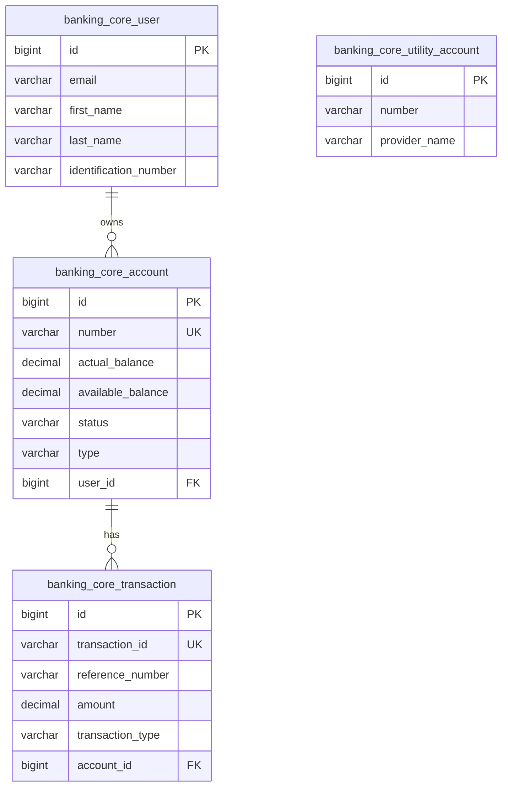

#### 9.1.2 Table Constraints and Indexes

**banking_core_account**:
- Primary Key: `id`
- Foreign Key: `user_id` → `banking_core_user(id)`
- Index: `FKt5uqy9p0v3rp3yhlgvm7ep0ij` on `user_id`
- Recommended Index: `idx_account_number` on `number` (for faster lookups)

**banking_core_transaction**:
- Primary Key: `id`
- Foreign Key: `account_id` → `banking_core_account(id)`
- Index: `FKk9w2ogq595jbe8r2due7vv3xr` on `account_id`
- Recommended Index: `idx_transaction_id` on `transaction_id` (for unique lookups)
- Recommended Index: `idx_account_type` on `(account_id, transaction_type)` (for queries)

### 9.2 User Service Database

**Database Name**: `user_service`

**Table: user**:
| Column | Type | Constraints | Description |
|--------|------|-------------|-------------|
| id | BIGINT(20) | PK, AUTO_INCREMENT | Primary key |
| auth_id | VARCHAR(255) | - | Keycloak user ID |
| identification | VARCHAR(255) | - | National ID |
| status | VARCHAR(50) | - | PENDING, APPROVED, REJECTED |

**Recommended Indexes**:
- `idx_auth_id` on `auth_id` (for Keycloak lookups)
- `idx_identification` on `identification` (for user searches)

### 9.3 Fund Transfer Service Database

**Database Name**: `fund_transfer_service`

**Table: fund_transfer**:
| Column | Type | Constraints | Description |
|--------|------|-------------|-------------|
| id | BIGINT(20) | PK, AUTO_INCREMENT | Primary key |
| from_account | VARCHAR(255) | - | Source account |
| to_account | VARCHAR(255) | - | Destination account |
| amount | DECIMAL(19,2) | - | Transfer amount |
| status | VARCHAR(50) | - | PENDING, SUCCESS, FAILED |
| transaction_reference | VARCHAR(255) | - | Core Banking transaction ID |
| auth_id | VARCHAR(255) | - | User auth ID |

**Recommended Indexes**:
- `idx_status` on `status` (for filtering by status)
- `idx_from_account` on `from_account` (for user transfer history)
- `idx_transaction_reference` on `transaction_reference` (for lookups)

### 9.4 Utility Payment Service Database

**Database Name**: `utility_payment_service`

**Table: utility_payment**:
| Column | Type | Constraints | Description |
|--------|------|-------------|-------------|
| id | BIGINT(20) | PK, AUTO_INCREMENT | Primary key |
| account | VARCHAR(255) | - | User account |
| provider_id | VARCHAR(255) | - | Provider name |
| amount | DECIMAL(19,2) | - | Payment amount |
| reference_number | VARCHAR(255) | - | Bill reference |
| status | VARCHAR(50) | - | Payment status |
| transaction_id | VARCHAR(255) | - | Core Banking transaction ID |

**Recommended Indexes**:
- `idx_account` on `account` (for user payment history)
- `idx_reference_number` on `reference_number` (for bill tracking)
- `idx_transaction_id` on `transaction_id` (for lookups)

### 9.5 JPA Entity Annotations

#### 9.5.1 Example: BankAccountEntity

```java
@Entity
@Table(name = "banking_core_account")
@Data
@NoArgsConstructor
@AllArgsConstructor
public class BankAccountEntity {
    
    @Id
    @GeneratedValue(strategy = GenerationType.IDENTITY)
    private Long id;
    
    @Column(name = "number")
    private String number;
    
    @Column(name = "actual_balance", precision = 19, scale = 2)
    private BigDecimal actualBalance;
    
    @Column(name = "available_balance", precision = 19, scale = 2)
    private BigDecimal availableBalance;
    
    @Column(name = "status")
    @Enumerated(EnumType.STRING)
    private AccountStatus status;
    
    @Column(name = "type")
    @Enumerated(EnumType.STRING)
    private AccountType type;
    
    @ManyToOne(fetch = FetchType.LAZY)
    @JoinColumn(name = "user_id", referencedColumnName = "id")
    private UserEntity user;
    
    @OneToMany(mappedBy = "account", cascade = CascadeType.ALL, orphanRemoval = true)
    private List<TransactionEntity> transactions = new ArrayList<>();
}
```

**Key Annotations**:
- `@Entity`: Marks class as JPA entity
- `@Table`: Specifies table name
- `@Id`: Marks primary key field
- `@GeneratedValue`: Auto-increment strategy
- `@Column`: Specifies column properties
- `@Enumerated(EnumType.STRING)`: Store enum as string
- `@ManyToOne`: Many accounts belong to one user
- `@OneToMany`: One account has many transactions
- `@JoinColumn`: Specifies foreign key column

### 9.6 Flyway Migration Best Practices

**Naming Convention**: `V<version>__<description>.sql`
- Example: `V1.0.20210427174638__create_base_table_structure.sql`

**Best Practices**:
1. Never modify existing migrations
2. Always use new migrations for schema changes
3. Test migrations on staging before production
4. Keep migrations idempotent where possible
5. Use descriptive names
6. Include rollback scripts for production migrations

**Migration Execution Order**:
1. Flyway reads all migration files
2. Checks `flyway_schema_history` table
3. Executes pending migrations in version order
4. Records successful migrations in history table

---

## 10. Inter-Service Communication

### 10.1 Communication Patterns

#### 10.1.1 Synchronous Communication (REST/Feign)

**Current Implementation**:
- Fund Transfer Service → Core Banking Service
- Utility Payment Service → Core Banking Service
- User Service → Core Banking Service

**Technology**: OpenFeign (declarative REST client)

**Advantages**:
- Simple request-response model
- Immediate consistency
- Easy to debug

**Disadvantages**:
- Tight coupling
- Cascading failures risk
- Increased latency

#### 10.1.2 Asynchronous Communication (Planned)

**Future Implementation**: RabbitMQ for event-driven patterns

**Use Cases**:
- Transaction notifications
- Email/SMS notifications
- Audit event publishing
- Analytics event streaming

### 10.2 Feign Client Configuration

#### 10.2.1 Standard Feign Client

**Declaration**:
```java
@FeignClient(name = "core-banking-service")
public interface BankingCoreFeignClient {
    
    @GetMapping("/api/v1/account/read/{accountNumber}")
    AccountResponse readBankAccount(@PathVariable("accountNumber") String accountNumber);
    
    @PostMapping("/api/v1/transaction/fund-transfer")
    FundTransferResponse fundTransfer(@RequestBody FundTransferRequest request);
}
```

**Configuration Properties**:
```yaml
feign:
  client:
    config:
      default:
        connectTimeout: 5000      # 5 seconds
        readTimeout: 10000        # 10 seconds
        loggerLevel: full         # NONE, BASIC, HEADERS, FULL
        errorDecoder: com.javatodev.finance.configuration.CustomFeignErrorDecoder
        requestInterceptors:
          - com.javatodev.finance.configuration.FeignRequestInterceptor
```

#### 10.2.2 Service Discovery Integration

**Feign + Eureka Integration**:
1. Feign client references service by name (e.g., `core-banking-service`)
2. Spring Cloud LoadBalancer queries Eureka for instances
3. Load balancer selects instance (round-robin by default)
4. Request sent to selected instance
5. Automatic retry on failure (configurable)

**Load Balancing Strategies**:
- **Round Robin** (default): Distribute requests evenly
- **Random**: Select random instance
- **Weighted Response Time**: Favor faster instances

#### 10.2.3 Error Handling

**Custom Error Decoder**:
```java
public class CustomFeignErrorDecoder implements ErrorDecoder {
    
    private final ErrorDecoder defaultErrorDecoder = new Default();
    
    @Override
    public Exception decode(String methodKey, Response response) {
        switch (response.status()) {
            case 400:
                return new SimpleBankingGlobalException("Bad Request", "BAD_REQUEST");
            case 404:
                return new EntityNotFoundException("Resource not found");
            case 500:
                return new SimpleBankingGlobalException("Internal Server Error", "INTERNAL_ERROR");
            default:
                return defaultErrorDecoder.decode(methodKey, response);
        }
    }
}
```

**Retry Configuration** (Planned):
```yaml
feign:
  client:
    config:
      default:
        retryer: com.javatodev.finance.configuration.CustomRetryer

# Custom Retryer
public class CustomRetryer implements Retryer {
    private final int maxAttempts = 3;
    private final long backoff = 1000L;
    private int attempt = 1;
    
    @Override
    public void continueOrPropagate(RetryableException e) {
        if (attempt++ >= maxAttempts) {
            throw e;
        }
        try {
            Thread.sleep(backoff * attempt);
        } catch (InterruptedException ignored) {
            Thread.currentThread().interrupt();
        }
    }
}
```

### 10.3 Request/Response Flow

#### 10.3.1 Fund Transfer Flow

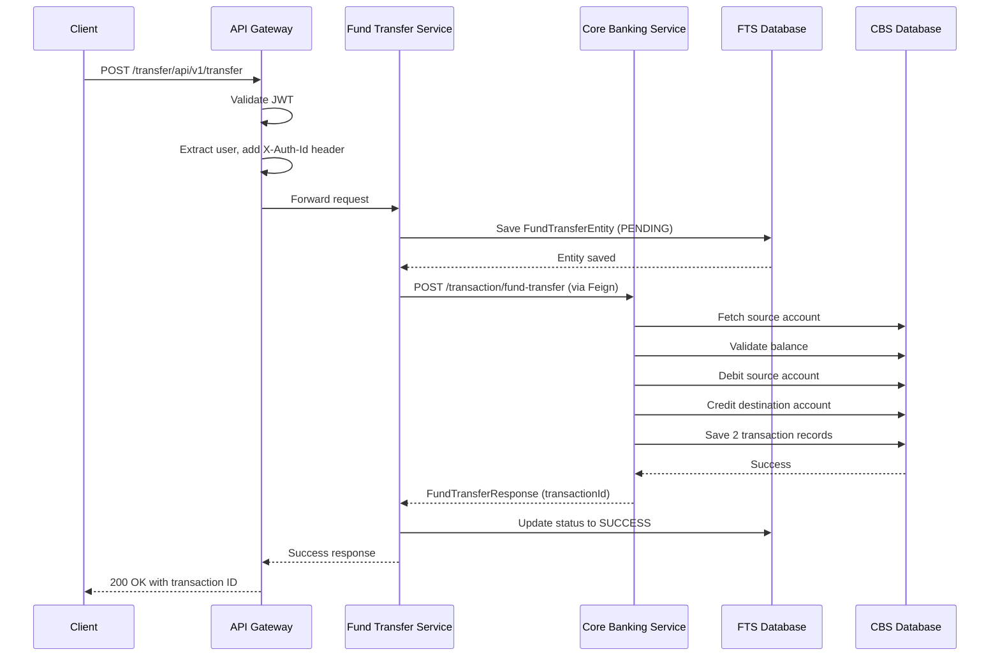

### 10.4 Timeout and Resilience

**Current Timeouts**:
- **Connect Timeout**: 5 seconds
- **Read Timeout**: 10 seconds

**Planned Resilience Patterns**:
- **Circuit Breaker**: Prevent cascading failures
- **Bulkhead**: Isolate thread pools per client
- **Rate Limiter**: Limit requests per second

**Resilience4j Configuration** (Planned):
```yaml
resilience4j:
  circuitbreaker:
    instances:
      coreBankingService:
        register-health-indicator: true
        sliding-window-size: 10
        minimum-number-of-calls: 5
        permitted-number-of-calls-in-half-open-state: 3
        automatic-transition-from-open-to-half-open-enabled: true
        wait-duration-in-open-state: 5s
        failure-rate-threshold: 50
        event-consumer-buffer-size: 10
```

---

## 11. Security Implementation

### 11.1 OAuth2 / OIDC Architecture

#### 11.1.1 Authentication Flow

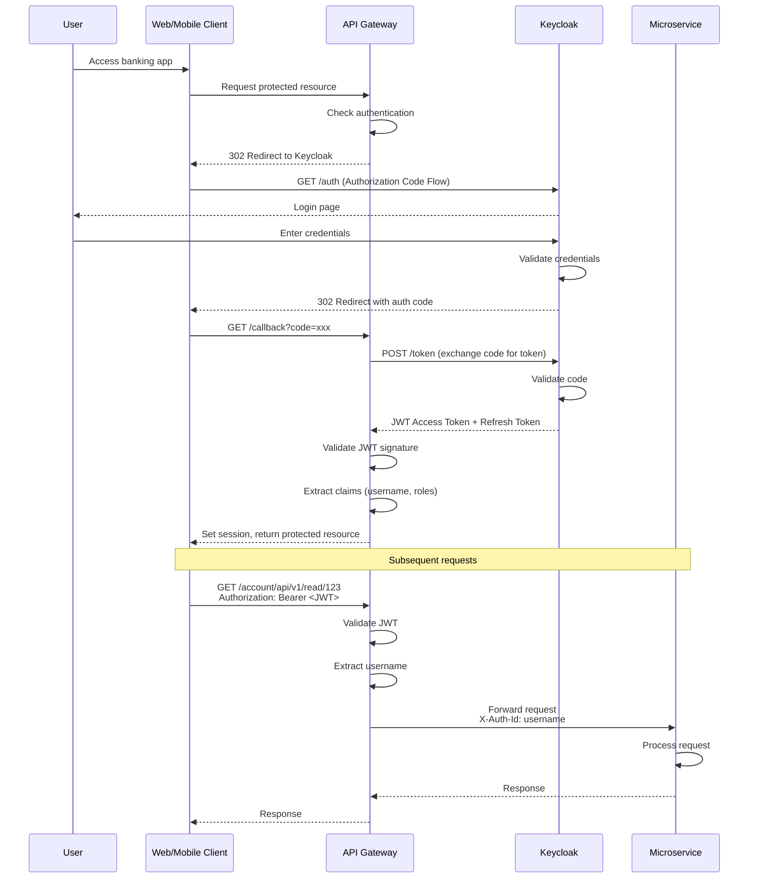

### 11.2 JWT Token Structure

**Token Format**: JSON Web Token (JWT)

**Header**:
```json
{
  "alg": "RS256",
  "typ": "JWT",
  "kid": "key-id"
}
```

**Payload (Claims)**:
```json
{
  "exp": 1704067200,
  "iat": 1704063600,
  "jti": "unique-token-id",
  "iss": "http://localhost:8080/auth/realms/internet-banking",
  "aud": ["core-banking-service", "account"],
  "sub": "user-uuid",
  "typ": "Bearer",
  "azp": "internet-banking-app",
  "session_state": "session-id",
  "preferred_username": "john.doe@example.com",
  "email_verified": true,
  "email": "john.doe@example.com",
  "name": "John Doe",
  "given_name": "John",
  "family_name": "Doe",
  "realm_access": {
    "roles": ["user", "customer"]
  },
  "resource_access": {
    "core-banking-service": {
      "roles": ["account-view", "transaction-create"]
    }
  }
}
```

**Signature**: RS256 (RSA with SHA-256)

**Token Expiration**:
- **Access Token**: 15 minutes
- **Refresh Token**: 30 days

### 11.3 API Gateway Security Configuration

**SecurityConfiguration Details**:

```java
@EnableWebFluxSecurity
public class SecurityConfiguration {
    
    @Bean
    public SecurityWebFilterChain springSecurityFilterChain(ServerHttpSecurity http) {
        http
            .authorizeExchange(exchanges -> exchanges
                // Public endpoints
                .pathMatchers("/user/api/v1/register").permitAll()
                .pathMatchers("/actuator/health").permitAll()
                
                // Protected endpoints
                .pathMatchers("/user/api/**").hasRole("USER")
                .pathMatchers("/account/api/**").hasRole("USER")
                .pathMatchers("/transaction/api/**").hasRole("USER")
                .pathMatchers("/transfer/api/**").hasRole("USER")
                .pathMatchers("/payment/api/**").hasRole("USER")
                
                // Admin endpoints
                .pathMatchers("/user/api/v1/update/**").hasRole("ADMIN")
                
                // Default: Require authentication
                .anyExchange().authenticated()
            )
            .oauth2Login(oauth2 -> oauth2
                .authorizationRequestResolver(customAuthorizationRequestResolver())
            )
            .oauth2ResourceServer(oauth2 -> oauth2
                .jwt(jwt -> jwt
                    .jwtAuthenticationConverter(grantedAuthoritiesExtractor())
                )
            )
            .csrf(csrf -> csrf.disable())
            .cors(cors -> cors.configurationSource(corsConfigurationSource()));
        
        return http.build();
    }
    
    @Bean
    public ReactiveJwtDecoder jwtDecoder() {
        return ReactiveJwtDecoders.fromIssuerLocation(
            "http://localhost:8080/auth/realms/internet-banking"
        );
    }
    
    @Bean
    public Converter<Jwt, Mono<AbstractAuthenticationToken>> grantedAuthoritiesExtractor() {
        JwtGrantedAuthoritiesConverter authoritiesConverter = new JwtGrantedAuthoritiesConverter();
        authoritiesConverter.setAuthorityPrefix("ROLE_");
        authoritiesConverter.setAuthoritiesClaimName("realm_access.roles");
        
        JwtAuthenticationConverter jwtAuthenticationConverter = new JwtAuthenticationConverter();
        jwtAuthenticationConverter.setJwtGrantedAuthoritiesConverter(authoritiesConverter);
        
        return new ReactiveJwtAuthenticationConverterAdapter(jwtAuthenticationConverter);
    }
}
```

### 11.4 Microservice Security

**Resource Server Configuration** (in each microservice):

```yaml
spring:
  security:
    oauth2:
      resourceserver:
        jwt:
          issuer-uri: http://localhost:8080/auth/realms/internet-banking
```

**Security Configuration** (Optional, for fine-grained control):
```java
@Configuration
@EnableWebSecurity
public class SecurityConfig extends WebSecurityConfigurerAdapter {
    
    @Override
    protected void configure(HttpSecurity http) throws Exception {
        http
            .authorizeRequests()
                .anyRequest().authenticated()
            .and()
            .oauth2ResourceServer()
                .jwt();
    }
}
```

**Note**: Most microservices rely on API Gateway for authentication. They trust requests forwarded by the gateway and use the `X-Auth-Id` header for user identification.

### 11.5 Keycloak Configuration

#### 11.5.1 Realm Setup

**Realm Name**: `internet-banking`

**Realm Settings**:
- **Display Name**: Internet Banking
- **Enabled**: Yes
- **User Registration**: Disabled (users registered via API)
- **Email as Username**: Yes
- **Login with Email**: Yes
- **Require SSL**: All requests

#### 11.5.2 Client Configuration

**Client ID**: `internet-banking-app` (Public client for web/mobile)

**Client Settings**:
- **Client Protocol**: openid-connect
- **Access Type**: public
- **Standard Flow Enabled**: Yes (Authorization Code Flow)
- **Direct Access Grants Enabled**: No
- **Valid Redirect URIs**: `http://localhost:8080/*`
- **Web Origins**: `http://localhost:8080`

**Service Client**: `user-service` (Confidential client for service-to-service)

**Service Client Settings**:
- **Access Type**: confidential
- **Service Accounts Enabled**: Yes (Client Credentials Grant)
- **Authorization Enabled**: No

#### 11.5.3 Roles and Permissions

**Realm Roles**:
- `user`: Regular customer
- `admin`: Administrator
- `customer-service`: Customer service representative

**Client Roles** (for core-banking-service):
- `account-view`: View account details
- `account-manage`: Manage accounts
- `transaction-create`: Create transactions
- `transaction-view`: View transaction history

**Role Mapping**:
- New users assigned `user` role by default
- Admin role assigned manually
- Client roles assigned based on permissions

### 11.6 Security Best Practices Implemented

1. **Token-Based Authentication**: Stateless JWT tokens
2. **Short Token Expiration**: 15 minutes for access tokens
3. **Refresh Token Rotation**: New refresh token on each use
4. **HTTPS Only**: TLS 1.2+ for all communication (production)
5. **CORS Configuration**: Restrict allowed origins
6. **CSRF Protection**: Disabled for REST API (token-based)
7. **SQL Injection Prevention**: Parameterized queries via JPA
8. **Input Validation**: Bean Validation annotations
9. **Sensitive Data Masking**: Passwords never logged
10. **Audit Logging**: All transactions logged with user ID

### 11.7 Planned Security Enhancements

1. **Multi-Factor Authentication (MFA)**: OTP via SMS/Email
2. **Rate Limiting**: Prevent brute force attacks
3. **IP Whitelisting**: Restrict access by IP
4. **Anomaly Detection**: Monitor unusual transaction patterns
5. **Token Revocation**: Implement token blacklist
6. **API Key Authentication**: For third-party integrations
7. **Data Encryption at Rest**: Database-level encryption
8. **Security Headers**: HSTS, X-Frame-Options, etc.

---

## 12. Exception Handling

### 12.1 Exception Hierarchy

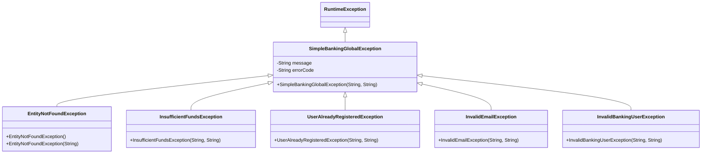

### 12.2 Global Exception Handler

**GlobalExceptionHandler** (in each service):

```java
@RestControllerAdvice
@Slf4j
public class GlobalExceptionHandler {
    
    @ExceptionHandler(EntityNotFoundException.class)
    public ResponseEntity<ErrorResponse> handleEntityNotFoundException(EntityNotFoundException ex) {
        log.error("Entity not found: {}", ex.getMessage());
        ErrorResponse errorResponse = ErrorResponse.builder()
            .errorCode(ex.getErrorCode())
            .message(ex.getMessage())
            .timestamp(LocalDateTime.now())
            .build();
        return new ResponseEntity<>(errorResponse, HttpStatus.NOT_FOUND);
    }
    
    @ExceptionHandler(InsufficientFundsException.class)
    public ResponseEntity<ErrorResponse> handleInsufficientFundsException(InsufficientFundsException ex) {
        log.error("Insufficient funds: {}", ex.getMessage());
        ErrorResponse errorResponse = ErrorResponse.builder()
            .errorCode(ex.getErrorCode())
            .message(ex.getMessage())
            .timestamp(LocalDateTime.now())
            .build();
        return new ResponseEntity<>(errorResponse, HttpStatus.BAD_REQUEST);
    }
    
    @ExceptionHandler(UserAlreadyRegisteredException.class)
    public ResponseEntity<ErrorResponse> handleUserAlreadyRegisteredException(UserAlreadyRegisteredException ex) {
        log.error("User already registered: {}", ex.getMessage());
        ErrorResponse errorResponse = ErrorResponse.builder()
            .errorCode(ex.getErrorCode())
            .message(ex.getMessage())
            .timestamp(LocalDateTime.now())
            .build();
        return new ResponseEntity<>(errorResponse, HttpStatus.BAD_REQUEST);
    }
    
    @ExceptionHandler(MethodArgumentNotValidException.class)
    public ResponseEntity<ErrorResponse> handleValidationException(MethodArgumentNotValidException ex) {
        log.error("Validation error: {}", ex.getMessage());
        
        Map<String, String> errors = new HashMap<>();
        ex.getBindingResult().getFieldErrors().forEach(error -> 
            errors.put(error.getField(), error.getDefaultMessage())
        );
        
        ErrorResponse errorResponse = ErrorResponse.builder()
            .errorCode("VALIDATION_ERROR")
            .message("Validation failed")
            .details(errors)
            .timestamp(LocalDateTime.now())
            .build();
        return new ResponseEntity<>(errorResponse, HttpStatus.BAD_REQUEST);
    }
    
    @ExceptionHandler(Exception.class)
    public ResponseEntity<ErrorResponse> handleGenericException(Exception ex) {
        log.error("Unexpected error: ", ex);
        ErrorResponse errorResponse = ErrorResponse.builder()
            .errorCode("INTERNAL_ERROR")
            .message("An unexpected error occurred")
            .timestamp(LocalDateTime.now())
            .build();
        return new ResponseEntity<>(errorResponse, HttpStatus.INTERNAL_SERVER_ERROR);
    }
}
```

### 12.3 Error Response Model

**ErrorResponse DTO**:
```java
@Data
@Builder
@AllArgsConstructor
@NoArgsConstructor
public class ErrorResponse {
    private String errorCode;
    private String message;
    private LocalDateTime timestamp;
    private Map<String, String> details;  // For validation errors
}
```

**Example Error Response**:
```json
{
  "errorCode": "INSUFFICIENT_FUNDS",
  "message": "Insufficient funds in the account 100015003000",
  "timestamp": "2024-01-15T10:30:45",
  "details": null
}
```

### 12.4 Error Codes

**GlobalErrorCode Constants**:

| Error Code | HTTP Status | Description |
|-----------|-------------|-------------|
| ENTITY_NOT_FOUND | 404 | Entity not found in database |
| INSUFFICIENT_FUNDS | 400 | Insufficient account balance |
| ERROR_EMAIL_REGISTERED | 400 | Email already registered |
| ERROR_INVALID_EMAIL | 400 | Email doesn't match core banking record |
| ERROR_USER_NOT_FOUND_UNDER_NIC | 404 | User not found by identification |
| VALIDATION_ERROR | 400 | Request validation failed |
| INTERNAL_ERROR | 500 | Unexpected internal error |

### 12.5 Validation

**Bean Validation** (JSR-303):

```java
@Data
public class FundTransferRequest {
    
    @NotNull(message = "Source account cannot be null")
    @Pattern(regexp = "\\d+", message = "Account number must be numeric")
    private String fromAccount;
    
    @NotNull(message = "Destination account cannot be null")
    @Pattern(regexp = "\\d+", message = "Account number must be numeric")
    private String toAccount;
    
    @NotNull(message = "Amount cannot be null")
    @Positive(message = "Amount must be positive")
    @Digits(integer = 17, fraction = 2, message = "Invalid amount format")
    private BigDecimal amount;
}
```

**Validation Error Response**:
```json
{
  "errorCode": "VALIDATION_ERROR",
  "message": "Validation failed",
  "timestamp": "2024-01-15T10:30:45",
  "details": {
    "fromAccount": "Source account cannot be null",
    "amount": "Amount must be positive"
  }
}
```

---

## 13. Configuration Management

### 13.1 Configuration Hierarchy

**Configuration Priority** (highest to lowest):
1. Command-line arguments
2. System properties
3. Environment variables
4. Application properties from Config Server
5. Profile-specific properties (`application-{profile}.yml`)
6. Default application properties (`application.yml`)

### 13.2 Configuration Profiles

**Available Profiles**:
- `dev`: Development environment
- `test`: Test/QA environment
- `staging`: Staging environment
- `prod`: Production environment

**Profile Activation**:
```bash
# Via environment variable
export SPRING_PROFILES_ACTIVE=prod

# Via command-line
java -jar service.jar --spring.profiles.active=prod

# Via application.yml
spring:
  profiles:
    active: dev
```

### 13.3 Environment-Specific Configuration

#### 13.3.1 Development Profile

**core-banking-service-dev.yml**:
```yaml
spring:
  datasource:
    url: jdbc:mysql://localhost:3306/banking_core_service
    username: dev_user
    password: dev_password
  
  jpa:
    show-sql: true
    properties:
      hibernate:
        format_sql: true
  
  flyway:
    clean-disabled: false  # Allow clean in dev

logging:
  level:
    com.javatodev: DEBUG
    org.springframework.web: DEBUG
    org.hibernate.SQL: DEBUG
    org.hibernate.type.descriptor.sql.BasicBinder: TRACE

management:
  endpoints:
    web:
      exposure:
        include: "*"  # Expose all actuator endpoints in dev
```

#### 13.3.2 Production Profile

**core-banking-service-prod.yml**:
```yaml
spring:
  datasource:
    url: jdbc:mysql://prod-db-host:3306/banking_core_service
    username: ${DB_USERNAME}  # From environment variable
    password: ${DB_PASSWORD}
    hikari:
      maximum-pool-size: 20
      minimum-idle: 5
      connection-timeout: 30000
      idle-timeout: 600000
      max-lifetime: 1800000
  
  jpa:
    show-sql: false
    properties:
      hibernate:
        format_sql: false
  
  flyway:
    clean-disabled: true  # Prevent accidental clean in prod

logging:
  level:
    com.javatodev: INFO
    org.springframework: WARN
  file:
    name: /var/log/banking/core-banking-service.log
    max-size: 10MB
    max-history: 30

management:
  endpoints:
    web:
      exposure:
        include: health,info,metrics,prometheus
  metrics:
    export:
      prometheus:
        enabled: true
```

### 13.4 Sensitive Configuration Management

**Current Approach** (Config Server):
- Configuration stored in Git repository
- Should be encrypted using Spring Cloud Config encryption

**Encryption** (Planned):
```yaml
spring:
  datasource:
    username: {cipher}AQA9fN8...encrypted-value...
    password: {cipher}BQB3kL7...encrypted-value...
```

**Encryption Key Configuration**:
```yaml
# In Config Server application.yml
encrypt:
  key: ${ENCRYPT_KEY}  # Symmetric key from environment
```

**Recommended Production Approach**:
- **Kubernetes Secrets**: For sensitive values in K8s deployments
- **AWS Secrets Manager**: For AWS deployments
- **HashiCorp Vault**: For centralized secret management
- **Azure Key Vault**: For Azure deployments

### 13.5 Configuration Refresh

**Dynamic Refresh** (without restart):

1. Update configuration in Git repository
2. Call refresh endpoint:
```bash
curl -X POST http://localhost:<service-port>/actuator/refresh
```

3. Service reloads configuration from Config Server

**Refresh Scope Annotation**:
```java
@Configuration
@RefreshScope
public class DynamicConfiguration {
    
    @Value("${some.dynamic.property}")
    private String dynamicProperty;
    
    // This bean will be recreated on refresh
}
```

**Limitations**:
- Database connection settings require restart
- Security settings require restart
- Some Spring Boot properties are not refreshable

---

## 14. Observability Implementation

### 14.1 Distributed Tracing

#### 14.1.1 Spring Cloud Sleuth Configuration

**Auto-Configuration** (via dependencies):
```xml
<dependency>
    <groupId>org.springframework.cloud</groupId>
    <artifactId>spring-cloud-starter-sleuth</artifactId>
</dependency>
<dependency>
    <groupId>org.springframework.cloud</groupId>
    <artifactId>spring-cloud-sleuth-zipkin</artifactId>
</dependency>
```

**Configuration** (from Config Server):
```yaml
spring:
  sleuth:
    sampler:
      probability: 1.0  # 100% sampling in dev, 0.1 (10%) in prod
    baggage:
      remote-fields: X-Auth-Id
      correlation-fields: X-Auth-Id
  zipkin:
    base-url: http://localhost:9411
    sender:
      type: web
```

#### 14.1.2 Trace Context

**Trace ID**: Unique identifier for entire request flow across services  
**Span ID**: Unique identifier for each service interaction  
**Parent Span ID**: Links child spans to parent

**Example Log Output** (with tracing):
```
2024-01-15 10:30:45.123 INFO [core-banking-service,550e8400e29b41d4a716446655440000,a716446655440001,true] 
  com.javatodev.finance.service.TransactionService : Processing fund transfer
```
Format: `[application-name,trace-id,span-id,exportable]`

#### 14.1.3 Zipkin UI

**Access URL**: `http://localhost:9411`

**Features**:
- Trace visualization
- Service dependency graph
- Latency analysis
- Error tracking

**Trace Search**:
- By trace ID
- By service name
- By span name
- By time range

### 14.2 Metrics Collection

#### 14.2.1 Spring Boot Actuator

**Actuator Endpoints** (exposed):
- `/actuator/health`: Service health status
- `/actuator/info`: Application information
- `/actuator/metrics`: Available metrics
- `/actuator/metrics/{metricName}`: Specific metric details
- `/actuator/prometheus`: Prometheus-formatted metrics

**Health Endpoint Response**:
```json
{
  "status": "UP",
  "components": {
    "db": {
      "status": "UP",
      "details": {
        "database": "MySQL",
        "validationQuery": "isValid()"
      }
    },
    "diskSpace": {
      "status": "UP",
      "details": {
        "total": 499963174912,
        "free": 123456789012,
        "threshold": 10485760,
        "exists": true
      }
    },
    "ping": {
      "status": "UP"
    }
  }
}
```

#### 14.2.2 Prometheus Metrics

**Metrics Endpoint**: `/actuator/prometheus`

**Key Metrics Exposed**:

**JVM Metrics**:
- `jvm_memory_used_bytes`: JVM memory usage
- `jvm_memory_max_bytes`: Maximum JVM memory
- `jvm_gc_pause_seconds`: Garbage collection pause times
- `jvm_threads_live`: Number of live threads

**HTTP Metrics**:
- `http_server_requests_seconds`: HTTP request duration
  - Tags: `method`, `uri`, `status`, `outcome`
- `http_server_requests_seconds_count`: Request count
- `http_server_requests_seconds_sum`: Total request duration

**Database Metrics**:
- `hikaricp_connections_active`: Active database connections
- `hikaricp_connections_idle`: Idle database connections
- `hikaricp_connections_pending`: Pending connection requests

**Custom Business Metrics** (example):
```java
@Service
public class TransactionService {
    
    private final MeterRegistry meterRegistry;
    private final Counter fundTransferCounter;
    private final Timer fundTransferTimer;
    
    public TransactionService(MeterRegistry meterRegistry) {
        this.meterRegistry = meterRegistry;
        this.fundTransferCounter = Counter.builder("fund_transfer_total")
            .description("Total number of fund transfers")
            .tag("service", "core-banking")
            .register(meterRegistry);
        
        this.fundTransferTimer = Timer.builder("fund_transfer_duration")
            .description("Fund transfer processing duration")
            .register(meterRegistry);
    }
    
    public FundTransferResponse fundTransfer(FundTransferRequest request) {
        return fundTransferTimer.record(() -> {
            try {
                FundTransferResponse response = processFundTransfer(request);
                fundTransferCounter.increment();
                meterRegistry.counter("fund_transfer_success").increment();
                return response;
            } catch (Exception e) {
                meterRegistry.counter("fund_transfer_failed").increment();
                throw e;
            }
        });
    }
}
```

#### 14.2.3 Prometheus Configuration

**Prometheus Scrape Configuration**:
```yaml
scrape_configs:
  - job_name: 'core-banking-service'
    metrics_path: '/actuator/prometheus'
    static_configs:
      - targets: ['localhost:8080', 'localhost:8081', 'localhost:8082']
    
  - job_name: 'user-service'
    metrics_path: '/actuator/prometheus'
    static_configs:
      - targets: ['localhost:8083']
    
  - job_name: 'fund-transfer-service'
    metrics_path: '/actuator/prometheus'
    static_configs:
      - targets: ['localhost:8084']
```

**Kubernetes Service Discovery** (for K8s deployments):
```yaml
scrape_configs:
  - job_name: 'kubernetes-services'
    kubernetes_sd_configs:
      - role: endpoints
    relabel_configs:
      - source_labels: [__meta_kubernetes_service_annotation_prometheus_io_scrape]
        action: keep
        regex: true
      - source_labels: [__meta_kubernetes_service_annotation_prometheus_io_path]
        action: replace
        target_label: __metrics_path__
        regex: (.+)
```

### 14.3 Logging

#### 14.3.1 Logging Configuration

**Logback Configuration** (`logback-spring.xml`):
```xml
<?xml version="1.0" encoding="UTF-8"?>
<configuration>
    <include resource="org/springframework/boot/logging/logback/defaults.xml"/>
    
    <!-- Console appender with color -->
    <appender name="CONSOLE" class="ch.qos.logback.core.ConsoleAppender">
        <encoder>
            <pattern>%d{yyyy-MM-dd HH:mm:ss.SSS} %highlight(%-5level) [%thread] %cyan(%logger{36}) - %msg%n</pattern>
        </encoder>
    </appender>
    
    <!-- File appender -->
    <appender name="FILE" class="ch.qos.logback.core.rolling.RollingFileAppender">
        <file>logs/application.log</file>
        <encoder>
            <pattern>%d{yyyy-MM-dd HH:mm:ss.SSS} %-5level [%thread] %logger{36} - %msg%n</pattern>
        </encoder>
        <rollingPolicy class="ch.qos.logback.core.rolling.TimeBasedRollingPolicy">
            <fileNamePattern>logs/application-%d{yyyy-MM-dd}.%i.log</fileNamePattern>
            <timeBasedFileNamingAndTriggeringPolicy class="ch.qos.logback.core.rolling.SizeAndTimeBasedFNATP">
                <maxFileSize>10MB</maxFileSize>
            </timeBasedFileNamingAndTriggeringPolicy>
            <maxHistory>30</maxHistory>
        </rollingPolicy>
    </appender>
    
    <!-- JSON appender for production -->
    <appender name="JSON" class="ch.qos.logback.core.rolling.RollingFileAppender">
        <file>logs/application.json</file>
        <encoder class="net.logstash.logback.encoder.LogstashEncoder">
            <includeMdcKeyName>traceId</includeMdcKeyName>
            <includeMdcKeyName>spanId</includeMdcKeyName>
            <includeMdcKeyName>X-Auth-Id</includeMdcKeyName>
        </encoder>
        <rollingPolicy class="ch.qos.logback.core.rolling.TimeBasedRollingPolicy">
            <fileNamePattern>logs/application-%d{yyyy-MM-dd}.json</fileNamePattern>
            <maxHistory>30</maxHistory>
        </rollingPolicy>
    </appender>
    
    <!-- Logger levels -->
    <logger name="com.javatodev" level="DEBUG"/>
    <logger name="org.springframework" level="INFO"/>
    <logger name="org.hibernate" level="INFO"/>
    
    <root level="INFO">
        <appender-ref ref="CONSOLE"/>
        <appender-ref ref="FILE"/>
    </root>
    
    <springProfile name="prod">
        <root level="WARN">
            <appender-ref ref="JSON"/>
        </root>
    </springProfile>
</configuration>
```

#### 14.3.2 Structured Logging

**Log Format** (JSON in production):
```json
{
  "timestamp": "2024-01-15T10:30:45.123Z",
  "level": "INFO",
  "thread": "http-nio-8080-exec-1",
  "logger": "com.javatodev.finance.service.TransactionService",
  "message": "Processing fund transfer",
  "traceId": "550e8400e29b41d4a716446655440000",
  "spanId": "a716446655440001",
  "X-Auth-Id": "john.doe@example.com",
  "context": {
    "service": "core-banking-service",
    "environment": "production"
  }
}
```

#### 14.3.3 Logging Best Practices

**Implemented**:
- **Correlation IDs**: Automatic via Sleuth (traceId, spanId)
- **Structured Logging**: JSON format in production
- **Log Levels**: Appropriate levels per environment
- **Sensitive Data Masking**: Passwords and tokens never logged
- **Exception Logging**: Full stack traces for errors

**Example Service Logging**:
```java
@Slf4j
@Service
public class TransactionService {
    
    public FundTransferResponse fundTransfer(FundTransferRequest request) {
        log.info("Processing fund transfer from {} to {} amount {}",
            request.getFromAccount(),
            request.getToAccount(),
            request.getAmount());
        
        try {
            // Business logic
            FundTransferResponse response = executeFundTransfer(request);
            
            log.info("Fund transfer completed successfully. Transaction ID: {}",
                response.getTransactionId());
            
            return response;
        } catch (InsufficientFundsException e) {
            log.error("Insufficient funds in account {}. Required: {}, Available: {}",
                request.getFromAccount(),
                request.getAmount(),
                e.getAvailableBalance());
            throw e;
        } catch (Exception e) {
            log.error("Unexpected error during fund transfer", e);
            throw new SimpleBankingGlobalException("Fund transfer failed", "INTERNAL_ERROR");
        }
    }
}
```

### 14.4 Health Checks

#### 14.4.1 Liveness and Readiness Probes

**Kubernetes Health Probes**:
```yaml
apiVersion: v1
kind: Pod
metadata:
  name: core-banking-service
spec:
  containers:
  - name: service
    image: core-banking-service:latest
    livenessProbe:
      httpGet:
        path: /actuator/health/liveness
        port: 8080
      initialDelaySeconds: 60
      periodSeconds: 10
      failureThreshold: 3
    readinessProbe:
      httpGet:
        path: /actuator/health/readiness
        port: 8080
      initialDelaySeconds: 30
      periodSeconds: 5
      failureThreshold: 3
```

**Health Endpoint Configuration**:
```yaml
management:
  health:
    livenessState:
      enabled: true
    readinessState:
      enabled: true
  endpoint:
    health:
      show-details: when-authorized
      probes:
        enabled: true
```

**Custom Health Indicator**:
```java
@Component
public class DatabaseHealthIndicator implements HealthIndicator {
    
    private final DataSource dataSource;
    
    @Override
    public Health health() {
        try (Connection conn = dataSource.getConnection()) {
            if (conn.isValid(1)) {
                return Health.up()
                    .withDetail("database", "MySQL")
                    .withDetail("status", "Connected")
                    .build();
            } else {
                return Health.down()
                    .withDetail("database", "MySQL")
                    .withDetail("status", "Connection invalid")
                    .build();
            }
        } catch (SQLException e) {
            return Health.down()
                .withDetail("database", "MySQL")
                .withDetail("error", e.getMessage())
                .build();
        }
    }
}
```

---

## 15. Data Flow Diagrams

### 15.1 Complete Request Flow

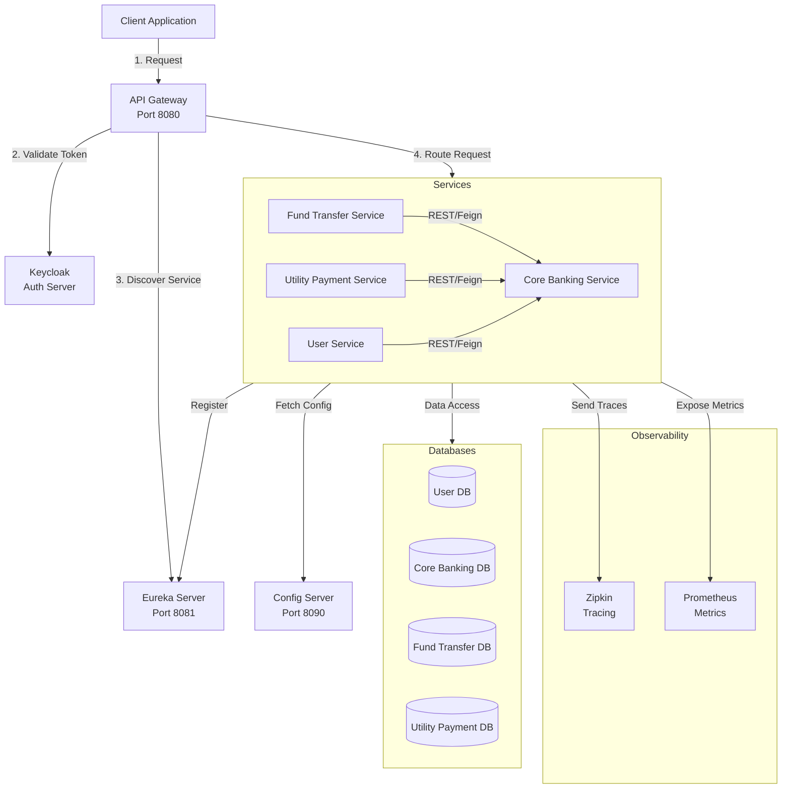

### 15.2 Fund Transfer Data Flow

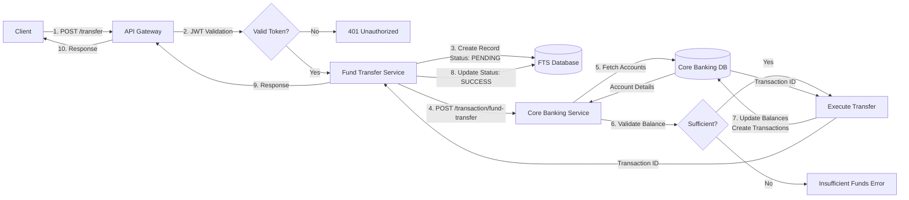

### 15.3 User Registration Flow

```mermaid
flowchart TB
    A[Client] -->|1. POST /user/api/v1/register| B[API Gateway]
    B -->|2. Route<br/>Public Endpoint| C[User Service]
    C -->|3. Check Email Exists| D[Keycloak]
    D -->|Email Exists?| E{Exists?}
    E -->|Yes| F[Return Error:<br/>EMAIL_REGISTERED]
    E -->|No| G[4. Validate User]
    G -->|GET /user/read/{id}| H[Core Banking Service]
    H -->|5. Fetch User| I[(Core Banking DB)]
    I -->|User Data| H
    H -->|User Details| G
    G -->|6. Verify Email Match| J{Email Match?}
    J -->|No| K[Return Error:<br/>INVALID_EMAIL]
    J -->|Yes| L[7. Create User in Keycloak]
    L -->|User Created<br/>enabled=false| D
    D -->|Keycloak User ID| M[8. Save Local Record]
    M -->|Status: PENDING| N[(User Service DB)]
    N -->|User Saved| O[9. Return Success]
    O --> B --> A
```

---

## 16. Deployment Configuration

### 16.1 Docker Configuration

#### 16.1.1 Dockerfile (Multi-stage build)

**Example Dockerfile** (for Core Banking Service):
```dockerfile
# Stage 1: Build
FROM gradle:7.4-jdk11 AS build
WORKDIR /app
COPY build.gradle settings.gradle ./
COPY src ./src
RUN gradle clean build -x test

# Stage 2: Runtime
FROM openjdk:11-jre-slim
WORKDIR /app

# Create non-root user
RUN groupadd -r appuser && useradd -r -g appuser appuser

# Copy JAR from build stage
COPY --from=build /app/build/libs/*.jar app.jar

# Change ownership
RUN chown -R appuser:appuser /app

# Switch to non-root user
USER appuser

# Expose port
EXPOSE 8080

# Health check
HEALTHCHECK --interval=30s --timeout=3s --start-period=60s --retries=3 \
  CMD curl -f http://localhost:8080/actuator/health || exit 1

# JVM options
ENV JAVA_OPTS="-Xms512m -Xmx1024m -XX:+UseG1GC -XX:MaxGCPauseMillis=200"

# Run application
ENTRYPOINT ["sh", "-c", "java $JAVA_OPTS -jar app.jar"]
```

**Build Command**:
```bash
docker build -t core-banking-service:1.0.0 .
```

#### 16.1.2 Docker Compose

**docker-compose.yml** (for local development):
```yaml
version: '3.8'

services:
  mysql:
    image: mysql:8.0
    environment:
      MYSQL_ROOT_PASSWORD: root
      MYSQL_DATABASE: banking_core_service
    ports:
      - "3306:3306"
    volumes:
      - mysql_data:/var/lib/mysql
    networks:
      - banking-network

  keycloak:
    image: quay.io/keycloak/keycloak:latest
    environment:
      KEYCLOAK_ADMIN: admin
      KEYCLOAK_ADMIN_PASSWORD: admin
      KC_DB: mysql
      KC_DB_URL: jdbc:mysql://mysql:3306/keycloak
      KC_DB_USERNAME: root
      KC_DB_PASSWORD: root
    ports:
      - "8080:8080"
    depends_on:
      - mysql
    command: start-dev
    networks:
      - banking-network

  zipkin:
    image: openzipkin/zipkin:latest
    ports:
      - "9411:9411"
    networks:
      - banking-network

  rabbitmq:
    image: rabbitmq:3-management
    ports:
      - "5672:5672"
      - "15672:15672"
    environment:
      RABBITMQ_DEFAULT_USER: guest
      RABBITMQ_DEFAULT_PASS: guest
    networks:
      - banking-network

  config-server:
    build: ./internet-banking-config-server
    ports:
      - "8090:8090"
    environment:
      SPRING_PROFILES_ACTIVE: native
    networks:
      - banking-network

  eureka-server:
    build: ./internet-banking-service-registry
    ports:
      - "8081:8081"
    networks:
      - banking-network

  api-gateway:
    build: ./internet-banking-api-gateway
    ports:
      - "8080:8080"
    environment:
      SPRING_PROFILES_ACTIVE: docker
      EUREKA_CLIENT_SERVICE_URL_DEFAULTZONE: http://eureka-server:8081/eureka
      SPRING_CLOUD_CONFIG_URI: http://config-server:8090
    depends_on:
      - eureka-server
      - config-server
      - keycloak
    networks:
      - banking-network

  core-banking-service:
    build: ./core-banking-service
    environment:
      SPRING_PROFILES_ACTIVE: docker
      SPRING_DATASOURCE_URL: jdbc:mysql://mysql:3306/banking_core_service
      SPRING_DATASOURCE_USERNAME: root
      SPRING_DATASOURCE_PASSWORD: root
      EUREKA_CLIENT_SERVICE_URL_DEFAULTZONE: http://eureka-server:8081/eureka
      SPRING_CLOUD_CONFIG_URI: http://config-server:8090
      SPRING_ZIPKIN_BASE_URL: http://zipkin:9411
    depends_on:
      - mysql
      - eureka-server
      - config-server
      - zipkin
    networks:
      - banking-network

  user-service:
    build: ./internet-banking-user-service
    environment:
      SPRING_PROFILES_ACTIVE: docker
      SPRING_DATASOURCE_URL: jdbc:mysql://mysql:3306/user_service
      EUREKA_CLIENT_SERVICE_URL_DEFAULTZONE: http://eureka-server:8081/eureka
      KEYCLOAK_SERVER_URL: http://keycloak:8080/auth
    depends_on:
      - mysql
      - eureka-server
      - config-server
      - keycloak
    networks:
      - banking-network

volumes:
  mysql_data:

networks:
  banking-network:
    driver: bridge
```

### 16.2 Kubernetes Deployment

#### 16.2.1 Deployment Manifest

**core-banking-service-deployment.yaml**:
```yaml
apiVersion: apps/v1
kind: Deployment
metadata:
  name: core-banking-service
  namespace: banking
  labels:
    app: core-banking-service
    version: v1
spec:
  replicas: 3
  selector:
    matchLabels:
      app: core-banking-service
  template:
    metadata:
      labels:
        app: core-banking-service
        version: v1
      annotations:
        prometheus.io/scrape: "true"
        prometheus.io/path: "/actuator/prometheus"
        prometheus.io/port: "8080"
    spec:
      containers:
      - name: core-banking-service
        image: banking-registry/core-banking-service:1.0.0
        imagePullPolicy: Always
        ports:
        - containerPort: 8080
          name: http
          protocol: TCP
        env:
        - name: SPRING_PROFILES_ACTIVE
          value: "kubernetes"
        - name: SPRING_DATASOURCE_URL
          valueFrom:
            configMapKeyRef:
              name: banking-config
              key: database.url
        - name: SPRING_DATASOURCE_USERNAME
          valueFrom:
            secretKeyRef:
              name: banking-secrets
              key: database.username
        - name: SPRING_DATASOURCE_PASSWORD
          valueFrom:
            secretKeyRef:
              name: banking-secrets
              key: database.password
        - name: EUREKA_CLIENT_SERVICE_URL_DEFAULTZONE
          value: "http://eureka-server:8081/eureka"
        - name: SPRING_CLOUD_CONFIG_URI
          value: "http://config-server:8090"
        - name: JAVA_OPTS
          value: "-Xms512m -Xmx1024m -XX:+UseG1GC"
        resources:
          requests:
            memory: "1Gi"
            cpu: "500m"
          limits:
            memory: "2Gi"
            cpu: "2000m"
        livenessProbe:
          httpGet:
            path: /actuator/health/liveness
            port: 8080
          initialDelaySeconds: 60
          periodSeconds: 10
          timeoutSeconds: 5
          failureThreshold: 3
        readinessProbe:
          httpGet:
            path: /actuator/health/readiness
            port: 8080
          initialDelaySeconds: 30
          periodSeconds: 5
          timeoutSeconds: 3
          failureThreshold: 3
      restartPolicy: Always
---
apiVersion: v1
kind: Service
metadata:
  name: core-banking-service
  namespace: banking
spec:
  selector:
    app: core-banking-service
  ports:
  - name: http
    port: 8080
    targetPort: 8080
    protocol: TCP
  type: ClusterIP
---
apiVersion: autoscaling/v2
kind: HorizontalPodAutoscaler
metadata:
  name: core-banking-service-hpa
  namespace: banking
spec:
  scaleTargetRef:
    apiVersion: apps/v1
    kind: Deployment
    name: core-banking-service
  minReplicas: 3
  maxReplicas: 10
  metrics:
  - type: Resource
    resource:
      name: cpu
      target:
        type: Utilization
        averageUtilization: 70
  - type: Resource
    resource:
      name: memory
      target:
        type: Utilization
        averageUtilization: 80
```

#### 16.2.2 ConfigMap

**banking-config.yaml**:
```yaml
apiVersion: v1
kind: ConfigMap
metadata:
  name: banking-config
  namespace: banking
data:
  database.url: "jdbc:mysql://mysql-service:3306/banking_core_service"
  eureka.url: "http://eureka-server:8081/eureka"
  config.server.url: "http://config-server:8090"
  zipkin.url: "http://zipkin:9411"
```

#### 16.2.3 Secret

**banking-secrets.yaml**:
```yaml
apiVersion: v1
kind: Secret
metadata:
  name: banking-secrets
  namespace: banking
type: Opaque
stringData:
  database.username: "banking_user"
  database.password: "secure_password"
  keycloak.client.secret: "keycloak_secret"
```

### 16.3 Environment Variables

**Common Environment Variables**:

| Variable | Purpose | Example |
|----------|---------|---------|
| SPRING_PROFILES_ACTIVE | Active profile | prod, dev, test |
| SPRING_DATASOURCE_URL | Database connection URL | jdbc:mysql://host:3306/db |
| SPRING_DATASOURCE_USERNAME | Database username | banking_user |
| SPRING_DATASOURCE_PASSWORD | Database password | secure_password |
| EUREKA_CLIENT_SERVICE_URL_DEFAULTZONE | Eureka server URL | http://eureka:8081/eureka |
| SPRING_CLOUD_CONFIG_URI | Config server URL | http://config:8090 |
| SPRING_ZIPKIN_BASE_URL | Zipkin server URL | http://zipkin:9411 |
| KEYCLOAK_SERVER_URL | Keycloak server URL | http://keycloak:8080/auth |
| JAVA_OPTS | JVM options | -Xms512m -Xmx1024m |

### 16.4 Resource Sizing

**Recommended Resource Allocation** (per instance):

| Service | CPU Request | CPU Limit | Memory Request | Memory Limit |
|---------|-------------|-----------|----------------|--------------|
| Core Banking Service | 500m | 2000m | 1Gi | 2Gi |
| User Service | 250m | 1000m | 512Mi | 1Gi |
| Fund Transfer Service | 250m | 1000m | 512Mi | 1Gi |
| Utility Payment Service | 250m | 1000m | 512Mi | 1Gi |
| API Gateway | 500m | 2000m | 512Mi | 1Gi |
| Eureka Server | 250m | 500m | 512Mi | 1Gi |
| Config Server | 250m | 500m | 256Mi | 512Mi |

**Scaling Strategy**:
- **Core Banking Service**: 3-10 replicas (based on CPU/memory)
- **Other Services**: 2-5 replicas
- **Auto-scaling**: Based on CPU (70%) and memory (80%) utilization

---

## Conclusion

This Low-Level Design document provides comprehensive technical details for implementing, maintaining, and extending the Internet Banking Microservices Platform. It covers the complete system from API endpoints to database schemas, inter-service communication, security implementation, and deployment strategies.

### Key Takeaways

1. **Microservices Architecture**: Each service has clear responsibilities and independent databases
2. **Security-First**: OAuth2/OIDC with JWT tokens, API Gateway as security enforcement point
3. **Observability**: Comprehensive tracing (Zipkin), metrics (Prometheus), and logging
4. **Configuration Management**: Centralized configuration via Spring Cloud Config
5. **Inter-Service Communication**: Synchronous REST/Feign with planned async messaging
6. **Database Design**: Flyway migrations for version control, JPA for ORM
7. **Error Handling**: Consistent exception handling across all services
8. **Deployment**: Docker and Kubernetes ready with health checks and auto-scaling

### Development Guidelines

1. **Code Quality**: Follow established patterns (Repository, Service, DTO)
2. **API Design**: RESTful principles, versioning, validation
3. **Testing**: Unit tests (>80% coverage), integration tests with Testcontainers
4. **Documentation**: Keep API documentation (OpenAPI) up to date
5. **Security**: Never log sensitive data, validate all inputs
6. **Performance**: Use pagination, optimize database queries
7. **Observability**: Log meaningful messages with context

### Future Enhancements

1. Implement circuit breakers (Resilience4j)
2. Add RabbitMQ for asynchronous communication
3. Implement saga pattern for distributed transactions
4. Add caching layer (Redis)
5. Enhance security with MFA
6. Implement rate limiting
7. Add API documentation (Swagger UI)
8. Expand test coverage

---

**Document Owner**: Development Team  
**Review Cycle**: Quarterly or when significant changes occur  
**Related Artifacts**: Source code, API documentation, runbooks
