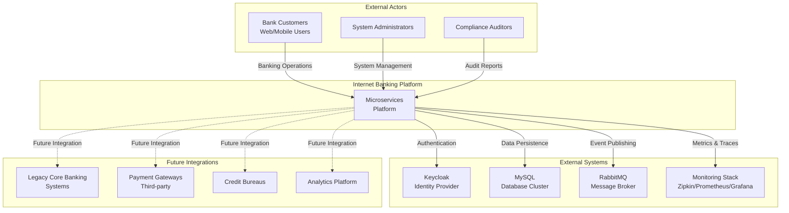

# Product Architecture - Internet Banking Microservices Platform

## 1. Executive Summary

### 1.1 Document Purpose
This Product Architecture document defines the strategic architectural vision, principles, and decisions for the Internet Banking Microservices Platform. It serves as a blueprint for technical and business stakeholders to understand the system's architectural approach, rationale, and evolution strategy.

### 1.2 Product Vision
To deliver a modern, secure, and scalable internet banking platform that enables customers to perform banking operations seamlessly while providing the organization with flexibility to innovate and adapt to changing market demands.

### 1.3 Business Context
The platform addresses the growing demand for digital banking services by providing:
- 24/7 access to banking services
- Real-time transaction processing
- Secure authentication and authorization
- Scalable infrastructure for business growth
- Foundation for future financial products

### 1.4 Architectural Style
**Microservices Architecture** with the following characteristics:
- Independently deployable services
- Domain-driven design principles
- API-first approach
- Cloud-native patterns
- Event-driven capabilities

## 2. Architectural Principles

### 2.1 Core Principles

#### 2.1.1 Single Responsibility Principle
Each microservice owns a specific business capability:
- User Service: User lifecycle management
- Core Banking: Account and transaction operations
- Fund Transfer Service: Transfer orchestration
- Utility Payment Service: Payment processing

**Rationale**: Clear boundaries enable independent development, deployment, and scaling.

#### 2.1.2 Decentralized Data Management
Each service owns its database and data model.

**Benefits**:
- Loose coupling between services
- Independent scaling of data stores
- Technology diversity (polyglot persistence)
- Improved fault isolation

**Challenges**:
- Eventual consistency between services
- No distributed transactions
- Data duplication where necessary

**Mitigation**:
- Saga pattern for distributed workflows
- Event-driven synchronization
- Clear data ownership boundaries

#### 2.1.3 API-First Design
All services expose well-defined REST APIs:
- Versioned endpoints (v1, v2)
- Standard HTTP methods (GET, POST, PUT, DELETE)
- Consistent response formats
- Comprehensive error handling

**Benefits**:
- Contract-first development
- Parallel team development
- Easy integration with external systems
- Clear service boundaries

#### 2.1.4 Design for Failure
Assume failures will occur and build resilience:
- Circuit breakers prevent cascading failures
- Timeouts on all external calls
- Retry with exponential backoff
- Graceful degradation
- Fallback responses

**Philosophy**: "Failures are normal, not exceptional."

#### 2.1.5 Observability-First
Built-in monitoring and debugging capabilities:
- Distributed tracing (Zipkin + Sleuth)
- Structured logging with correlation IDs
- Metrics collection (Prometheus)
- Health checks for all services
- Business metrics tracking

**Goal**: Understand system behavior in production.

#### 2.1.6 Security by Design
Security integrated from the start:
- OAuth2/OIDC authentication
- JWT-based authorization
- Encrypted data in transit and at rest
- Principle of least privilege
- Regular security audits

**Principle**: "Never trust, always verify."

#### 2.1.7 Automation-First
Manual processes are error-prone and slow:
- Automated builds and tests (CI)
- Automated deployments (CD)
- Infrastructure as code
- Automated monitoring and alerting
- Self-healing capabilities

#### 2.1.8 Evolutionary Architecture
Architecture evolves with business needs:
- Fitness functions for architectural governance
- Regular architecture reviews
- Refactoring as continuous activity
- Incremental improvements over big-bang rewrites
- Technical debt management

### 2.2 Design Principles

#### 2.2.1 Domain-Driven Design (DDD)
Services aligned with business domains:
- **Bounded Contexts**: User management, Banking core, Transfers, Payments
- **Ubiquitous Language**: Shared terminology within each domain
- **Aggregates**: Transaction consistency boundaries
- **Domain Events**: Communication between contexts

#### 2.2.2 Twelve-Factor App Methodology
Cloud-native application principles:
1. **Codebase**: One codebase (monorepo), multiple deployments
2. **Dependencies**: Explicit declaration (Gradle)
3. **Config**: Externalized via Spring Cloud Config
4. **Backing Services**: Treat as attached resources
5. **Build, Release, Run**: Strict separation
6. **Processes**: Stateless services
7. **Port Binding**: Self-contained services
8. **Concurrency**: Scale via process model
9. **Disposability**: Fast startup and graceful shutdown
10. **Dev/Prod Parity**: Keep environments similar
11. **Logs**: Treat as event streams
12. **Admin Processes**: Run as one-off processes

#### 2.2.3 RESTful Principles
- Resource-based URLs
- HTTP methods for CRUD operations
- Stateless communication
- HATEOAS for discoverability (future)
- Standard HTTP status codes

#### 2.2.4 Separation of Concerns
**Layered Architecture within Services**:
- **Controller Layer**: HTTP request handling
- **Service Layer**: Business logic
- **Repository Layer**: Data access
- **Model Layer**: Domain entities and DTOs

**Benefits**: Maintainability, testability, clear responsibilities.

## 3. Architectural Drivers

### 3.1 Business Drivers

#### 3.1.1 Time to Market
**Requirement**: Rapidly deliver new features to stay competitive.

**Architectural Support**:
- Independent service deployment
- Parallel team development
- Automated CI/CD pipelines
- Feature flags for gradual rollouts

#### 3.1.2 Customer Experience
**Requirement**: Provide fast, reliable, and intuitive banking experience.

**Architectural Support**:
- Low-latency response times (< 500ms P95)
- High availability (99.9%+)
- Responsive API design
- Real-time transaction processing

#### 3.1.3 Cost Efficiency
**Requirement**: Optimize infrastructure costs while scaling.

**Architectural Support**:
- Independent scaling of services
- Resource rightsizing per service
- Auto-scaling based on demand
- Efficient resource utilization

#### 3.1.4 Compliance & Security
**Requirement**: Meet banking regulations and protect customer data.

**Architectural Support**:
- Centralized authentication (Keycloak)
- Audit trail for all transactions
- Data encryption
- Role-based access control
- Regular security assessments

### 3.2 Technical Drivers

#### 3.2.1 Scalability
**Growth Projections**:
- 10x user growth over 3 years
- 100x transaction volume growth
- Global expansion to multiple regions

**Architectural Decisions**:
- Horizontal scaling of stateless services
- Database sharding strategies (future)
- Caching layers for read-heavy operations
- CDN for static content

#### 3.2.2 Availability
**Target**: 99.9% uptime (8.76 hours downtime/year)

**Architectural Support**:
- Multi-instance deployment
- Health-based load balancing
- Circuit breakers
- Automated failover
- Zero-downtime deployments

#### 3.2.3 Performance
**Requirements**:
- P50: < 200ms
- P95: < 500ms
- P99: < 1000ms
- Support 10,000 concurrent users

**Architectural Support**:
- Efficient database queries with proper indexing
- Connection pooling (HikariCP)
- Async processing for non-critical operations
- Optimized JVM settings

#### 3.2.4 Maintainability
**Requirements**:
- Easy debugging and troubleshooting
- Clear code ownership
- Minimal technical debt

**Architectural Support**:
- Service isolation
- Comprehensive logging and tracing
- Code quality tools (SonarQube)
- Regular refactoring cycles

#### 3.2.5 Testability
**Requirements**:
- High test coverage (>80%)
- Fast feedback loops
- Reliable test execution

**Architectural Support**:
- Layered architecture for unit testing
- Testcontainers for integration testing
- Service virtualization for external dependencies
- Automated test execution in CI/CD

### 3.3 Quality Attributes

| Quality Attribute | Priority | Target Metric | Current Status |
|------------------|----------|---------------|----------------|
| Availability | High | 99.9% | In Progress |
| Performance (Latency) | High | P95 < 500ms | In Progress |
| Scalability | High | 10K concurrent users | Supported |
| Security | Critical | Zero critical vulnerabilities | Active monitoring |
| Maintainability | Medium | Code coverage > 80% | 70% (improving) |
| Reliability | High | MTBF > 720 hours | Measuring |
| Usability (API) | Medium | Clear documentation | Complete |
| Portability | Medium | Multi-cloud capable | Docker/K8s ready |

## 4. System Context & Stakeholders

### 4.1 System Context

### 4.2 Stakeholders

#### 4.2.1 Business Stakeholders

**Bank Customers**
- **Needs**: Fast, secure, convenient banking services
- **Concerns**: Account security, transaction reliability, ease of use
- **Influence**: High (primary users)

**Product Owners**
- **Needs**: Feature delivery, market differentiation
- **Concerns**: Time to market, customer satisfaction, regulatory compliance
- **Influence**: High (prioritization)

**Business Executives**
- **Needs**: ROI, market share, brand reputation
- **Concerns**: Cost, scalability, competitive advantage
- **Influence**: High (budget approval)

**Compliance Officers**
- **Needs**: Regulatory adherence, audit trails
- **Concerns**: Data protection, transaction monitoring, reporting
- **Influence**: High (legal requirements)

#### 4.2.2 Technical Stakeholders

**Development Teams**
- **Needs**: Clear architecture, development tools, documentation
- **Concerns**: Code quality, technical debt, productivity
- **Influence**: High (implementation)

**Operations Team**
- **Needs**: Reliable deployments, monitoring, incident management
- **Concerns**: System stability, performance, recovery procedures
- **Influence**: High (production support)

**Security Team**
- **Needs**: Secure systems, vulnerability management
- **Concerns**: Threat prevention, incident response, compliance
- **Influence**: High (security approval)

**Architects**
- **Needs**: Scalable, maintainable architecture
- **Concerns**: Technical debt, evolution, best practices
- **Influence**: High (architectural decisions)

**QA Team**
- **Needs**: Testable systems, quality metrics
- **Concerns**: Test coverage, defect rates, test automation
- **Influence**: Medium (quality gates)

## 5. Architectural Decisions

### 5.1 Key Architectural Decision Records (ADRs)

#### ADR-001: Microservices Architecture

**Context**: Need for scalability, independent deployment, and team autonomy.

**Decision**: Adopt microservices architecture over monolithic approach.

**Consequences**:
- ✅ Independent scaling and deployment
- ✅ Technology diversity
- ✅ Team autonomy
- ❌ Increased operational complexity
- ❌ Distributed system challenges
- ❌ Need for robust DevOps practices

**Status**: Accepted

---

#### ADR-002: Spring Boot as Application Framework

**Context**: Need for production-ready Java framework with extensive ecosystem.

**Decision**: Use Spring Boot 2.4.5 for all microservices.

**Consequences**:
- ✅ Rapid development with auto-configuration
- ✅ Extensive library ecosystem
- ✅ Production-ready features (Actuator, Security)
- ✅ Strong community support
- ❌ Framework lock-in
- ❌ Larger memory footprint

**Alternatives Considered**: Quarkus, Micronaut
**Status**: Accepted

---

#### ADR-003: Netflix Eureka for Service Discovery

**Context**: Microservices need to discover each other dynamically.

**Decision**: Use Netflix Eureka for service registry and discovery.

**Consequences**:
- ✅ Battle-tested solution
- ✅ Client-side load balancing
- ✅ Spring Cloud integration
- ❌ Additional infrastructure component
- ❌ Potential single point of failure (mitigated with clustering)

**Alternatives Considered**: Consul, Kubernetes Service Discovery
**Status**: Accepted

---

#### ADR-004: Spring Cloud Gateway for API Gateway

**Context**: Need single entry point for all client requests with routing and security.

**Decision**: Use Spring Cloud Gateway (reactive) over Zuul.

**Consequences**:
- ✅ Reactive/non-blocking architecture
- ✅ Better performance
- ✅ Spring ecosystem integration
- ✅ Active development and support
- ❌ Reactive programming learning curve

**Alternatives Considered**: Netflix Zuul, Kong, Nginx
**Status**: Accepted

---

#### ADR-005: Keycloak for Identity and Access Management

**Context**: Need enterprise-grade authentication and authorization solution.

**Decision**: Use Keycloak as OAuth2/OIDC provider.

**Consequences**:
- ✅ Standards-based (OAuth2, OIDC)
- ✅ Rich feature set (SSO, social login, MFA)
- ✅ Open source with commercial support available
- ✅ Admin UI for user management
- ❌ Additional infrastructure component
- ❌ Learning curve for OAuth2/OIDC

**Alternatives Considered**: Auth0, Okta, AWS Cognito, Custom solution
**Status**: Accepted

---

#### ADR-006: Database per Service Pattern

**Context**: Microservices should be loosely coupled including data layer.

**Decision**: Each service has its own database schema/instance.

**Consequences**:
- ✅ Loose coupling between services
- ✅ Independent scaling of databases
- ✅ Technology diversity (polyglot persistence)
- ❌ No distributed transactions
- ❌ Eventual consistency challenges
- ❌ Data duplication

**Mitigation**: Saga pattern, event-driven synchronization
**Status**: Accepted

---

#### ADR-007: MySQL as Primary Database

**Context**: Need reliable, ACID-compliant relational database.

**Decision**: Use MySQL 8.0 as primary database for all services.

**Consequences**:
- ✅ ACID compliance
- ✅ Mature and stable
- ✅ Rich ecosystem and tooling
- ✅ Team familiarity
- ❌ Scaling challenges at very high volumes
- ❌ Potential for vendor lock-in

**Future Consideration**: NoSQL for specific use cases (caching, event store)
**Status**: Accepted

---

#### ADR-008: Flyway for Database Migrations

**Context**: Need version control for database schema changes.

**Decision**: Use Flyway for database migration management.

**Consequences**:
- ✅ Version-controlled database changes
- ✅ Automated migration on startup
- ✅ Rollback capability
- ✅ Environment consistency
- ❌ Requires discipline in migration management

**Alternatives Considered**: Liquibase
**Status**: Accepted

---

#### ADR-009: OpenFeign for Inter-Service Communication

**Context**: Need declarative REST client for service-to-service calls.

**Decision**: Use Spring Cloud OpenFeign for synchronous inter-service communication.

**Consequences**:
- ✅ Declarative client definition
- ✅ Eureka integration for service discovery
- ✅ Load balancing support
- ✅ Easy to use and maintain
- ❌ Synchronous blocking calls
- ❌ Tight coupling between services

**Complementary**: RabbitMQ for asynchronous communication (planned)
**Status**: Accepted

---

#### ADR-010: RabbitMQ for Asynchronous Messaging

**Context**: Need asynchronous communication for events and notifications.

**Decision**: Use RabbitMQ as message broker.

**Consequences**:
- ✅ Reliable message delivery
- ✅ Decoupling of services
- ✅ Buffer for traffic spikes
- ✅ Support for multiple messaging patterns
- ❌ Additional infrastructure component
- ❌ Eventual consistency complexity

**Status**: Partially Implemented (infrastructure ready, integration in progress)

---

#### ADR-011: Spring Cloud Config for Centralized Configuration

**Context**: Need to externalize and centralize configuration across services.

**Decision**: Use Spring Cloud Config Server with Git backend.

**Consequences**:
- ✅ Centralized configuration management
- ✅ Environment-specific configs
- ✅ Version-controlled configuration
- ✅ Dynamic refresh capability
- ❌ Additional infrastructure component
- ❌ Config server becomes critical dependency

**Alternatives Considered**: Consul, Kubernetes ConfigMaps
**Status**: Accepted

---

#### ADR-012: Zipkin + Sleuth for Distributed Tracing

**Context**: Need to trace requests across multiple microservices.

**Decision**: Use Spring Cloud Sleuth for instrumentation and Zipkin for trace collection.

**Consequences**:
- ✅ Automatic trace instrumentation
- ✅ Request flow visualization
- ✅ Performance bottleneck identification
- ✅ Minimal code changes
- ❌ Additional infrastructure component
- ❌ Storage overhead for traces

**Alternatives Considered**: Jaeger, AWS X-Ray
**Status**: Accepted

---

#### ADR-013: Prometheus + Grafana for Metrics

**Context**: Need time-series metrics collection and visualization.

**Decision**: Use Prometheus for metrics collection and Grafana for dashboards.

**Consequences**:
- ✅ Rich query language (PromQL)
- ✅ Powerful visualization (Grafana)
- ✅ Alerting capabilities
- ✅ Spring Boot Actuator integration
- ❌ Additional infrastructure components
- ❌ Retention management needed

**Alternatives Considered**: Datadog, New Relic, ELK stack
**Status**: Accepted

---

#### ADR-014: Docker + Kubernetes for Containerization

**Context**: Need consistent deployment across environments.

**Decision**: Use Docker for containerization and Kubernetes for orchestration.

**Consequences**:
- ✅ Environment consistency
- ✅ Efficient resource utilization
- ✅ Auto-scaling and self-healing
- ✅ Industry standard
- ❌ Learning curve for Kubernetes
- ❌ Increased operational complexity

**Alternatives Considered**: Docker Swarm, AWS ECS
**Status**: Accepted

---

#### ADR-015: Monorepo Structure

**Context**: Decide between monorepo vs. multiple repositories for services.

**Decision**: Use monorepo approach with all services in single repository.

**Consequences**:
- ✅ Simplified dependency management
- ✅ Easier refactoring across services
- ✅ Single CI/CD pipeline
- ✅ Consistent tooling and standards
- ❌ Larger repository size
- ❌ Potential for tighter coupling

**Status**: Accepted

---

#### ADR-016: Synchronous REST over Asynchronous by Default

**Context**: Choose primary communication pattern between services.

**Decision**: Use synchronous REST as primary, asynchronous messaging for specific cases.

**Consequences**:
- ✅ Simpler mental model
- ✅ Easier debugging
- ✅ Immediate consistency
- ❌ Cascading failures risk
- ❌ Tighter coupling

**Mitigation**: Circuit breakers, timeouts, eventual async migration where appropriate
**Status**: Accepted (with planned evolution to more async patterns)

## 6. Architecture Evolution Strategy

### 6.1 Current Architecture Maturity

**Maturity Level**: Level 2 - Standardized

**Characteristics**:
- Core microservices operational
- Basic observability in place
- Manual scaling and deployment
- Limited resilience patterns
- Synchronous-first communication

### 6.2 Target Architecture Maturity

**Target**: Level 4 - Optimized (within 18 months)

**Characteristics**:
- Fully automated CI/CD
- Advanced resilience patterns (circuit breakers, bulkheads)
- Event-driven architecture
- Auto-scaling based on metrics
- Comprehensive chaos engineering
- Multi-region deployment

### 6.3 Evolution Roadmap

#### Phase 1: Stabilization (Months 0-3)
**Focus**: Production readiness and reliability

**Activities**:
- Implement circuit breakers (Resilience4j)
- Add comprehensive monitoring and alerting
- Performance testing and optimization
- Security hardening
- Documentation completion

**Success Metrics**:
- 99.9% availability achieved
- P95 latency < 500ms
- Zero critical security vulnerabilities
- Incident MTTR < 30 minutes

#### Phase 2: Resilience (Months 3-6)
**Focus**: Fault tolerance and recovery

**Activities**:
- Implement saga pattern for distributed transactions
- Add retry and timeout policies
- Chaos engineering introduction
- Database replication and failover
- Multi-instance deployment

**Success Metrics**:
- Zero data loss in failure scenarios
- Automatic recovery from failures
- Successful chaos experiments

#### Phase 3: Asynchronous Evolution (Months 6-12)
**Focus**: Event-driven architecture

**Activities**:
- RabbitMQ integration for events
- Event sourcing for audit trail
- Notification service implementation
- CQRS pattern for read-heavy operations
- Async API for long-running operations

**Success Metrics**:
- 50% of inter-service calls asynchronous
- Improved decoupling between services
- Better scalability under load

#### Phase 4: Advanced Operations (Months 12-18)
**Focus**: Operational excellence

**Activities**:
- Service mesh implementation (Istio)
- Advanced observability (OpenTelemetry)
- GitOps with ArgoCD
- Multi-region deployment
- Advanced auto-scaling

**Success Metrics**:
- Zero-touch deployments
- Global latency < 100ms
- Automatic capacity management

### 6.4 Architecture Fitness Functions

Automated checks to ensure architecture principles are maintained:

#### Fitness Function 1: Service Independence
**Check**: No direct database access across service boundaries
**Frequency**: Every commit (static analysis)
**Tool**: ArchUnit

#### Fitness Function 2: API Stability
**Check**: No breaking changes to public APIs without version bump
**Frequency**: On pull request
**Tool**: OpenAPI diff checker

#### Fitness Function 3: Performance Budgets
**Check**: Response time within SLA (P95 < 500ms)
**Frequency**: Continuous (production monitoring)
**Tool**: Prometheus alerts

#### Fitness Function 4: Security Compliance
**Check**: No critical vulnerabilities, all endpoints authenticated
**Frequency**: Daily scan
**Tool**: OWASP Dependency Check, SonarQube

#### Fitness Function 5: Test Coverage
**Check**: Code coverage > 80%
**Frequency**: Every build
**Tool**: JaCoCo

## 7. Technology Selection Rationale

### 7.1 Backend Technology Stack

#### Java 11
**Selection Rationale**:
- LTS version with long-term support
- Performance improvements over Java 8
- Modern language features (var, HTTP client)
- Ecosystem maturity
- Team expertise

**Trade-offs**:
- Larger memory footprint than some alternatives
- Startup time slower than GraalVM native
- Considered alternatives: Go, Node.js, Kotlin

#### Spring Boot 2.4.5
**Selection Rationale**:
- Production-ready features out of the box
- Extensive ecosystem (Spring Cloud, Spring Data, Spring Security)
- Auto-configuration reduces boilerplate
- Large community and support
- Enterprise adoption

**Trade-offs**:
- Framework "magic" can obscure behavior
- Opinionated defaults (flexibility vs. convention)
- Considered alternatives: Quarkus, Micronaut

### 7.2 Data Layer

#### MySQL 8.0
**Selection Rationale**:
- ACID compliance for financial transactions
- Proven stability and reliability
- Rich ecosystem (drivers, tools, monitoring)
- JSON support for semi-structured data
- Team familiarity

**Trade-offs**:
- Vertical scaling limits
- Less suitable for massive scale-out
- Considered alternatives: PostgreSQL, CockroachDB

#### Spring Data JPA
**Selection Rationale**:
- Abstraction over JPA/Hibernate
- Reduces boilerplate code
- Query derivation from method names
- Spring ecosystem integration

**Trade-offs**:
- Potential N+1 query issues
- Learning curve for advanced features
- Considered alternatives: jOOQ, MyBatis

#### Flyway
**Selection Rationale**:
- Simple SQL-based migrations
- Version control for database schema
- Automatic execution on startup
- Rollback support

**Trade-offs**:
- Requires discipline in migration management
- Considered alternatives: Liquibase

### 7.3 Service Infrastructure

#### Netflix Eureka
**Selection Rationale**:
- Battle-tested at scale (Netflix)
- Client-side service discovery
- Health checking built-in
- Spring Cloud integration

**Trade-offs**:
- Maintenance mode (Netflix no longer actively developing)
- Considered alternatives: Consul, Kubernetes DNS

**Future Consideration**: Migration to Kubernetes-native service discovery

#### Spring Cloud Gateway
**Selection Rationale**:
- Non-blocking reactive architecture
- Better performance than Zuul
- Active development
- Spring ecosystem integration

**Trade-offs**:
- Reactive programming model learning curve
- Considered alternatives: Zuul, Kong, Envoy

#### Spring Cloud Config
**Selection Rationale**:
- Centralized configuration management
- Git-backed (version control)
- Environment-specific profiles
- Dynamic refresh capability

**Trade-offs**:
- Single point of failure (needs HA setup)
- Considered alternatives: Consul, Kubernetes ConfigMaps

### 7.4 Security

#### Keycloak
**Selection Rationale**:
- Standards-compliant (OAuth2, OIDC, SAML)
- Feature-rich (SSO, MFA, social login)
- Open source with commercial support available
- Admin UI for user management
- Extensible architecture

**Trade-offs**:
- Additional infrastructure to manage
- Learning curve for OAuth2/OIDC
- Considered alternatives: Auth0 (SaaS), Okta, AWS Cognito

### 7.5 Observability

#### Zipkin + Spring Cloud Sleuth
**Selection Rationale**:
- Automatic trace instrumentation
- Visual trace representation
- Low overhead
- Spring integration

**Trade-offs**:
- Limited analysis features vs. commercial APMs
- Considered alternatives: Jaeger, Datadog APM

#### Prometheus + Grafana
**Selection Rationale**:
- Industry standard for metrics
- Powerful query language (PromQL)
- Flexible alerting
- Rich visualization (Grafana)

**Trade-offs**:
- Retention management needed
- Setup complexity
- Considered alternatives: Datadog, New Relic, CloudWatch

### 7.6 Messaging

#### RabbitMQ
**Selection Rationale**:
- Mature and stable
- Rich routing capabilities
- Spring AMQP integration
- Management UI
- Clustering support

**Trade-offs**:
- Not as high-throughput as Kafka
- Considered alternatives: Apache Kafka, AWS SQS

**Decision Context**: For notification and event patterns, RabbitMQ's routing flexibility is more valuable than Kafka's raw throughput.

### 7.7 Containerization & Orchestration

#### Docker
**Selection Rationale**:
- Industry standard for containerization
- Consistent environments (dev to prod)
- Efficient resource utilization
- Large ecosystem

**Trade-offs**:
- Image size management
- Security considerations (base images)

#### Kubernetes
**Selection Rationale**:
- Industry standard for orchestration
- Declarative configuration
- Auto-scaling and self-healing
- Cloud-agnostic (portability)
- Rich ecosystem

**Trade-offs**:
- Complexity and learning curve
- Resource overhead
- Considered alternatives: Docker Swarm, AWS ECS, managed services

## 8. Quality Attribute Scenarios

### 8.1 Performance Scenarios

#### Scenario P-1: High-Volume Fund Transfers
**Context**: Black Friday sale, 10x normal transaction volume

**Stimulus**: 10,000 concurrent fund transfer requests

**Response**: System maintains P95 latency < 500ms, no request failures

**Architectural Support**:
- Horizontal scaling of Fund Transfer and Core Banking services
- Database connection pool sizing
- Circuit breakers prevent cascading failures

---

#### Scenario P-2: Account Balance Query
**Context**: Mobile app dashboard refresh by thousands of users

**Stimulus**: 50,000 requests/minute for account balances

**Response**: P95 latency < 200ms

**Architectural Support**:
- Read replicas for database
- Caching layer (future enhancement)
- Efficient database queries with proper indexes

### 8.2 Availability Scenarios

#### Scenario A-1: Database Failure
**Context**: MySQL primary instance fails

**Stimulus**: Database connection lost

**Response**: Automatic failover to replica within 30 seconds, no data loss

**Architectural Support**:
- Database replication (master-slave)
- Health checks detect failure
- Kubernetes automatic pod restart
- Circuit breaker prevents requests to failed instance

---

#### Scenario A-2: Service Instance Crash
**Context**: Fund Transfer Service pod crashes due to memory leak

**Stimulus**: Service instance becomes unresponsive

**Response**: Kubernetes restarts pod within 10 seconds, requests automatically routed to healthy instances

**Architectural Support**:
- Multiple service instances (min 2)
- Kubernetes liveness probes
- Eureka health checking
- Client-side load balancing

### 8.3 Security Scenarios

#### Scenario S-1: Unauthorized Access Attempt
**Context**: Attacker tries to access account information without valid token

**Stimulus**: API request without valid JWT token

**Response**: Request rejected with 401 Unauthorized, attempt logged

**Architectural Support**:
- API Gateway validates all tokens
- No token, no access policy
- Audit logging of failed attempts

---

#### Scenario S-2: Token Theft
**Context**: JWT token stolen and used from different IP

**Stimulus**: Valid token used from suspicious IP/location

**Response**: (Future) Additional verification required, alert triggered

**Architectural Support**:
- Short token expiration (15 minutes)
- Refresh token rotation
- IP-based anomaly detection (planned)
- User notification of suspicious activity (planned)

### 8.4 Scalability Scenarios

#### Scenario SC-1: User Base Growth
**Context**: User base grows from 10K to 100K over 6 months

**Stimulus**: 10x increase in daily active users

**Response**: System scales transparently, performance maintained

**Architectural Support**:
- Horizontal scaling of all services
- Database read replicas added
- Kubernetes auto-scaling based on metrics
- Load testing validates capacity

---

#### Scenario SC-2: New Feature Rollout
**Context**: Loan management service added

**Stimulus**: New microservice needs to be integrated

**Response**: Deployed independently without affecting existing services

**Architectural Support**:
- Loosely coupled architecture
- Service registration with Eureka
- API Gateway routing for new endpoints
- Independent database for new service

### 8.5 Maintainability Scenarios

#### Scenario M-1: Bug Fix Deployment
**Context**: Critical bug found in Fund Transfer Service

**Stimulus**: Code fix committed to repository

**Response**: Fix deployed to production within 30 minutes

**Architectural Support**:
- Automated CI/CD pipeline
- Comprehensive automated tests
- Blue-green deployment strategy
- Rollback capability if issues detected

---

#### Scenario M-2: Performance Investigation
**Context**: User reports slow transaction processing

**Stimulus**: Performance degradation complaint

**Response**: Root cause identified within 15 minutes

**Architectural Support**:
- Distributed tracing (Zipkin) shows request flow
- Metrics (Prometheus) identify bottleneck
- Correlation IDs link logs across services
- Grafana dashboards visualize system state

### 8.6 Modifiability Scenarios

#### Scenario MO-1: Database Technology Change
**Context**: Decision to migrate from MySQL to PostgreSQL for specific service

**Stimulus**: Change database for User Service

**Response**: Change isolated to User Service, no impact on other services

**Architectural Support**:
- Database per service pattern
- Spring Data JPA abstracts database specifics
- Service interface unchanged
- Independent deployment

---

#### Scenario MO-2: Authentication Provider Change
**Context**: Migrate from Keycloak to Auth0

**Stimulus**: New identity provider

**Response**: Change localized to authentication configuration, minimal code changes

**Architectural Support**:
- Standards-based (OAuth2/OIDC)
- Configuration externalized
- Service-to-service calls unchanged (JWT still used)

## 9. Risk Analysis & Mitigation

### 9.1 Technical Risks

#### Risk T-1: Microservices Complexity Overhead
**Probability**: High | **Impact**: Medium

**Description**: Operational complexity of managing multiple services, distributed tracing, and eventual consistency.

**Mitigation**:
- Invest in comprehensive observability (Zipkin, Prometheus, Grafana)
- Develop robust DevOps practices and automation
- Implement service mesh for advanced traffic management (future)
- Establish clear ownership and on-call procedures
- Regular training for development and operations teams

**Contingency**: If complexity becomes unmanageable, consider consolidating some services.

---

#### Risk T-2: Distributed Transaction Management
**Probability**: Medium | **Impact**: High

**Description**: Maintaining data consistency across services without distributed transactions.

**Mitigation**:
- Implement saga pattern for long-running workflows
- Design for idempotency in all operations
- Event sourcing for audit trail and reconciliation
- Regular reconciliation jobs to detect inconsistencies
- Clear rollback/compensation procedures

**Contingency**: Manual reconciliation procedures, eventual consistency acceptance.

---

#### Risk T-3: Service Dependency Failures
**Probability**: Medium | **Impact**: High

**Description**: Cascading failures when one service becomes unavailable.

**Mitigation**:
- Implement circuit breakers (Resilience4j)
- Set timeouts on all inter-service calls
- Design for graceful degradation
- Implement fallback responses where appropriate
- Regular chaos engineering exercises

**Contingency**: Manual failover procedures, service bypass for critical functions.

---

#### Risk T-4: Database Performance Bottleneck
**Probability**: Medium | **Impact**: High

**Description**: MySQL becomes performance bottleneck under high load.

**Mitigation**:
- Implement read replicas for read-heavy services
- Add caching layer (Redis) for frequently accessed data
- Optimize queries and add proper indexes
- Regular performance testing and capacity planning
- Database sharding for horizontal scaling (future)

**Contingency**: Vertical scaling of database instances, migration to distributed database.

---

#### Risk T-5: OAuth2/Keycloak Single Point of Failure
**Probability**: Low | **Impact**: Critical

**Description**: Keycloak outage prevents all authentication.

**Mitigation**:
- High availability deployment (3+ instances)
- Database replication for Keycloak storage
- Health monitoring and alerting
- Caching of token validation results (short TTL)
- Load balancing across instances

**Contingency**: Emergency authentication bypass for critical operations (with audit).

---

#### Risk T-6: Configuration Management Issues
**Probability**: Medium | **Impact**: Medium

**Description**: Wrong configuration deployed, causing service failures.

**Mitigation**:
- Configuration validation before application startup
- Staged rollout (dev → test → staging → prod)
- Configuration drift detection
- Automated testing of configuration changes
- Quick rollback capability via Config Server

**Contingency**: Manual configuration override, service restart with correct config.

### 9.2 Operational Risks

#### Risk O-1: Insufficient Monitoring and Alerting
**Probability**: Medium | **Impact**: High

**Description**: Issues in production not detected or alerted promptly.

**Mitigation**:
- Comprehensive metrics collection (Prometheus)
- SLO-based alerting
- Distributed tracing (Zipkin)
- Centralized logging (ELK - planned)
- Regular review and tuning of alerts

**Contingency**: Enhanced on-call procedures, manual monitoring.

---

#### Risk O-2: Deployment Pipeline Failures
**Probability**: Medium | **Impact**: Medium

**Description**: CI/CD pipeline issues prevent deployments.

**Mitigation**:
- Redundant build infrastructure
- Pipeline as code (version controlled)
- Regular pipeline testing
- Manual deployment procedures documented
- Multiple deployment strategies (blue-green, canary)

**Contingency**: Manual deployment using kubectl, rollback to last known good.

---

#### Risk O-3: Knowledge Silos
**Probability**: High | **Impact**: Medium

**Description**: Key system knowledge held by few individuals.

**Mitigation**:
- Comprehensive documentation (architecture, runbooks, ADRs)
- Regular knowledge sharing sessions
- Pair programming and code reviews
- Rotation of on-call responsibilities
- Documentation as part of Definition of Done

**Contingency**: External consultants, extended incident resolution times.

### 9.3 Security Risks

#### Risk SE-1: Credential Compromise
**Probability**: Low | **Impact**: Critical

**Description**: Database or service credentials leaked or compromised.

**Mitigation**:
- Secrets management solution (HashiCorp Vault - planned)
- Regular credential rotation
- Least privilege access
- Audit logging of credential access
- Encrypted secrets in configuration

**Contingency**: Immediate credential rotation, incident response procedures.

---

#### Risk SE-2: Injection Attacks
**Probability**: Low | **Impact**: High

**Description**: SQL injection or other injection attacks.

**Mitigation**:
- Parameterized queries (JPA)
- Input validation and sanitization
- Output encoding
- Regular security scanning (OWASP Dependency Check)
- Penetration testing

**Contingency**: WAF rules, temporary service shutdown, incident response.

---

#### Risk SE-3: DDoS Attacks
**Probability**: Medium | **Impact**: High

**Description**: Distributed denial of service attack overwhelming system.

**Mitigation**:
- Rate limiting at API Gateway
- DDoS protection (CloudFlare, AWS Shield)
- Auto-scaling to absorb traffic
- Traffic analysis and anomaly detection
- IP blacklisting

**Contingency**: Manual traffic filtering, increased capacity, communication plan.

### 9.4 Business Risks

#### Risk B-1: Regulatory Compliance Changes
**Probability**: Medium | **Impact**: High

**Description**: New banking regulations require architectural changes.

**Mitigation**:
- Modular architecture allows localized changes
- Comprehensive audit logging already in place
- Regular compliance reviews
- Flexible data model
- Proactive monitoring of regulatory landscape

**Contingency**: Accelerated development cycles, temporary manual processes.

---

#### Risk B-2: Scalability Below Projections
**Probability**: Low | **Impact**: Medium

**Description**: User growth slower than expected, over-engineered solution.

**Mitigation**:
- Phased implementation (MVP first)
- Cost monitoring and optimization
- Right-sizing of infrastructure
- Pay-as-you-go cloud resources

**Contingency**: Scale down infrastructure, defer advanced features.

## 10. Architecture Governance

### 10.1 Governance Model

#### Architecture Review Board (ARB)
**Composition**:
- Lead Architect (chair)
- Service Architects
- Security Representative
- Operations Representative
- Product Owner Representative

**Responsibilities**:
- Review and approve architectural decisions
- Ensure alignment with architectural principles
- Resolve architectural conflicts
- Maintain ADR repository
- Quarterly architecture assessments

**Meeting Cadence**: Bi-weekly

#### Service Ownership Model
Each microservice has a designated owning team:
- **Core Banking Service**: Banking Core Team
- **User Service**: Identity Team
- **Fund Transfer Service**: Payments Team
- **Utility Payment Service**: Payments Team
- **API Gateway**: Platform Team
- **Config Server**: Platform Team
- **Service Registry**: Platform Team

**Ownership Responsibilities**:
- Code quality and maintainability
- API contract management
- Performance and availability
- Security and compliance
- Documentation
- On-call support

### 10.2 Standards & Guidelines

#### Code Standards
- Java Coding Conventions (Google Style Guide)
- SonarQube quality gates mandatory
- Code coverage minimum: 80%
- Peer review required for all changes
- Static analysis in CI pipeline

#### API Standards
- RESTful principles
- OpenAPI 3.0 specification
- Semantic versioning (v1, v2)
- Standard HTTP status codes
- Consistent error response format
- HATEOAS for discoverability (future)

#### Documentation Standards
- Architecture Decision Records (ADR)
- API documentation (OpenAPI/Swagger)
- README in each service directory
- Runbooks for operational procedures
- Inline code documentation (Javadoc)

#### Security Standards
- OWASP Top 10 compliance
- Dependency vulnerability scanning
- Static application security testing (SAST)
- Dynamic application security testing (DAST)
- Regular penetration testing

### 10.3 Architectural Fitness Functions

Automated checks to ensure architectural integrity:

1. **Service Isolation Check**
   - No cross-database access
   - Tool: ArchUnit tests in CI

2. **API Contract Stability**
   - No breaking changes without version bump
   - Tool: OpenAPI diff

3. **Performance Budget**
   - P95 latency within SLA
   - Tool: Prometheus alerts

4. **Security Compliance**
   - No critical vulnerabilities
   - All endpoints authenticated
   - Tool: OWASP Dependency Check, SonarQube

5. **Code Quality**
   - Coverage > 80%
   - No critical SonarQube issues
   - Tool: JaCoCo, SonarQube

### 10.4 Technical Debt Management

#### Tracking
- Technical debt items logged as tickets
- Categorized by type (code quality, architecture, security, etc.)
- Prioritized by impact and effort
- Reviewed quarterly

#### Allocation
- 20% of sprint capacity for technical debt
- Critical security issues: immediate priority
- Architectural debt: addressed in dedicated refactoring sprints
- Documentation debt: continuous improvement

#### Measurement
- Tech debt ratio (SonarQube)
- Code coverage trends
- Dependency freshness
- Architecture compliance violations

## 11. Success Metrics & KPIs

### 11.1 Business Metrics

| Metric | Target | Current | Measurement |
|--------|--------|---------|-------------|
| User Registration Rate | 1000/month | - | Analytics |
| Active Users (DAU) | 5000 | - | Analytics |
| Transaction Success Rate | >99.5% | - | Application logs |
| Customer Satisfaction (CSAT) | >4.5/5 | - | Surveys |
| Time to Market (new feature) | <2 weeks | - | JIRA |

### 11.2 Technical Metrics

| Metric | Target | Current | Measurement |
|--------|--------|---------|-------------|
| Availability | 99.9% | Measuring | Uptime monitoring |
| P95 Response Time | <500ms | Testing | Prometheus |
| P99 Response Time | <1000ms | Testing | Prometheus |
| Error Rate | <0.1% | Measuring | Application logs |
| MTTR (Mean Time To Recovery) | <30min | Measuring | Incident tracking |
| MTBF (Mean Time Between Failures) | >720hr | Measuring | Incident tracking |

### 11.3 Quality Metrics

| Metric | Target | Current | Measurement |
|--------|--------|---------|-------------|
| Code Coverage | >80% | 70% | JaCoCo |
| Critical Vulnerabilities | 0 | Monitoring | OWASP Dependency Check |
| Tech Debt Ratio | <5% | 8% | SonarQube |
| Build Success Rate | >95% | 90% | CI/CD |
| Deployment Frequency | Daily | Weekly | CD metrics |

### 11.4 Operational Metrics

| Metric | Target | Current | Measurement |
|--------|--------|---------|-------------|
| Deployment Time | <15min | 20min | CD pipeline |
| Rollback Time | <5min | Testing | CD pipeline |
| Alert Response Time | <5min | - | PagerDuty |
| Incident Resolution Time | <2hr | - | JIRA |
| Change Failure Rate | <5% | - | Incident tracking |

## 12. Conclusion

### 12.1 Architectural Strengths

1. **Scalability**: Independent service scaling supports business growth
2. **Resilience**: Fault isolation and recovery mechanisms
3. **Security**: Enterprise-grade OAuth2/OIDC authentication
4. **Observability**: Comprehensive monitoring and tracing
5. **Maintainability**: Clear service boundaries and ownership
6. **Agility**: Rapid feature delivery through independent deployments

### 12.2 Areas for Improvement

1. **Resilience Patterns**: Circuit breakers and retry logic need implementation
2. **Asynchronous Communication**: More event-driven patterns needed
3. **Caching**: Caching layer for improved performance
4. **Multi-Region**: Geographic distribution for global users
5. **Advanced Observability**: Enhanced monitoring and business intelligence

### 12.3 Strategic Recommendations

1. **Short Term (0-6 months)**:
   - Implement circuit breakers and resilience patterns
   - Complete RabbitMQ integration for async communication
   - Enhance monitoring and alerting
   - Conduct security audit and penetration testing

2. **Medium Term (6-12 months)**:
   - Migrate to event-driven architecture for key workflows
   - Implement caching layer (Redis)
   - Service mesh evaluation (Istio)
   - Multi-region deployment planning

3. **Long Term (12-24 months)**:
   - Event sourcing and CQRS for audit and scalability
   - AI/ML integration for fraud detection and insights
   - GraphQL API layer for flexible client queries
   - Global expansion with edge computing

### 12.4 Final Thoughts

The Internet Banking Microservices Platform architecture is designed to support the organization's digital banking ambitions while maintaining flexibility for future innovation. The microservices approach, combined with modern DevOps practices and robust infrastructure, provides a solid foundation for growth.

Success requires continued investment in:
- **Technical Excellence**: Code quality, testing, and observability
- **Operational Maturity**: Automation, monitoring, and incident response
- **Security**: Proactive threat management and compliance
- **Team Development**: Skills, knowledge sharing, and best practices

By adhering to the architectural principles and continuously evolving the system based on lessons learned, the platform will deliver significant value to customers and the business for years to come.

---

**Document Version**: 1.0  
**Last Updated**: 2024  
**Next Review**: Quarterly  
**Owner**: Architecture Team
